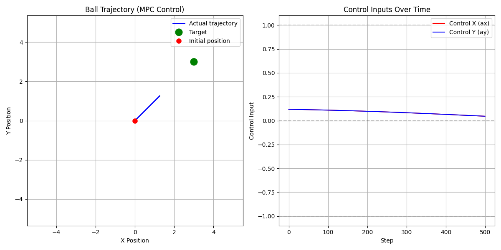
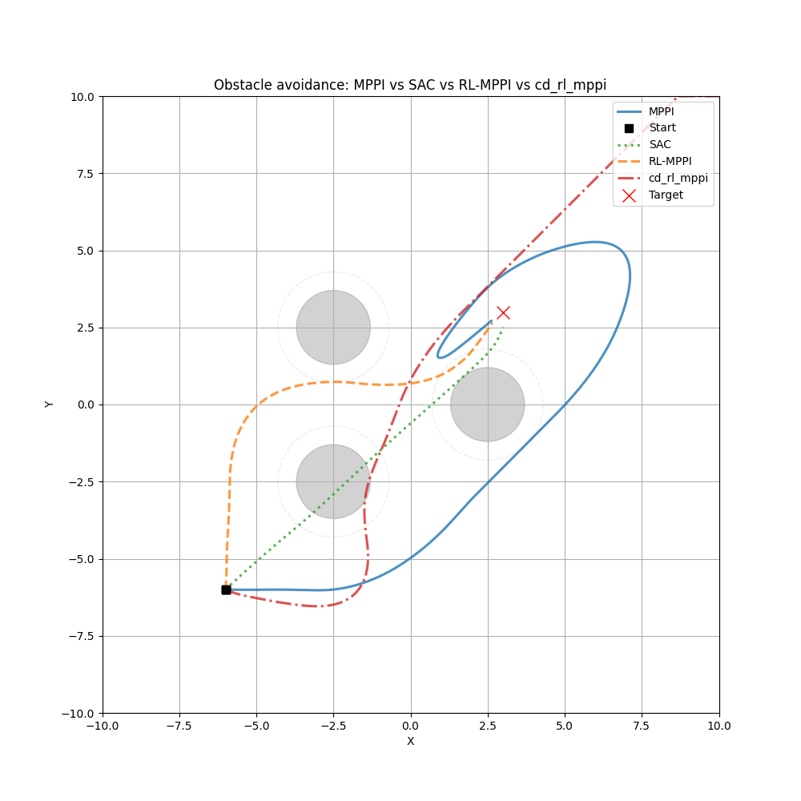

# RL-MPPI 项目

这是一个基于强化学习（RL）和采样/预测控制的运动规划与控制框架，主要用于2D小球环境的轨迹生成和控制。项目实现了多种控制算法，包括 MPPI、RL-MPPI（SAC 引导的 MPPI）、SAC，以及 CDF 路径规划算法。（MPC 代码仍保留为单独示例，但已从对比脚本中移除。）

## 目录结构

```
rl_mppi/
├── algorithms/             # 基础算法（可复用的控制/学习实现）
│   ├── cdf_rl_mppi/         # CDF算法与相关示例
│   ├── mppi/               # MPPI
│   ├── rl_mppi/            # RL-MPPI（SAC引导的MPPI）
│   ├── sac/                # SAC 网络与训练组件（工具/模型定义）
│   └── mpc/                # MPC（可复用实现/示例）
├── experiments/            # 运行脚本/对比测试（可直接 python 运行）
│   ├── compare_ball/       # 2D小球：MPPI/SAC/RL-MPPI 对比与避障对比
│   ├── sac_ball/           # SAC 训练/测试 CLI 与模型输出
│   ├── results/            # 脚本输出图片/结果
│   └── mpc/                # CasADi demos + 2D小球 MPC 示例
├── env/                    # 环境定义
│   └── envball_utils.py    # 2D小球环境实现
│   └── envball_obstacles.py # 2D小球环境（圆形障碍物，用于对比测试）
└── docs/                   # 文档/论文等
```

## 核心功能

### 1. 环境模块（env/）
- **BallEnvironment**：2D小球控制环境，支持位置、速度控制
- 状态空间：[x, y, vx, vy]（位置和速度）
- 动作空间：[ax, ay]（加速度控制）
- 支持自定义目标位置和环境参数

### 2. 配置空间距离场（CDF）算法（algorithms/cdf_rl_mppi/cdf_2d/）
- 实现了配置空间距离场的计算和使用
- 支持高斯模型和混合高斯模型
- 提供基于采样的路径规划方法（shooting方法）
- 支持配置空间和任务空间的转换

### 3. 模型预测路径积分（MPPI）算法（mppi/）
- 基于采样的模型预测控制算法
- 支持轨迹优化和成本函数设计
- 实现了高斯分布和混合高斯模型的动作采样
- 支持2D小球环境的目标点追踪

### 4. 模型预测控制（MPC）算法（mpc/）
- 基于CasADi的数值优化实现
- 支持状态约束和控制约束
- 提供PID回退控制器确保稳定性
- 实现了高效的初始猜测生成和暖启动机制

### 5. 强化学习（SAC）算法（sac/）
- 实现了Soft Actor-Critic强化学习算法
- 支持离线训练数据生成
- 提供预训练模型和测试脚本
- 可用于生成MPPI算法的初始策略

## 安装说明

### 依赖项
- Python 3.8+
- NumPy
- PyTorch
- CasADi
- Matplotlib
- SciPy

### 安装步骤
1. 克隆项目代码：
   ```bash
   git clone <repository-url>
   cd rl_mppi
   ```

2. 安装依赖：
   ```bash
   pip install numpy torch casadi matplotlib scipy
   ```

## 使用方法

### 1. 多算法对比（MPPI / SAC / RL-MPPI）
```bash
python experiments/compare_ball/compare_all.py \
  --model_path experiments/sac_ball/models/sac_ball_model_online.pth \
  --target_x 3 --target_y 3 --num_tests 10 --max_steps 2000
```

### 2. 运行RL-MPPI算法（SAC prior + MPPI）
```bash
python experiments/compare_ball/test_rl_mppi_ball.py \
  --model_path experiments/sac_ball/models/sac_ball_model_online.pth \
  --target_x 3 --target_y 3 --num_tests 10 --max_steps 2000
```

### 3. 避障对比测试（圆形障碍物：MPPI / SAC / RL-MPPI）
```bash
python experiments/compare_ball/compare_obstacle_avoidance.py \
  --model_path experiments/sac_ball/models/sac_ball_model_online.pth \
  --num_tests 10 --max_steps 2000
```

避障相关实现与可调参数（当前代码状态）：

- 环境：[env/envball_obstacles.py](env/envball_obstacles.py)
  - 在 [env/envball_utils.py](env/envball_utils.py) 的基础上加入圆形障碍物。
  - `--terminate_on_collision` 开启后，发生碰撞会提前终止 episode（用于更严格评测）。
  - `info` 中提供 `min_obstacle_clearance`（最小间隙）与 `hit_obstacle`（是否碰撞）。

- 控制器侧（规划代价）
  - [algorithms/mppi/mppi_ball.py](algorithms/mppi/mppi_ball.py)：纯 MPPI
    - 支持障碍物“影响距离”惩罚：在 `obstacle_margin` 范围内对靠近障碍物的轨迹增加二次代价。
    - 增加“硬碰撞代价” `collision_cost`：预测到进入障碍物（clearance < 0）时直接加一个很大的 cost。
    - 增加障碍物膨胀 `obstacle_safety_distance`：规划时按 `r + safety` 计算 clearance，减少“擦边”导致的碰撞。
    - 增加 LOS（line-of-sight）障碍代价：当障碍物靠近“当前位置→目标点”的线段时施加惩罚（促使更早绕行）。
    - 名义轨迹改为 PD nominal（并带轻微斥力项），采样围绕 nominal 展开。
  - [algorithms/rl_mppi/rl_mppi_ball.py](algorithms/rl_mppi/rl_mppi_ball.py)：RL-MPPI
    - 在 rollout cost 中加入与 MPPI 一致的：影响距离惩罚 / 硬碰撞代价 / 障碍物膨胀 / LOS 代价。

常用调参（都在 [experiments/compare_ball/compare_obstacle_avoidance.py](experiments/compare_ball/compare_obstacle_avoidance.py) 暴露为 CLI）：

- `--obstacle_margin`：障碍物影响距离（越大越“提前绕”）
- `--obstacle_cost_coeff`：影响距离惩罚系数
- `--collision_cost`：碰撞硬惩罚（建议远大于其它 cost）
- `--obstacle_safety_distance`：规划侧障碍物膨胀（避免擦边）
- `--los_influence` / `--los_cost_coeff`：LOS 代价的影响距离/权重（促进早绕行）
- `--horizon` / `--num_samples` / `--noise_std`：MPPI 搜索能力（避障通常需要更大一些）

示例（更严格的避障评测）：

```bash
python experiments/compare_ball/compare_obstacle_avoidance.py --model_path experiments/sac_ball/models/sac_ball_model_online.pth \
  --terminate_on_collision --num_tests 10 --max_steps 2000 \
  --horizon 30 --num_samples 600 --noise_std 0.8 \
  --obstacle_margin 2.0 --obstacle_cost_coeff 80000 \
  --obstacle_safety_distance 0.2 --collision_cost 5e7 \
  --los_influence 1.5 --los_cost_coeff 120000
```

### 4. 运行 MPC 单文件示例
```bash
python algorithms/mpc/mpc_ball.py
```

### 5. 运行CDF演示
```bash
python algorithms/cdf_rl_mppi/cdf_2d/cdf_demo.py
```

### 6. 运行SAC强化学习
```bash
cd experiments/sac_ball
python sac_ball_cli.py train  # 在线交互训练
python sac_ball_cli.py test_near     # 从目标点附近初始化的快速测试
```

## 算法原理

### 1. MPPI（Model Predictive Path Integral）
MPPI是一种基于采样的模型预测控制算法，通过在控制空间采样多个轨迹，计算每个轨迹的成本，并使用加权平均来选择最优控制动作。其核心公式为：

$$ u^*(t) = \frac{1}{\eta} \int u \exp(-\frac{1}{\lambda} J(u)) p(u) du $$

其中，$J(u)$是轨迹成本，$\lambda$是温度参数，$p(u)$是控制分布。

### 2. MPC（Model Predictive Control）
MPC通过求解一个有限时域的最优控制问题来生成控制动作，使用CasADi进行数值优化：

$$ \min_{u} \sum_{k=0}^{N-1} l(x_k, u_k) + V_f(x_N) $$
$$ \text{subject to } x_{k+1} = f(x_k, u_k), \quad k=0,\ldots,N-1 $$
$$ x_0 = x(t), \quad x_k \in X, \quad u_k \in U $$

### 3. CDF（Configuration Space Distance Field）
CDF用于表示配置空间中的障碍物信息，通过距离场的概念来快速计算路径规划所需的距离信息。核心函数包括：
- `calculate_cdf()`：计算配置空间距离场
- `shooting()`：基于采样的路径生成方法
- `projection()`：将任务空间点投影到配置空间

### 4. SAC（Soft Actor-Critic）
SAC是一种基于最大熵框架的强化学习算法，同时优化策略的预期回报和熵：

$$ \max_{\pi} \mathbb{E}_{\tau \sim \pi} \left[ \sum_{t=0}^\infty \gamma^t \left( r(s_t, a_t) + \alpha H(\pi(\cdot|s_t)) \right) \right] $$

其中，$H(\pi)$是策略的熵，$\alpha$是熵温度参数。

## 示例结果

### 1. MPPI控制轨迹
（示例图由 `experiments/compare_ball/*` 脚本输出到 `experiments/results/`）

### 2. MPC控制轨迹


### 3. SAC学习轨迹


### 4. 避障对比轨迹（MPPI vs SAC vs RL-MPPI）


## 文档

- **CDF算法**：
  - [CDF算法原理与公式详解.md](algorithms/cdf_rl_mppi/cdf_2d/doc/CDF算法原理与公式详解.md)
  - [CDF算法说明_中文.md](algorithms/cdf_rl_mppi/cdf_2d/doc/CDF算法说明_中文.md)
  - [calculate_cdf函数详解.md](algorithms/cdf_rl_mppi/cdf_2d/doc/calculate_cdf函数详解.md)

- **SAC算法**：
  - [RL-Driven_MPPI_Accelerating_Online_Control_Laws_Calculation_With_Offline_Policy.pdf](docs/papers/RL-Driven_MPPI_Accelerating_Online_Control_Laws_Calculation_With_Offline_Policy.pdf)

## 许可证

本项目采用MIT许可证。

## 作者与贡献

本项目由[作者姓名]开发，欢迎提交Issue和Pull Request。

## 联系方式

如有问题或建议，请联系：
- 邮箱：[your-email@example.com]
- GitHub：[your-github-profile]