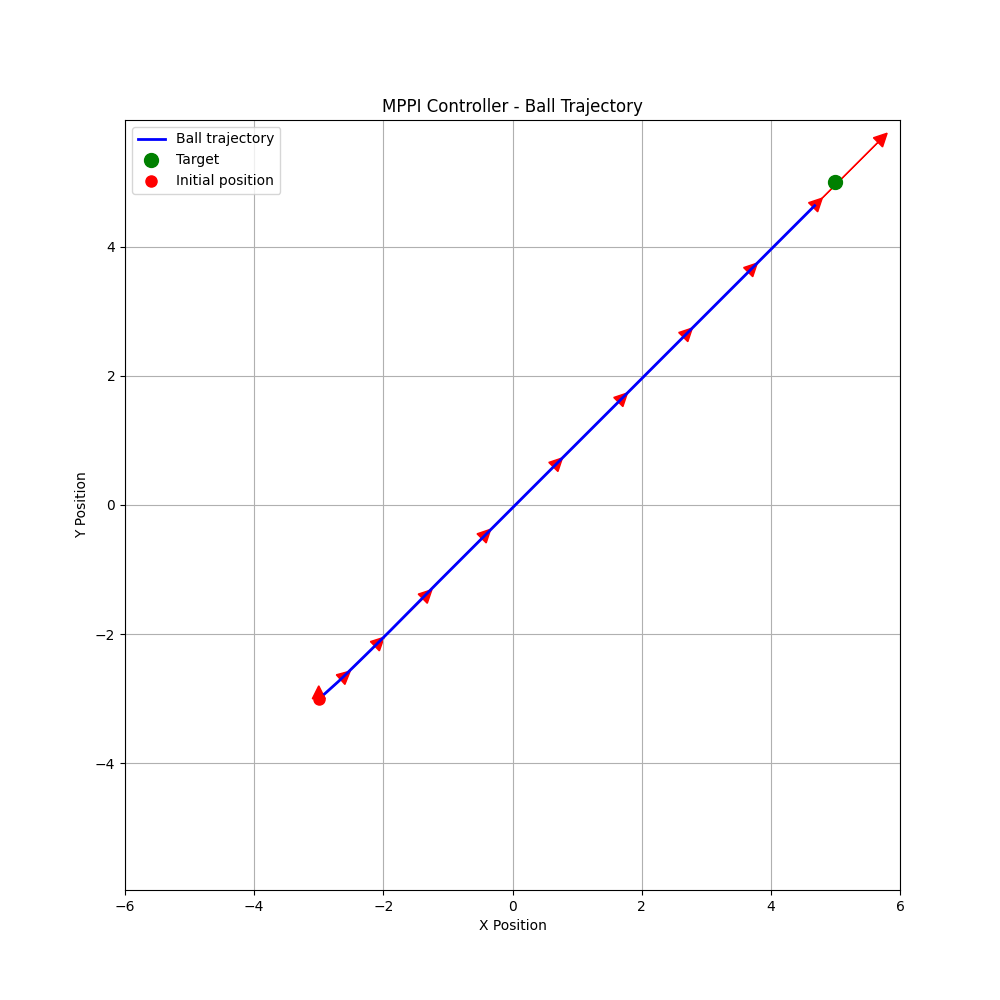
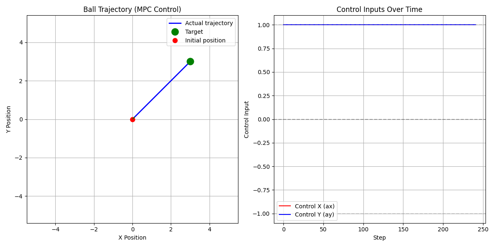
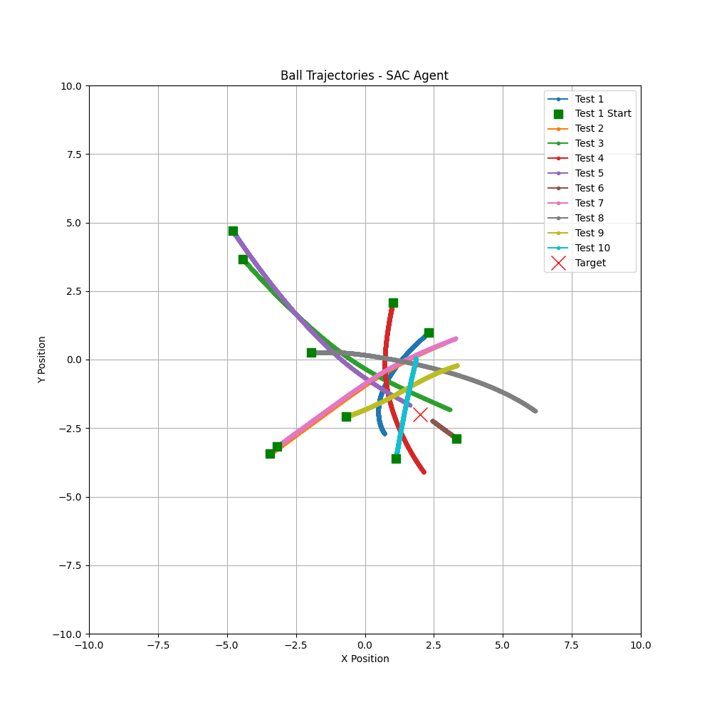

# RL-MPPI 项目

这是一个基于强化学习（RL）和模型预测控制（MPC）的运动规划与控制框架，主要用于2D小球环境的轨迹生成和控制。项目实现了多种先进的控制算法，包括MPPI（Model Predictive Path Integral）、MPC（Model Predictive Control）、SAC（Soft Actor-Critic）强化学习算法，以及CDF（Configuration Space Distance Field）路径规划算法。

## 目录结构

```
rl_mppi/
├── env/                    # 环境定义
│   └── envball_utils.py    # 2D小球环境实现
├── cdf_2d/                 # 配置空间距离场（CDF）算法
│   ├── cdf.py              # CDF核心实现
│   ├── cdf_demo.py         # CDF演示代码
│   ├── nn_cdf.py           # 基于神经网络的CDF
│   ├── doc/                # CDF文档
│   └── ...                 # 其他相关文件
├── mppi/                   # 模型预测路径积分（MPPI）算法
│   └── mppi_ball.py        # MPPI小球控制实现
├── mpc/                    # 模型预测控制（MPC）算法
│   ├── mpc_ball.py         # MPC小球控制实现
│   ├── casadi_optimization_demo.py # CasADi优化演示
│   └── README.md           # MPC说明文档
├── sac/                    # 软演员-评论家（SAC）强化学习算法
│   ├── sac_utils.py        # SAC工具函数
│   ├── sac_ball/           # SAC小球环境应用
│   ├── sac_simple/         # SAC简单示例
│   └── doc/                # SAC文档
└── DataDriven-MPPI-Manipulator.docx # 项目文档
```

## 核心功能

### 1. 环境模块（env/）
- **BallEnvironment**：2D小球控制环境，支持位置、速度控制
- 状态空间：[x, y, vx, vy]（位置和速度）
- 动作空间：[ax, ay]（加速度控制）
- 支持自定义目标位置和环境参数

### 2. 配置空间距离场（CDF）算法（cdf_2d/）
- 实现了配置空间距离场的计算和使用
- 支持高斯模型和混合高斯模型
- 提供基于采样的路径规划方法（shooting方法）
- 支持配置空间和任务空间的转换

### 3. 模型预测路径积分（MPPI）算法（mppi/）
- 基于采样的模型预测控制算法
- 支持轨迹优化和成本函数设计
- 实现了高斯分布和混合高斯模型的动作采样
- 支持2D小球环境的目标点追踪

### 4. 模型预测控制（MPC）算法（mpc/）
- 基于CasADi的数值优化实现
- 支持状态约束和控制约束
- 提供PID回退控制器确保稳定性
- 实现了高效的初始猜测生成和暖启动机制

### 5. 强化学习（SAC）算法（sac/）
- 实现了Soft Actor-Critic强化学习算法
- 支持离线训练数据生成
- 提供预训练模型和测试脚本
- 可用于生成MPPI算法的初始策略

## 安装说明

### 依赖项
- Python 3.8+
- NumPy
- PyTorch
- CasADi
- Matplotlib
- SciPy

### 安装步骤
1. 克隆项目代码：
   ```bash
   git clone <repository-url>
   cd rl_mppi
   ```

2. 安装依赖：
   ```bash
   pip install numpy torch casadi matplotlib scipy
   ```

## 使用方法

### 1. 运行MPPI算法
```bash
cd mppi
python mppi_ball.py
```

### 2. 运行MPC算法
```bash
cd mpc
python mpc_ball.py
```

### 3. 运行CDF演示
```bash
cd cdf_2d
python cdf_demo.py
```

### 4. 运行SAC强化学习
```bash
cd sac/sac_ball
python train_sac_ball.py  # 训练模型
python test_sac_ball.py   # 测试模型
```

## 算法原理

### 1. MPPI（Model Predictive Path Integral）
MPPI是一种基于采样的模型预测控制算法，通过在控制空间采样多个轨迹，计算每个轨迹的成本，并使用加权平均来选择最优控制动作。其核心公式为：

$$ u^*(t) = \frac{1}{\eta} \int u \exp(-\frac{1}{\lambda} J(u)) p(u) du $$

其中，$J(u)$是轨迹成本，$\lambda$是温度参数，$p(u)$是控制分布。

### 2. MPC（Model Predictive Control）
MPC通过求解一个有限时域的最优控制问题来生成控制动作，使用CasADi进行数值优化：

$$ \min_{u} \sum_{k=0}^{N-1} l(x_k, u_k) + V_f(x_N) $$
$$ \text{subject to } x_{k+1} = f(x_k, u_k), \quad k=0,\ldots,N-1 $$
$$ x_0 = x(t), \quad x_k \in X, \quad u_k \in U $$

### 3. CDF（Configuration Space Distance Field）
CDF用于表示配置空间中的障碍物信息，通过距离场的概念来快速计算路径规划所需的距离信息。核心函数包括：
- `calculate_cdf()`：计算配置空间距离场
- `shooting()`：基于采样的路径生成方法
- `projection()`：将任务空间点投影到配置空间

### 4. SAC（Soft Actor-Critic）
SAC是一种基于最大熵框架的强化学习算法，同时优化策略的预期回报和熵：

$$ \max_{\pi} \mathbb{E}_{\tau \sim \pi} \left[ \sum_{t=0}^\infty \gamma^t \left( r(s_t, a_t) + \alpha H(\pi(\cdot|s_t)) \right) \right] $$

其中，$H(\pi)$是策略的熵，$\alpha$是熵温度参数。

## 示例结果

### 1. MPPI控制轨迹


### 2. MPC控制轨迹


### 3. SAC学习轨迹


## 文档

- **CDF算法**：
  - [CDF.pdf](cdf_2d/doc/CDF.pdf)
  - [CDF-MPPI.pdf](cdf_2d/doc/CDF-MPPI.pdf)
  - [CDF算法原理与公式详解.md](cdf_2d/doc/CDF算法原理与公式详解.md)

- **SAC算法**：
  - [RL-Driven_MPPI_Accelerating_Online_Control_Laws_Calculation_With_Offline_Policy.pdf](sac/doc/RL-Driven_MPPI_Accelerating_Online_Control_Laws_Calculation_With_Offline_Policy.pdf)

## 许可证

本项目采用MIT许可证。

## 作者与贡献

本项目由[作者姓名]开发，欢迎提交Issue和Pull Request。

## 联系方式

如有问题或建议，请联系：
- 邮箱：[your-email@example.com]
- GitHub：[your-github-profile]