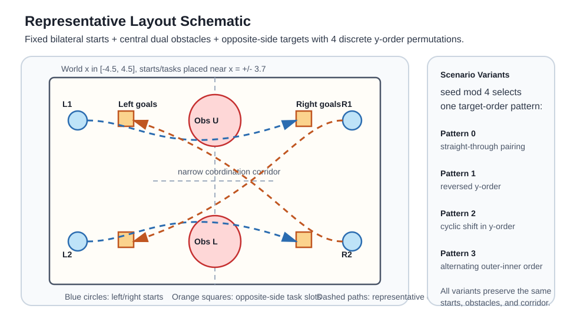
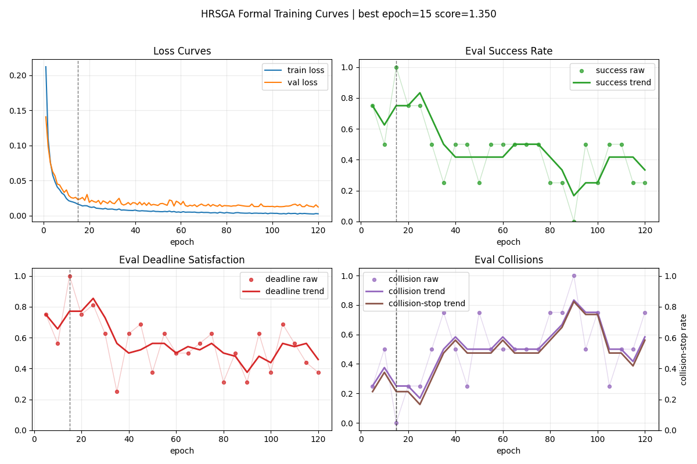
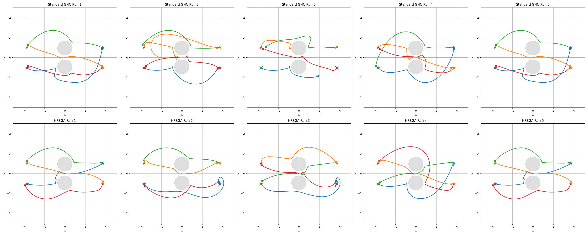
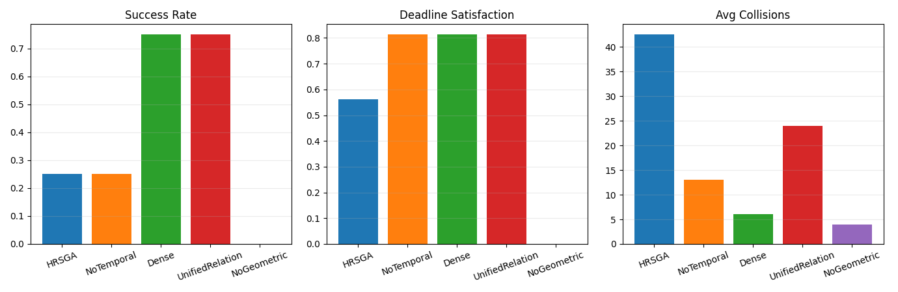

# 面向多机器人规划的异质关系稀疏图注意力网络

## 摘要
本文提出了一种面向多机器人任务分配与运动规划的异质关系稀疏图注意力网络，记为 HRSGA（Heterogeneous Relational Sparse Graph Attention）。该结构以机器人、任务和障碍物构成的异质图为输入，引入关系类型感知的多头注意力机制、几何与时序联合驱动的边重要性评估，以及基于 Top-K 的稀疏边选择策略。当前实现进一步采用局部可行性与全局协调分离的两阶段机器人中心式融合，并在稀疏关系主干之外加入稠密残差分支以增强分布外鲁棒性。本文给出了该结构的设计逻辑、数学定义、实验方案与适用范围，旨在为多机器人联合规划提供一种更具一般性的图注意力建模框架。

## 1. 介绍
### 1.1 研究背景与问题挑战

随着制造业柔性化、个性化与智能化发展需求的持续提升，多机械臂协同作业模式被广泛应用于各类生产单元。多台独立机械臂在共享工作空间内并行完成抓取、搬运、装配与检测等复杂工序，已成为智能制造的重要实现路径之一[1][2]。与单臂作业相比，多机械臂系统能够显著提升生产效率、空间利用率与任务冗余性，但多体协同也显著增加了运动规划与协作控制的复杂度。

多机械臂规划问题的困难主要体现在两个方面。其一，所有机械臂的联合构型空间维数极高，传统规划算法的计算开销随自由度和机器人数量增加而迅速增长[1][10][11]。其二，任务分配、调度与运动规划之间存在强耦合关系，任务执行顺序、资源占用、时间窗和碰撞约束需要被同时考虑，局部决策的不合理往往会导致整体方案不可行[2][4][26][27]。

因此，理想的多机器人规划器应同时具备四项能力：一是可扩展性，即在机器人数量增加时仍保持可控的计算代价；二是协作性，即在共享空间内实现无碰撞且互不阻碍的联合执行；三是闭环性，即能够对动态变化做出实时响应；四是灵活性，即能够适配不同数量、布局和任务组合，而无需对每一种新配置重新设计求解流程[1][2][4]。

### 1.2 现有研究与局限

多机械臂轨迹规划通常可表述为在联合配置空间内同时为所有机械臂生成满足运动学与动力学约束的连续轨迹，并在整个时间域内规避环境障碍和臂间碰撞。传统方法主要包括集中式规划器与去中心化方法。前者如概率路线图（Probabilistic Roadmap, PRM）[10]、快速扩展随机树（Rapidly-exploring Random Tree, RRT）[11] 及其变体，能够利用全局信息生成无碰撞轨迹，但在高维场景中易出现计算复杂度过高、难以实时响应环境变化的问题；后者如多机器人路径规划中的冲突搜索（Conflict-Based Search, CBS）[12]、M*[13] 以及多智能体路径搜索（Multi-Agent Path Finding, MAPF）统一定义框架[14] 所代表的方法，虽然在特定离散场景下具备较好的求解效率，但通常难以直接迁移到高自由度机械臂的紧耦合工作空间。

近年来，基于学习的方法在多机器人规划中得到了广泛研究。Ha 等人[3]通过多智能体强化学习训练去中心化策略，并结合基于采样的运动规划专家演示，提高了学习效率与推理速度。Long 等人[15]和 Sartoretti 等人[16] 分别从深度强化学习和强化学习结合模仿学习的角度出发，探索了多机器人避碰与路径规划的学习式求解。进一步地，图神经网络与强化学习的结合已被用于多机器人任务分配、调度与运动规划的联合优化[4]。这类方法通常将机器人、任务和障碍物统一表示为图结构，并在大规模仿真中学习策略，从而获得较好的泛化能力与实时性能。

从图表示学习的发展脉络来看，图卷积网络（Graph Convolutional Network, GCN）[17]、GraphSAGE 方法[18] 和神经消息传递框架[19] 为图结构上的局部聚合与关系推理奠定了基础；关系归纳偏置与图网络的系统性讨论进一步说明了图表示在复杂交互建模中的适用性[20]。在此基础上，图注意力网络（Graph Attention Network, GAT）[5] 证明了基于邻域重要性的自适应加权机制能够有效提升图表示能力；异质图注意力网络（Heterogeneous Graph Attention Network, HAN）[6] 则进一步表明，在多类型节点与多类型关系并存的图中，对不同语义通道进行独立建模是必要的。与此同时，关系图卷积网络（Relational Graph Convolutional Network, R-GCN）[7] 与关系图注意力网络（Relational Graph Attention Network, R-GAT）[8] 为多关系图上的参数共享与关系区分提供了方法基础，使得“按边类型建模”成为关系图学习中的重要思路。在机器人规划方向，Message-Aware Graph Attention Networks[9] 已展示出图注意力机制在大规模多机器人路径规划中的应用潜力，说明显式关系建模对于提升多主体协调效率具有直接价值。

此外，从更广义的注意力机制发展来看，Transformer 模型[21] 的提出使自注意力成为结构化建模的重要工具；Sparse Transformer[22] 和 BigBird[23] 等工作进一步表明，稀疏注意力能够在保持表达能力的同时显著提升长序列或大规模结构上的计算效率。进一步地，图 Transformer 方向的研究，如图 Transformer 的一般化框架[24] 与 Graphormer[25]，说明了将注意力机制推广到图结构并结合结构偏置已成为具有代表性的发展趋势。另一方面，时间窗调度、资源受限项目调度以及时序规划领域的研究[26][27][28] 也说明，在复杂任务系统中显式表示时间约束与资源约束是获得可执行解的重要前提。这些工作共同构成了本文方法设计的理论背景。

然而，已有图策略中的注意力机制往往仍较为轻量，通常仅在边级别进行简单权重调制。这类设计一方面缺乏对不同关系类型语义差异的显式建模，另一方面也没有充分利用几何信息与工作时序信息来刻画边的重要性。在多机器人场景中，上述不足会限制模型对复杂交互关系的表达能力；同时，全连接图所带来的大量低价值边也会增加训练与推理开销。

### 1.3 本文工作与贡献

针对上述问题，本文提出一种面向多机器人规划的异质关系稀疏图注意力网络 HRSGA。该方法以机器人、任务和障碍物构成的异质图为基础，通过关系类型感知的多头注意力机制、几何与时序联合驱动的边重要性评估以及基于 Top-K 的稀疏边选择，实现对多机器人关键交互关系的精细建模。

本文的主要贡献可概括为以下三点：

1. 提出一种关系类型感知的图注意力建模框架，对机器人协调、任务吸引和障碍约束进行分通道建模。
2. 将几何先验、工作时序约束与稀疏边筛选机制共同引入图注意力过程中，以增强模型对可达性、碰撞风险、调度优先级和关键交互的辨识能力。
3. 构建一套面向多机器人规划的实验评估方案，从性能、稳定性与扩展性三个方面验证方法的有效性。

## 2. 相关工作

### 2.1 传统多机器人规划方法

传统多机器人规划方法主要包括集中式规划与去中心化协调两类。集中式方法通常在全局配置空间中直接求解多机器人联合轨迹，能够显式处理碰撞约束，但在高维、多机器人场景下往往面临严重的计算瓶颈[1]。典型代表包括 PRM[10]、RRT[11] 以及针对多主体冲突消解提出的 CBS[12] 与 M*[13] 等方法。去中心化方法通过局部规则、优先级机制或速度障碍模型实现实时协调，尽管在一定程度上降低了计算负担，但通常依赖较强的场景假设和手工设计，难以兼顾复杂约束与全局最优性[14]。

### 2.2 基于学习的多机器人策略

随着深度强化学习的发展，越来越多工作尝试通过学习方法直接从环境状态到机器人动作构建映射。此类方法具有在线推理速度快、适应动态变化能力强等优点。代表性工作包括基于多智能体强化学习的去中心化多臂规划方法[3]，以及面向多机器人避碰和协同路径规划的深度强化学习方法[15][16]。这些方法在一定程度上缓解了高维动作空间和多主体协同带来的训练困难，但通常对输入结构的设计较为敏感，且对多实体关系的表达能力有限。

### 2.3 图表示学习在多机器人规划中的应用

图表示学习为多机器人规划提供了天然的关系建模框架。通过将机器人、任务和障碍物表示为图中的不同实体，图神经网络能够在消息传递过程中显式编码实体之间的交互关系。基础图表示方法如 GCN[17]、GraphSAGE[18] 与神经消息传递框架[19] 为此类建模提供了统一视角，而关系归纳偏置研究则进一步说明了图结构对复杂交互系统建模的重要性[20]。图注意力网络（Graph Attention Network, GAT）[5] 首次将自注意力机制引入图结构学习，使节点能够根据邻域重要性自适应分配权重；异质图注意力网络（Heterogeneous Graph Attention Network, HAN）[6] 则进一步强调了不同类型节点与关系在图表示学习中的独立建模需求。另一方面，关系图卷积网络（R-GCN）[7] 与关系图注意力网络（R-GAT）[8] 为多关系图上的参数化建模提供了基础，使得不同边类型可以通过独立变换或注意力机制进行区分处理。

在机器人规划方向，Message-Aware Graph Attention Networks[9] 已将图注意力机制引入大规模多机器人路径规划任务，表明显式关系建模有助于提升多主体协调效率。进一步地，图神经网络与强化学习的结合也被用于多机器人任务分配、调度与运动规划的联合求解[4]。与此同时，稀疏注意力研究[22][23] 与图 Transformer 研究[24][25] 均表明，在大规模结构化输入上引入稀疏连接和结构偏置，有助于提升模型的效率与表达能力。然而，现有方法中的图注意力机制大多仍停留在统一关系建模或轻量边权重调制层面，对异质关系、几何偏置以及稀疏图结构的联合建模仍然不足。本文工作正是在这一背景下展开，旨在构建一种更适用于多机器人场景的异质关系稀疏图注意力框架。

### 2.4 时序规划与调度相关研究

除空间几何与拓扑关系外，多机器人任务执行过程往往还受到时间窗、前驱依赖、资源占用和节拍约束的共同影响，因此时序规划与调度研究同样构成本文的重要背景。经典调度理论系统讨论了释放时间、截止时间、机器占用与工序排序等因素对任务可执行性和最优性的影响[26]；资源受限项目调度问题（Resource-Constrained Project Scheduling Problem, RCPSP）及其扩展研究则进一步说明，当前驱约束与共享资源并存时，任务排序和资源分配之间存在显著耦合[27]。另一方面，时序规划领域的研究，如 PDDL2.1 对持续动作与时间约束的表达[28]，表明在复杂任务系统中显式建模时间结构是获得可执行规划的重要前提。

不过，上述研究大多侧重符号规划、运筹优化或规则驱动的调度建模，较少直接面向多机器人连续运动决策中的表征学习问题。相较而言，本文关注的是如何将这类时序约束转化为注意力分配中的结构偏置，使任务释放时间、截止期、资源冲突窗口以及机器人间潜在时序干扰能够直接影响图上的关系建模过程，从而在统一框架中耦合任务分配、时序协调与运动规划。换言之，本文并非试图以注意力模型替代经典调度器，而是将调度与时序约束编码为图注意力中的可学习偏置，用于服务联合决策过程中的表示学习与动作选择。

## 3. 问题定义

考虑一个共享障碍环境下的多机器人到达任务（reaching task）。设系统中包含 $N_r$ 个机器人、$N_t$ 个任务目标以及 $N_o$ 个障碍物。在每个决策时刻，系统状态包含所有机器人的运动学状态、所有任务的位姿、完成状态与时序属性，以及障碍物的几何信息。这里的时序属性可包括任务释放时间、截止时间、预计执行时长、前驱任务完成状态或工位占用窗口。目标是在避免碰撞并满足机器人运动约束的前提下，生成协调动作，使全部任务尽可能高效地完成。

本文将环境状态表示为有向异质图

$$
G = (V, E)
$$

其中$V$为节点集合，$E$为边集合，$G$为图。节点集合由三类实体组成：机器人节点 $V_r$、任务节点 $V_t$ 和障碍节点 $V_o$。边集合由机器人到机器人 $E_{rr}$、任务到机器人 $E_{tr}$、障碍到机器人 $E_{or}$ 之间的交互关系构成：

$$
E = E_{rr} \cup E_{tr} \cup E_{or}
$$

每条边都带有关系特征，其中既包含相对位姿、障碍尺寸、可行性相关信息，也可包含等待时间、时间窗松弛量、前驱完成标记和资源占用冲突窗口等时序特征。

基于上述异质图表示，本文将多机器人规划问题表述为结构化关系状态上的策略学习问题。具体而言，策略网络需综合不同类型节点及其交互边所携带的空间约束、任务耦合及时序信息，并据此学习从图状态到联合动作的映射关系。策略网络学习如下映射：

$$
\pi_\theta : G \mapsto a
$$

其中 $a$ 表示所有机器人的联合动作向量。在行动者-评论家（actor-critic）框架中，评论家（critic）网络学习价值函数 $Q_\psi(G, a)$ 用于评估在图状态 $G$ 下执行联合动作 $a$ 所对应的期望长期回报[3][4]。其中，策略网络负责依据当前图状态生成多机器人的联合控制动作，而价值网络则从状态-动作对的角度刻画该决策对后续任务完成、碰撞规避与时序约束满足等整体目标的贡献，并为策略优化提供学习信号。通过这一建模方式，多机器人规划问题可在统一的图表示框架下被表述为联合动作生成与价值评估相互耦合的序贯决策过程。

尽管统一的图神经网络对所有边做消息传递已经具备良好的扩展性，但轻量级边权重调制并没有显式区分不同关系类型的语义差异。在多机器人场景中，不同关系承担的作用是不同的：

- 机器人到机器人边主要编码协调、竞争与避碰关系。
- 任务到机器人边主要编码任务分配、任务吸引与可达性。
- 障碍到机器人边主要编码几何约束和局部风险。

如果所有交互共享同一套更新逻辑，模型可能难以充分表达这些差异。进一步地，当任务存在先后约束、工位占用窗口或截止期时，若注意力中缺少显式时序信息，模型将难以区分“当前可做”与“暂不可做”任务。与此同时，在任务和障碍数量较大时，全连接图会产生大量低价值边，增加训练和推理成本。因此，需要一种同时具备关系类型感知能力、时序感知能力和稀疏化能力的图注意力结构。

## 4. 方法

### 4.1 HRSGA 总体结构

HRSGA 采用异质图状态表示，并以关系感知注意力模块替代统一图更新块[6][7][8]。当前实现的整体结构包含五个主要部分：

1. 类型特定的节点编码器。
2. 异质关系注意力模块。
3. 几何与时序联合偏置驱动的注意力打分。
4. 基于 Top-K 的稀疏边选择。
5. 两阶段机器人中心式融合与稠密残差校正。

整体设计采用机器人中心式建模，即以机器人节点作为决策表示的核心载体，将任务节点与障碍节点视为提供分配约束、几何约束及时序信息的外部信息源，并将关键交互信息汇聚到机器人节点表示中。采用该设计的主要原因在于，多机器人规划问题的策略输出天然对应各机器人在当前时刻的控制动作，因此以机器人节点作为最终读出对象，更有利于使表示学习过程与决策输出形式保持一致，同时避免在与动作无直接对应关系的节点上引入不必要的更新开销。

图 1 给出了 HRSGA 的总体结构。整体流程可概括为：首先依据环境状态构建由机器人、任务和障碍物组成的异质图；随后通过类型特定的编码器获得不同实体的初始表示，并在关系感知注意力模块中结合几何偏置、时序偏置与 Top-K 稀疏边选择机制，对关键交互进行筛选与聚合；接着，先由任务与障碍关系完成局部可行性融合，再由机器人间关系完成全局协调融合；最后，将稀疏关系主干与稠密残差分支进行门控合成，形成用于决策的机器人表示，并分别送入策略头与价值头，以实现联合动作生成和状态动作价值评估。

图 1. HRSGA 总体结构图

### 4.2 表示学习与关系建模

#### 4.2.1 类型特定的节点编码

给定机器人、任务和障碍节点的原始特征分别为 $x_i^r$、$x_j^t$ 和 $x_k^o$，首先使用三个相互独立的编码器将其映射到共享潜空间：

$$
\begin{aligned}
h_i^r &= E_r(x_i^r), \\
h_j^t &= E_t(x_j^t), \\
h_k^o &= E_o(x_k^o)
\end{aligned}
$$

其中 $E_r$、$E_t$、$E_o$ 均为多层感知机。采用独立编码器的目的在于适配机器人、任务和障碍在语义与物理属性上的显著差异；若使用统一编码器，模型需要在单一映射中同时拟合多种不兼容的表示模式，从而削弱表达能力[6][7][8]。

#### 4.2.2 关系感知多头注意力

在获得类型特定的节点表示后，模型需进一步显式建模不同实体之间的交互关系。为此，本文针对不同关系类型构建相互独立的多头注意力机制，以增强对机器人协调、任务吸引和障碍约束的区分建模能力[5][6][8]。设关系类型 $c \in \{rr, tr, or\}$，分别表示机器人到机器人、任务到机器人和障碍到机器人关系；设注意力头数为 $H$，则对于关系类型 $c$ 下的第 $h$ 个注意力头，接收端机器人节点生成 query，源节点生成 key 与 value，其定义为：

$$
q_i^{c,h} = W_Q^{c,h} h_i^r
$$

$$
k_j^{c,h} = W_K^{c,h} h_j^c
$$

$$
v_j^{c,h} = W_V^{c,h} h_j^c
$$

其中，当 $c = rr$ 时，源节点为机器人；当 $c = tr$ 时，源节点为任务；当 $c = or$ 时，源节点为障碍物。$W_Q^{c,h}$、$W_K^{c,h}$ 与 $W_V^{c,h}$ 分别表示关系类型 $c$ 下第 $h$ 个注意力头的 query、key 与 value 投影矩阵，$h_i^r$ 表示接收端机器人节点 $i$ 的隐表示，$h_j^c$ 表示关系类型 $c$ 下源节点 $j$ 的隐表示。这里，query 用于表征接收端机器人的检索需求，key 用于表征源节点的匹配特征，value 用于表征源节点传递的消息内容。该参数化方式与以目标节点为中心的消息传递过程一致，并使模型能够在统一框架下对不同关系类型的交互模式进行分离建模。

#### 4.2.3 几何与时序联合偏置建模

尽管上述关系特定注意力机制能够在一定程度上刻画异质交互模式，但若仅依赖节点隐表示进行相关性计算，仍难以充分覆盖多机器人规划中的关键决策约束。其根本原因在于，影响交互重要性的核心因素并不完全蕴含于节点语义表示之中，而是广泛存在于实体间的几何关系、可达性结构以及任务时序约束之中。基于这一认识，本文进一步在关系建模过程中引入几何偏置、时序偏置与显式边筛选机制[20][24][25]。

具体而言，在多机器人规划场景中，边的重要性不仅取决于节点表示之间的语义相关性，而且受到相对位姿、可行性先验、时间窗约束、前驱依赖及潜在资源冲突等因素的共同影响。因此，本文在 scaled dot-product attention[21]、关系感知图注意力[6][8] 以及图结构偏置注意力建模[24][25] 的基础上，在隐空间匹配项之外进一步显式编码边级几何先验与时序先验，以使关系强度的估计更符合实际规划约束与决策需求。

设关系边 $(j \to i)$ 在关系类型 $c$ 下的几何特征为 $e_{ij}^c$，时序特征为 $u_{ij}^c$，则第 $h$ 个注意力头的未归一化打分定义为：

$$
\ell_{ij}^{c,h}
= \frac{(q_i^{c,h})^\top k_j^{c,h}}{\sqrt{d}} + b_{geo}^{c,h}(e_{ij}^c) + b_{tmp}^{c,h}(u_{ij}^c)
$$

其中，$d$ 表示单个注意力头的特征维度，缩放点积项继承自标准注意力机制[21]；$b_{geo}^{c,h}(\cdot)$ 与 $b_{tmp}^{c,h}(\cdot)$ 分别表示关系类型特定的几何偏置网络与时序偏置网络，用于将相对位姿、障碍几何、可达性先验、安全裕度，以及等待时间、时间窗松弛量、前驱完成状态、预计占用时长等边特征映射为附加注意力偏置。因而，该打分形式可视为在关系感知图注意力[6][8] 与图结构偏置注意力建模[24][25] 基础上，结合多机器人规划场景对标准缩放点积注意力[21] 所作的扩展。进一步地，$W_Q^{c,h}$、$W_K^{c,h}$、$W_V^{c,h}$ 及偏置网络内部参数均由训练过程学习得到；$d$、$H$ 与关系类型集合由模型结构预先设定；几何特征 $e_{ij}^c$ 与时序特征 $u_{ij}^c$ 则由环境状态显式构造。通过上述设计，注意力打分不再仅依赖隐空间中的语义相似性，而能够同时综合运动学约束、碰撞风险与调度时序信息。

对于任务到机器人关系，时序特征 $u_{ij}^{tr}$ 可具体写为：

$$
u_{ij}^{tr} = [\Delta t_{release}, \Delta t_{deadline}, \rho_{pred}, \hat{d}_{ij}^{exec}]
$$

其中 $\Delta t_{release}$ 表示距任务释放时刻的剩余时间，$\Delta t_{deadline}$ 表示距截止时间的松弛量，$\rho_{pred}$ 表示前驱任务完成标记，$\hat{d}_{ij}^{exec}$ 表示机器人 $i$ 执行任务 $j$ 的预计耗时。

对于机器人到机器人关系，可进一步将时序特征 $u_{ij}^{rr}$ 定义为：

$$
u_{ij}^{rr} = [\omega_{ij}^{overlap}, \Delta t_{ij}^{conf}, \rho_{ij}^{yield}]
$$

其中 $\omega_{ij}^{overlap}$ 表示机器人 $i$ 与机器人 $j$ 在共享工作区或冲突通道上的预计占用区间重叠量，$\Delta t_{ij}^{conf}$ 表示两者到达潜在冲突区域的时间差，$\rho_{ij}^{yield}$ 表示由优先级规则、任务紧迫度或工艺顺序导出的让行标记。若 $\omega_{ij}^{overlap}$ 较大且 $\Delta t_{ij}^{conf}$ 较小，则对应边应获得更高的协调注意力，以提前建模潜在拥塞、互相阻挡或资源竞争风险。

#### 4.2.4 稀疏边筛选与关系级聚合

在得到更具物理意义的注意力打分后，还需要进一步解决大规模场景下边数过多带来的计算负担。多机器人规划中的一个关键计算瓶颈正来自于边数快速增长[1][4]。原始图结构下，交互复杂度近似为：

$$
O(N_r^2 + N_rN_t + N_rN_o)
$$

然而在实际决策时，大量边并不重要。例如，一个机器人通常只需要关注少数几个最相关任务、最接近的障碍和少量潜在冲突机器人。因此，本文在每种关系类型内部引入基于 Top-K 的稀疏边选择机制。该设计直接借鉴了稀疏注意力在大规模结构化输入上的降复杂度思路[22][23]，同时也与图 Transformer 中强调结构偏置和关键连接保留的做法一致[24][25]。在引入时序偏置后，边筛选不仅保留几何上最关键的邻居，也可优先保留当前时窗内最紧迫、最可执行或最可能形成资源冲突的交互边。

具体地，对每个机器人节点及每个注意力头，仅保留打分最高的若干条边。设机器人边、任务边和障碍边分别保留 $k_r$、$k_t$ 和 $k_o$ 条，则注意力归一化只在这些保留边上进行。这样一来，有效交互复杂度可近似压缩为：

$$
O(N_rk_r + N_rk_t + N_rk_o)
$$

其中 $k_r$、$k_t$、$k_o$ 都是远小于实体总数的常数。该机制不仅降低了训练与推理成本，也减少了弱相关边带来的噪声传播。

在完成边筛选之后，模型仅在保留下来的关键邻居上进行注意力归一化与消息聚合。对于每种关系类型 $c$ 和每个头 $h$，归一化注意力权重定义为：

$$
\alpha_{ij}^{c,h}
= \text{softmax}_{j \in \mathcal{N}_i^{c,h}}(\ell_{ij}^{c,h})
$$

其中 $\mathcal{N}_i^{c,h}$ 表示经过稀疏筛选后，机器人 $i$ 在第 $h$ 个头下保留的邻居集合。对应的消息聚合结果为：

$$
m_i^{c,h}
= \sum_{j \in \mathcal{N}_i^{c,h}} \alpha_{ij}^{c,h} v_j^{c,h}
$$

随后将各注意力头的聚合结果进行拼接，并通过关系类型特定的输出映射整合为统一的关系级表示：

$$
m_i^c
= W_O^c \, \text{Concat}(m_i^{c,1}, \dots, m_i^{c,H})
$$

其中，$W_O^c$ 表示关系类型 $c$ 下的输出投影矩阵，用于对不同注意力头捕获的互补信息进行重新组合与压缩，从而形成面向该关系类型的紧凑表示。通过这种多头聚合方式，模型能够在同一关系通道内从不同子空间刻画邻域交互，并在关系级别上完成统一融合。

因此，每个机器人节点最终会从三种关系通道获得相互独立但语义互补的信息聚合结果：$m_i^{rr}$ 主要编码机器人之间的协调、竞争与避碰信息，$m_i^{tr}$ 主要编码任务分配、任务吸引与可达性信息，$m_i^{or}$ 则主要编码障碍约束与局部风险信息。对三类关系结果进行显式分通道保留，有助于避免异质交互语义在同一表示空间中过早混合，并为后续机器人中心式融合提供结构化的信息基础。

### 4.3 机器人中心式融合与决策输出

在完成关系建模后，模型已获得来自机器人协调、任务引导与障碍约束等不同关系通道的消息表示。由于多机器人规划中的最终决策变量对应于各机器人在当前时刻的控制动作，因此后续表示更新无需对所有类型节点进行同等处理，而应围绕机器人节点展开面向决策的特征整合。

#### 4.3.1 两阶段机器人中心式融合更新

基于这一考虑，本文采用机器人中心式更新策略，将多关系通道信息分两阶段汇聚到机器人节点表示中，并以此作为后续策略生成与价值评估的核心状态表征。与早期的一次性三关系拼接融合不同，当前实现先聚合任务与障碍信息，再显式处理机器人间协调，以降低“局部可做性判断”和“全局让行协调”相互干扰的风险。

在第一阶段，模型仅利用任务到机器人与障碍到机器人的关系消息完成局部融合：

$$
z_i^{loc}
= \sigma\left(W_{loc}[h_i^r ; m_i^{tr} ; m_i^{or}]\right)
$$

$$
h_i^{r,(1)}
= h_i^r + z_i^{loc} \odot \text{Fuse}_{loc}\left([h_i^r ; m_i^{tr} ; m_i^{or}]\right)
$$

其中 $h_i^{r,(1)}$ 表示机器人 $i$ 在局部任务可行性与障碍风险融合后的中间表示。该阶段的目标是先判断“当前哪些任务更可做、哪些局部障碍更危险”。

在第二阶段，模型在上述中间表示基础上再显式引入机器人间协调信息。设

$$
g^{(1)} = \text{Pool}(\{h_i^{r,(1)}\}_{i=1}^{N_r})
$$

$$
z_i^{coord}
= \sigma\left(W_{coord}[h_i^{r,(1)} ; m_i^{rr} ; g^{(1)}]\right)
$$

$$
h_i^{r,(2)}
= h_i^{r,(1)} + z_i^{coord} \odot \text{Fuse}_{coord}\left([h_i^{r,(1)} ; m_i^{rr} ; g^{(1)}]\right)
$$

其中，$\text{Pool}(\cdot)$ 表示对所有机器人节点表示进行的置换不变聚合算子，当前实现采用均值池化构造全局上下文；$g^{(1)}$ 为由全体阶段一机器人表示汇聚得到的全局协作状态；符号 $[\cdot ; \cdot]$ 表示向量拼接，$W_{loc}$ 与 $W_{coord}$ 分别表示局部阶段与协调阶段的门控映射矩阵，$\sigma(\cdot)$ 表示逐元素 Sigmoid 激活函数，$\odot$ 表示逐元素乘法。该门控残差更新方式允许模型在保留原始机器人表示的同时，有选择地吸收来自局部可行性与全局协调两类不同性质的增量信息。

在当前基础实现中，任务节点和障碍节点仍主要作为信息源而不参与显式迭代更新，以控制模型复杂度；如需进一步增强表达能力，可再引入轻量级任务节点和障碍节点更新模块。

#### 4.3.2 两阶段结构与协调机制

为进一步提升融合表示的质量，并在推理过程中区分局部可行性与全局协调两类过程，本文将 HRSGA 组织为两阶段结构。

第一阶段主要关注任务到机器人和障碍到机器人的注意力聚合，使机器人能够先判断哪些任务在当前时刻更可做、哪些局部障碍更危险。在记号上，可将该阶段得到的中间表示写为

$$
h_i^{r,(1)} = \text{Fuse}_{loc}(h_i^r, m_i^{tr}, m_i^{or}, g)
$$

其中 $h_i^{r,(1)}$ 表示机器人 $i$ 经局部任务可行性与障碍风险融合后的中间表示，$\text{Fuse}_{loc}(\cdot)$ 表示对应的局部融合模块；该模块可以由前述门控残差更新块实现，也可以采用其轻量化变体。

第二阶段主要关注机器人之间的注意力聚合，用于处理竞争、互相阻挡和碰撞规避等全局协调问题。进一步地，可将第二阶段表示写为

$$
h_i^{r,(2)} = \text{Fuse}_{coord}(h_i^{r,(1)}, m_i^{rr}, g)
$$

其中 $h_i^{r,(2)}$ 表示在局部可行性判断基础上进一步融合机器人间协调信息后的表示，$\text{Fuse}_{coord}(\cdot)$ 表示面向全局协调的融合模块。

这种两阶段设计对应于由局部任务可行性与时序可执行性判断过渡到全局协同决策的规划逻辑。若策略网络堆叠 $L$ 个 HRSGA 模块，则最后一层输出记为 $h_i^{r,L}$；在当前实现下，它对应于最顶层模块中协调阶段输出的机器人表示。

#### 4.3.3 稀疏主干与稠密残差混合

为缓解纯 Top-K 稀疏关系选择在分布外布局中可能出现的关键边漏检问题，当前实现在两阶段稀疏关系主干之外并联一条稠密残差分支。该分支采用共享消息聚合方式对所有有效边进行平滑汇总，但保持与主干一致的“局部融合 $\rightarrow$ 协调融合”顺序，从而为主干提供更稳定的补充上下文。

记两阶段稀疏主干输出为 $h_i^{sparse}$，稠密残差分支输出为 $h_i^{dense}$，则最终机器人表示写为：

$$
z_i^{hyb} = \sigma\left(W_{hyb}[h_i^r ; h_i^{sparse} ; h_i^{dense}]\right)
$$

$$
h_i^{r,L} = h_i^{sparse} + z_i^{hyb} \odot h_i^{dense}
$$

该设计的作用不是以稠密分支替代关系感知稀疏主干，而是在分布外场景下提供更平滑、更保守的补充信息源，以降低单次边筛选失误被放大的风险。

#### 4.3.4 策略头与价值头

在获得最终机器人表示后，模型进一步构建策略头与价值头，分别用于动作生成与联合动作价值评估。

策略网络将多个 HRSGA 模块堆叠后，使用最终机器人节点表示生成动作：

$$
a_i = \tanh(\text{MLP}_{actor}(h_i^{r,L}))
$$

其中 $\text{MLP}_{actor}(\cdot)$ 表示策略头的多层感知机，$\tanh(\cdot)$ 用于将动作压缩到有界区间，便于与连续控制中的动作范围约束相匹配；$L$ 表示最后一层。所有机器人的动作拼接后构成联合动作向量：

$$
a = [a_1, \dots, a_{N_r}]
$$

这种设计保留了机器人级动作接口，因此能够较容易兼容常见的行动者-评论家训练框架[3][4]。

与策略头（actor）侧直接从机器人表示生成动作不同，价值头（critic）侧还需要进一步评估联合动作在多机器人系统中的相互作用。为此，本文建议先将动作嵌入到机器人表示中：

$$
\tilde{h}_i^r = \text{MLP}_{act}([h_i^{r,L}; a_i])
$$

其中，$\text{MLP}_{act}(\cdot)$ 表示动作条件编码器，用于将机器人状态表示与其当前动作联合映射到动作条件表示空间。随后，在动作条件下的机器人表示上，再增加一层轻量级机器人间注意力，以建模动作之间可能引发的互相干扰、碰撞风险或协调收益。最后，将动作条件下的机器人表示池化后送入价值头，得到 Q 值：

$$
Q(G,a) = \text{MLP}_{Q}(\text{Pool}(\{\tilde{h}_i^r\}))
$$

其中，$\text{MLP}_{Q}(\cdot)$ 表示价值头网络，输出标量状态动作价值估计。相比于简单地把动作拼接回节点再直接复用同一主干网络，这种价值网络结构更符合其“评估联合动作后果”的作用，因为它先在机器人层面显式编码动作影响，再在系统层面聚合多机器人联合行为的整体后果。

### 4.4 训练目标与方法优势

当前实现的训练主线采用监督模仿学习，即直接回归启发式专家控制器生成的机器人动作，以先验证表示结构本身是否能够稳定学习专家行为。在此基础上，本文仍保留将辅助监督接入到 HRSGA 主干中的扩展方向，以增强注意力层尽早学习具有判别性的结构信息。

设监督学习主损失记为

$$
L_{IL} = \frac{1}{|\mathcal{A}|} \sum_{i \in \mathcal{A}} \lVert a_i - a_i^{expert} \rVert_2^2
$$

其中 $\mathcal{A}$ 表示当前仍处于活动状态的机器人集合，$a_i$ 表示策略输出动作，$a_i^{expert}$ 表示专家动作。当前代码实现以该动作回归损失作为主要优化目标，并通过 mixed-layout 专家数据与 representative 布局 rollout 共同约束 checkpoint 选择。

在更完整的训练方案中，仍可进一步引入两个辅助任务。其基本思想是：在策略尚未充分收敛之前，直接利用几何可行性与局部冲突等相对容易从仿真器中提取的监督信号，对关系表示和注意力分配进行额外约束，从而减少纯回报驱动训练中常见的信用分配困难与梯度稀疏问题。

第一个辅助任务是机器人-任务可行性预测。对于任意机器人和任务对，预测该任务在当前状态下是否具备几何、运动学与时序上的可执行性：

$$
p_{ij}^{feas}
= \sigma(\text{MLP}_{feas}([h_i^r; h_j^t; e_{ij}^{tr}]))
$$

其中，$\text{MLP}_{feas}(\cdot)$ 表示可行性预测头，$p_{ij}^{feas} \in (0,1)$ 表示机器人 $i$ 执行任务 $j$ 的可行性概率估计。设对应监督标签为 $y_{ij}^{feas} \in \{0,1\}$，则可行性辅助损失可写为二元交叉熵形式：

$$
L_{feas} = - \sum_{(i,j)} \left[ y_{ij}^{feas} \log p_{ij}^{feas} + (1-y_{ij}^{feas}) \log(1-p_{ij}^{feas}) \right]
$$

第二个辅助任务是局部碰撞风险预测，用于估计机器人-机器人或机器人-障碍之间的冲突概率：

$$
p_{ij}^{coll,c} = \sigma(\text{MLP}_{coll}^{c}([h_i^r; h_j^{c}; e_{ij}^{c}])), \quad c \in \{rr, or\}
$$

其中，$c$ 表示碰撞关系类型；当 $c = rr$ 时，$h_j^{c}$ 对应另一机器人隐表示，$e_{ij}^{c}$ 对应机器人-机器人关系边特征；当 $c = or$ 时，$h_j^{c}$ 对应障碍隐表示，$e_{ij}^{c}$ 对应障碍到机器人关系边特征。$\text{MLP}_{coll}^{c}(\cdot)$ 表示关系类型特定的碰撞风险预测头，$p_{ij}^{coll,c} \in (0,1)$ 表示关系类型 $c$ 下的局部冲突概率估计。记监督标签为 $y_{ij}^{coll,c} \in \{0,1\}$，则碰撞风险辅助损失可写为：

$$
L_{coll} = - \sum_{c \in \{rr,or\}} \sum_{(i,j)} \left[ y_{ij}^{coll,c} \log p_{ij}^{coll,c} + (1-y_{ij}^{coll,c}) \log(1-p_{ij}^{coll,c}) \right]
$$

上述监督信号可由仿真中的碰撞检测、逆运动学可行性判断、时间窗满足性检查或短视规划结果自动生成。与仅依赖最终任务回报相比，这类辅助监督能够更早地告诉模型“哪些任务当前可做”“哪些局部交互具有高冲突风险”，从而提升关系表示学习的样本效率。

若采用上述扩展监督，则总损失函数可进一步写为：

$$
L
= L_{IL} + \lambda_1 L_{feas} + \lambda_2 L_{coll} + \lambda_3 L_{sparse}
$$

其中，$L_{IL}$ 为当前实现中的主监督损失；$L_{feas}$ 与 $L_{coll}$ 分别刻画可行性预测误差与局部碰撞风险预测误差；$L_{sparse}$ 为可选的稀疏正则项，用于鼓励注意力分布更加尖锐和集中；$\lambda_1$、$\lambda_2$ 与 $\lambda_3$ 为相应权重系数，用于平衡主任务与辅助任务之间的优化强度。

从整体设计上看，除上述训练机制外，HRSGA 相较于现有轻量级边注意力图策略至少体现出五方面增强。

1. 它是关系类型感知的，而不是对所有边一视同仁，因此能分别建模机器人协调、任务分配和障碍规避。

2. 它是几何信息驱动的，边的相对位姿与可行性信息被直接纳入注意力打分过程，而不是仅依赖隐空间特征。

3. 它显式建模工作时序，任务释放时间、截止时间、前驱约束和资源占用窗口能够直接影响注意力分配，从而更好地区分“应优先执行”与“暂缓执行”的候选任务。

4. 它具备显式稀疏化能力，不仅能给边赋不同权重，还能主动裁剪低价值交互，从而缓解大规模场景中的计算瓶颈。

5. 它采用机器人中心式、局部到全局的两阶段融合，并引入稠密残差分支作为分布外鲁棒性的补充机制，更符合多机器人动作决策的实际逻辑。

因此，该结构相较于简单的单头边注意力机制，更有希望在复杂、多关系和分布外冲突场景中获得稳定收益。

## 5. 实验

本节旨在系统验证 HRSGA 在多机器人任务分配与轨迹规划问题中的有效性，并围绕以下四个问题展开实验分析：

1. 相比统一图消息传递模型或轻量级边注意力模型，HRSGA 是否能够提升任务完成质量、时序约束满足能力与避碰性能。
2. 几何偏置、时序偏置与 Top-K 稀疏机制是否分别带来独立可测的性能增益。
3. HRSGA 在训练分布内场景与分布外代表性冲突场景中是否均具有稳定表现。
4. 当机器人数量、任务数量与障碍数量增加时，HRSGA 是否保持较好的扩展性与推理效率。

### 5.1 实验设置

实验基于二维多机器人到达任务环境展开，核心任务是在存在任务约束与障碍干扰的条件下完成多机器人协同到达。评价时统一统计任务完成质量、时序满足情况、安全性和推理效率等指标，以从任务效果与在线代价两个维度评估模型表现。

本文将测试场景统一设置为 representative 布局。该类场景并非完全随机采样，而是采用固定骨架加少量离散置换的代表性冲突构造方式：在当前四机器人设置下，两台机器人从左侧出发、两台机器人从右侧出发，起点分别固定在工作空间两侧的上下槽位；场景中央上下各放置一个圆形障碍物，从而在中部形成较窄通行区域；各机器人目标点仍位于对侧，但通过对目标纵向顺序做 4 种离散置换，稳定制造直行穿越、局部交叉、双侧交叉以及障碍侧绕后的会车冲突。该设计的目的，是在保证测试协议可复现的同时，持续暴露多机器人在中央拥挤区的协调、让行和避障难点。当前正式 HRSGA 训练采用 staged hybrid 版本：在两阶段局部-全局融合主干之外，同时启用稠密残差分支，并以 representative rollout 结果选择 checkpoint。

图 2 给出了 representative 布局的示意图。其中，左右两侧蓝色圆点表示四台机器人的固定起点，橙色方块表示位于对侧的目标槽位，中央上下两个圆形障碍物共同压缩出中部通行带；不同随机种子并不改变该骨架，而只在右侧和左侧目标槽位之间切换 4 种离散的纵向对应关系。正因如此，该测试场景既保持了几何结构和冲突来源的一致性，又能通过有限种 representative 变体持续考察策略在会车、交叉和绕障协调中的鲁棒性。

图 2. representative 布局示意图。固定双侧起点、中央双障碍和对侧目标槽位构成共享骨架，具体目标纵向顺序由 4 种离散置换决定。

训练数据由启发式专家策略生成，整体训练采用统一的监督模仿学习协议，以保证不同模型之间的比较公平。与此前直接学习全部专家轨迹不同，当前正式 HRSGA 额外启用了安全专家过滤，即仅保留无碰撞 expert episode。最终为了得到 384 条可用专家 episode，一共尝试生成了 1295 条轨迹，其中 911 条因存在碰撞被丢弃。该设计的目标是让训练目标与后续 strict collision stop 测试协议保持一致，避免模型继续模仿碰撞型专家行为。

当前正式比较主要围绕 HRSGA 与 Standard GNN 两类监督学习模型展开。表 2 已更新为当前 staged hybrid 安全专家版本 HRSGA 的正式结果；表 3 则保留上一轮消融实验的参考统计，并在 5.4 中单独说明其协议差异。为避免正文中重复展开具体数值，场景规模、训练协议、测试预算与当前正式 HRSGA 的主要结构参数统一汇总于表 1。

表 1. 实验设置与关键参数汇总

| 参数类别 | 参数项 | 取值 |
| --- | --- | --- |
| 场景设置 | 空间维度 | 二维 |
| 场景设置 | 机器人数量 | 4 |
| 场景设置 | 任务数量 | 4 |
| 场景设置 | 静态障碍物数量 | 2 |
| 场景设置 | 单次轨迹最大决策步长 | 180 |
| 场景设置 | 训练专家布局 | `structured, structured, random, representative` 混合循环 |
| 场景设置 | 分布外测试场景 | representative 布局 |
| 数据与训练 | 专家数据来源 | 启发式专家控制器 |
| 数据与训练 | 训练方式 | 监督模仿学习 |
| 数据与训练 | 专家碰撞过滤 | `expert_max_collisions = 0` |
| 数据与训练 | 保留专家 episode 数 | 384 |
| 数据与训练 | 尝试生成的 expert episode 数 | 1295 |
| 数据与训练 | 丢弃的碰撞 episode 数 | 911 |
| 数据与训练 | 训练集规模 | 320 条 expert episode，31528 个状态-动作样本 |
| 数据与训练 | 验证集规模 | 64 条 expert episode，6306 个状态-动作样本 |
| 数据与训练 | 训练随机种子 | 4300 |
| 数据与训练 | 训练轮数 | 120 epoch |
| 数据与训练 | 批量大小 | 64 |
| 数据与训练 | 学习率 | $3\times10^{-4}$ |
| 数据与训练 | 权重衰减 | $10^{-5}$ |
| 数据与训练 | 优化器 | AdamW |
| 数据与训练 | 训练时 rollout 评估次数 | 16 |
| 数据与训练 | checkpoint 选择场景 | representative rollout + strict collision stop |
| 测试协议 | representative 独立测试次数 | 20 |
| 测试协议 | 碰撞处理规则 | strict collision stop |
| 模型配置 | 隐藏维度 | 128 |
| 模型配置 | 注意力头数 | 4 |
| 模型配置 | 机器人关系保留边数 | $k_r=2$ |
| 模型配置 | 任务关系保留边数 | $k_t=2$ |
| 模型配置 | 障碍关系保留边数 | $k_o=1$ |
| 模型配置 | 两阶段局部-全局融合 | 启用 |
| 模型配置 | 稠密残差分支 | 启用 |

### 5.2 训练过程

为分析模型训练稳定性与测试阶段的行为差异，本文给出训练过程曲线和聚合结果图。

图 3 展示了当前 formal HRSGA 在训练过程中的损失与 representative rollout 指标变化。可以看到，训练损失与验证损失整体稳定下降，说明在安全专家过滤后的数据集上，监督模仿学习阶段仍然可以正常收敛。更关键的是，在第 15 个 epoch，模型在 representative rollout 验证中达到 `success rate = 1.0`、`deadline satisfaction = 1.0`、`avg collisions = 0.0` 与 `collision-stop rate = 0.0`，该 checkpoint 随后被选为正式最佳模型。

从图像组成上看，图 3 左上角给出了 `train loss` 与 `val loss` 两条监督损失曲线，用于反映模型对安全 expert 数据的拟合过程；右上角给出 representative rollout 的 `success rate`，左下角给出 `deadline satisfaction`，右下角给出 `avg collisions`，并在同一坐标区域额外叠加 `collision-stop rate` 的趋势线。当前作图脚本会同时保留原始评估点与平滑趋势线，并用竖线标记训练期间被选中的最佳 checkpoint epoch，因此图中既能看到离散评测结果本身，也能看到更稳定的整体变化趋势。

这些曲线数据直接来自训练日志 `runs/hrsga_formal/logs/metrics.jsonl`。其中，损失项按 epoch 记录，评估项则每隔 5 个 epoch 触发一次 representative rollout 验证。每次验证固定使用 16 个 episode，并启用 strict collision stop 规则，即一旦发生碰撞立即终止该 episode，并将该次运行同时计入碰撞统计与 collision-stop 统计。因此，图 3 中 success rate、deadline satisfaction、avg collisions 和 collision-stop rate 并不是训练批次上的即时值，而是小规模闭环测试的聚合结果。

图 3. HRSGA formal 训练过程中的损失与评估指标曲线。左上为监督损失，右上为 representative rollout 成功率，左下为截止期满足率，右下为平均碰撞数及碰撞终止率趋势。

值得注意的是，损失继续下降并不意味着 representative 闭环表现继续单调提升。图 3 中在 epoch 15 之后，虽然监督损失仍在缓慢降低，但 rollout 成功率、碰撞率与 collision-stop rate 出现了明显波动，说明在多机器人闭环执行中仍然存在典型的 imitation learning 分布偏移现象。这里的波动一部分来自闭环策略对未见冲突布局的真实敏感性，另一部分则来自评估样本量仅为 16 个 episode 所带来的统计方差。因此，后半段曲线的来回起伏不应被简单理解为“训练失败”或“优化器发散”，而应理解为监督拟合继续改善的同时，闭环泛化性能在离散代表性场景上仍然存在高方差。

也正因为如此，本文最终采用 representative rollout + strict collision stop 的组合指标，而不再仅依据验证损失选择 checkpoint。换言之，图 3 的主要作用并不是证明所有指标都会随 epoch 单调变好，而是揭示“监督收敛”和“闭环鲁棒性”并非同一问题：前者回答模型是否学会了模仿安全 expert，后者回答模型在高冲突 representative 布局中是否仍能稳定完成任务而不碰撞。当前 formal HRSGA 的最佳 checkpoint 正是在这两类信号的共同约束下选出的。

### 5.3 性能比较

本节给出当前已完成的正式总体性能比较结果。

图 4 逐列展示 Standard GNN 与 HRSGA 的执行轨迹：圆点表示起点，方块表示终点，星号表示已完成任务，叉号表示未完成任务。通过这种定性可视化，可以直接观察两类策略在会车、交叉通道和障碍侧绕区域中的行为差异。

从图 4 可以看到，Standard GNN 在多数案例中能够完成大部分任务，但轨迹往往更保守，部分机器人会在障碍侧绕或会车冲突区附近提前停止，或者因碰撞终止而留下未完成任务。相比之下，当前 HRSGA 的轨迹更接近“完整执行到目标”的行为模式：四个机器人都能在保持安全间距的前提下继续推进到各自任务点。

图 4. representative 布局下 HRSGA 与 Standard GNN 的逐 seed 轨迹对比。每列对应同一随机种子下的共享场景，上排为 Standard GNN，下排为 HRSGA。

表 2 汇总了 20 次独立测试的聚合统计。这里的“聚合统计”指的是：在相同布局分布、相同规则和连续随机种子区间下，对每次独立 episode 的成功标记、完成任务数、截止期满足率、碰撞次数、碰撞终止标记、任务距离、执行步长和单步推理耗时分别记录后，再对20次运行结果取平均得到的总体指标。可以看到，当前 HRSGA 已经在稳定超过 Standard GNN。

表 2.  HRSGA 与 Standard GNN 的正式测试结果

| 模型 | 成功率 | 平均完成任务数 | 截止期满足率 | 平均碰撞次数 | 碰撞终止率 | 平均任务距离 | 平均步长 | 平均推理时间/ms |
| --- | --- | --- | --- | --- | --- | --- | --- | --- |
| HRSGA | 100.00% | 4.00 | 100.00% | 0.00 | 0.00% | 0.238 | 102.75 | 3.13 |
| Standard GNN | 75.00% | 3.25 | 81.25% | 0.25 | 25.00% | 0.751 | 123.50 | 1.84 |

从相对变化看，HRSGA 相比 Standard GNN 将成功率提升了 25 个百分点，将平均完成任务数从 3.25 提升到 4.00，将碰撞终止率从 25.00% 降至 0，并将平均步长缩短了 20.75 步。与此同时，HRSGA 的平均任务距离也由 0.751 下降到 0.238，说明其不仅能更稳定地完成全部任务，而且在终止时状态离目标更近、整体执行效率更高。需要指出的是，HRSGA 当前的平均单步推理时间约为 3.13 ms，略高于 Standard GNN 的 1.84 ms。这说明 staged hybrid 结构确实引入了一定的在线计算开销，但该开销仍保持在毫秒级，并没有抵消其在高冲突场景中的明显性能收益。

### 5.4 消融实验

为分析各结构组件的独立贡献，本文此前在 representative 布局下对四类消融版本进行了统一评估：去除时序偏置、去除几何偏置、去除 Top-K 稀疏边选择，以及去除异质关系分通道建模。需要说明的是，当前 staged hybrid 安全专家版本的正式主结果已经更新为表 2 所示，但对应的消融 checkpoint 仍主要来自上一轮预改进训练过程，且其中部分旧 checkpoint 与当前两阶段编码器的加载接口不完全兼容。因此，表 3 与图 5 目前保留为上一轮 representative 协议下的结构敏感性参考结果，用于分析旧版 HRSGA 的失效模式，而不与表 2 做同协议的严格横向比较。

表 3. representative 布局下旧版 HRSGA 消融实验参考结果

| 模型变体 | 成功率 | 平均完成任务数 | 截止期满足率 | 平均碰撞次数 | 平均任务距离 | 平均步长 | 平均推理时间/ms |
| --- | --- | --- | --- | --- | --- | --- | --- |
| 完整 HRSGA（旧协议） | 25.00% | 2.25 | 56.25% | 42.50 | 1.371 | 170.25 | 2.77 |
| 去时序偏置 | 25.00% | 3.25 | 81.25% | 13.00 | 0.466 | 168.50 | 2.77 |
| 去稀疏化（Dense） | 75.00% | 3.75 | 81.25% | 6.00 | 0.258 | 154.25 | 2.65 |
| 去异质关系分通道（Unified Relation） | 75.00% | 3.75 | 81.25% | 24.00 | 0.318 | 148.75 | 2.99 |
| 去几何偏置 | 0.00% | 0.00 | 0.00% | 4.00 | 5.153 | 180.00 | 2.77 |

从表 3 可以得到三点对旧版 HRSGA 仍有参考价值的结论。首先，几何偏置是不可缺失的核心信息源。去除几何偏置后，模型在 representative 布局上完全失效，成功率降至 0，平均完成任务数降至 0，平均任务距离上升到 5.153。这说明无论最终采用何种训练协议，几何关系都直接决定机器人是否能够形成有效的可达性判断和任务趋近行为。

其次，旧版结果表明稀疏关系选择在训练分布不足或专家质量不稳定时会变得非常敏感。将 Top-K 稀疏机制退化为 dense attention 后，成功率从 25.00% 提升到 75.00%，平均碰撞次数从 42.50 降到 6.00，平均任务距离也从 1.371 降到 0.258。这说明旧版失败模式中，关键关系漏选曾是导致 representative 布局失稳的重要原因；而当前 staged hybrid 主模型已经通过混合布局训练、两阶段融合和安全专家过滤显著缓解了这一问题。

再次，异质关系分通道建模并不是旧版性能下降的唯一主因。统一关系参数后的模型同样达到了 75.00% 的成功率和 3.75 的平均完成任务数，说明把三类关系完全分开建模并不能自动保证 representative 泛化；不过，该版本的平均碰撞次数仍有 24.00，明显高于 Dense 版本的 6.00，说明共享关系参数虽然保留了任务完成能力，但在细粒度碰撞协调上仍然不如更充分的关系保留机制稳定。

去时序偏置后的结果则揭示出一个更细的现象：其成功率仍为 25.00%，但平均完成任务数提高到 3.25，截止期满足率提高到 81.25%，平均碰撞次数降低到 13.00。这说明在旧版训练协议下，时序偏置并未稳定转化为 representative 场景下的全局成功优势，反而可能与稀疏注意力共同诱导出过于激进或过于局部的边选择模式。对当前 staged hybrid 安全专家版本而言，这一判断仍需要新的兼容 checkpoint 重新跑完消融后才能最终确认。

图 5. representative 布局下旧版 HRSGA 各消融版本的聚合结果对比。

综合来看，当前主结果与旧版消融结果共同支持如下判断：几何先验始终是 HRSGA 的必要条件；而旧版性能下降的主要诱因并不在于“是否引入复杂结构”本身，而在于训练分布覆盖不足、碰撞型专家污染以及稀疏关系选择在分布外场景中的敏感性。当前 staged hybrid 安全专家版本已经在 representative 正式测试中取得了明显改善；下一步若要把 5.4 也完全更新到同一协议，需要对各消融版本重新在安全专家过滤与 strict collision stop 设置下补跑一轮正式训练与评测。

## 6. 结论

本文提出的 HRSGA 并非针对某一特定系统的局部改造，而是一种面向多机器人任务分配、协调与运动规划问题的通用图注意力建模框架。其核心思想在于对不同关系进行分类型建模，使几何信息与工作时序信息共同参与注意力计算，并通过稀疏机制聚焦关键交互。对于多机器人联合规划问题，该结构有望在保持图模型表达能力的同时进一步提升训练效率、扩展性与决策质量。

## 7. 索引

### 7.1 符号索引

- $G$：场景异质图。
- $V$：节点集合。
- $E$：边集合。
- $V_r$：机器人节点集合。
- $V_t$：任务节点集合。
- $V_o$：障碍节点集合。
- $E_{rr}$：机器人到机器人关系边。
- $E_{tr}$：任务到机器人关系边。
- $E_{or}$：障碍到机器人关系边。
- $N_r$：机器人数量。
- $N_t$：任务数量。
- $N_o$：障碍数量。
- $x_i^r, x_j^t, x_k^o$：机器人、任务、障碍的原始输入特征。
- $h_i^r, h_j^t, h_k^o$：对应节点的隐空间表示。
- $H$：多头注意力的头数。
- $d$：单个注意力头的特征维度。
- $q_i^{c,h}, k_j^{c,h}, v_j^{c,h}$：第 $h$ 个头在关系类型 $c$ 下的 query、key、value。
- $W_Q^{c,h}, W_K^{c,h}, W_V^{c,h}$：关系类型 $c$ 下第 $h$ 个注意力头的 query、key、value 投影矩阵。
- $e_{ij}^c$：关系边的几何特征。
- $u_{ij}^c$：关系边的时序特征。
- $u_{ij}^{tr}$：任务到机器人关系的时序特征。
- $u_{ij}^{rr}$：机器人到机器人关系的时序特征。
- $\omega_{ij}^{overlap}$：机器人 $i$ 与机器人 $j$ 的预计占用区间重叠量。
- $\Delta t_{ij}^{conf}$：机器人 $i$ 与机器人 $j$ 到达潜在冲突区域的时间差。
- $\rho_{ij}^{yield}$：机器人间由优先级或工艺顺序导出的让行标记。
- $b_{geo}^{c,h}(\cdot)$：关系类型 $c$ 下第 $h$ 个头的几何偏置网络。
- $b_{tmp}^{c,h}(\cdot)$：关系类型 $c$ 下第 $h$ 个头的时序偏置网络。
- $\ell_{ij}^{c,h}$：未归一化注意力打分。
- $\mathcal{N}_i^{c,h}$：机器人 $i$ 在关系类型 $c$ 的第 $h$ 个头下经稀疏筛选后保留的邻居集合。
- $\alpha_{ij}^{c,h}$：归一化注意力权重。
- $m_i^{c,h}$：机器人节点在关系类型 $c$ 的第 $h$ 个头下聚合得到的消息表示。
- $m_i^c$：机器人节点从关系通道 $c$ 聚合得到的消息表示。
- $W_O^c$：关系类型 $c$ 下的输出投影矩阵。
- $k_r, k_t, k_o$：机器人边、任务边和障碍边在 Top-K 稀疏化中分别保留的边数。
- $g$：由所有机器人节点表示池化得到的全局上下文向量。
- $\text{Pool}(\cdot)$：置换不变的池化聚合算子。
- $z_i$：机器人 $i$ 的门控向量，用于控制多关系信息的注入强度。
- $W_z$：生成门控向量 $z_i$ 的线性映射矩阵。
- $\sigma(\cdot)$：逐元素 Sigmoid 激活函数。
- $\odot$：逐元素乘法。
- $\hat{h}_i^r$：融合更新后的机器人节点表示。
- $h_i^{r,(1)}$：第一阶段局部融合后得到的机器人中间表示。
- $h_i^{r,(2)}$：第二阶段协调融合后得到的机器人中间表示。
- $\text{Fuse}_{loc}(\cdot)$：面向任务可行性与障碍风险的局部融合模块。
- $\text{Fuse}_{coord}(\cdot)$：面向机器人间协调的全局融合模块。
- $h_i^{r,L}$：第 $L$ 层 HRSGA 模块输出的机器人节点表示。
- $\tilde{h}_i^r$：融合动作条件后的机器人节点表示。
- $a_i$：第 $i$ 个机器人的动作输出。
- $\text{MLP}_{actor}(\cdot)$：策略头网络，用于根据最终机器人表示生成动作。
- $\tanh(\cdot)$：双曲正切激活函数，用于对连续动作进行有界映射。
- $a$：所有机器人动作拼接形成的联合动作向量。
- $\text{MLP}_{act}(\cdot)$：动作条件编码器，用于联合编码机器人表示与动作。
- $\text{MLP}_{Q}(\cdot)$：价值头网络，用于输出状态动作价值估计。
- $\text{MLP}_{feas}(\cdot)$：可行性预测头，用于输出机器人-任务对的可执行概率。
- $\text{MLP}_{coll}^{c}(\cdot)$：关系类型 $c$ 下的碰撞风险预测头，用于输出局部冲突概率。
- $p_{ij}^{feas}$：机器人 $i$ 执行任务 $j$ 的可行性预测概率。
- $p_{ij}^{coll,c}$：关系类型 $c$ 下的局部碰撞风险预测概率。
- $y_{ij}^{feas}$：机器人 $i$ 执行任务 $j$ 的可行性监督标签。
- $y_{ij}^{coll,c}$：关系类型 $c$ 下的局部碰撞风险监督标签。
- $L_{RL}$：主强化学习损失。
- $L_{feas}$：可行性预测辅助损失。
- $L_{coll}$：碰撞风险预测辅助损失。
- $L_{sparse}$：稀疏正则项。
- $\lambda_1, \lambda_2, \lambda_3$：各辅助损失与稀疏正则项的权重系数。
- $Q(G,a)$：状态动作价值函数。

### 7.2 缩写索引

- HRSGA：Heterogeneous Relational Sparse Graph Attention。
- GNN：Graph Neural Network，图神经网络。
- RL：Reinforcement Learning，强化学习。
- SAC：Soft Actor-Critic。
- GAT：Graph Attention Network，图注意力网络。
- Attention：注意力机制，用于对不同对象分配不同关注权重。
- Multi-Head Attention：多头注意力，通过多个并行注意力头从不同角度建模同一组交互关系。
- Graph Attention：图注意力，将注意力机制用于图结构中的邻居选择与信息聚合。
- Heterogeneous Graph Attention：异质图注意力，针对不同节点类型和关系类型分别建模注意力。
- Multi-Head Graph Attention：多头图注意力，在图注意力框架中并行使用多个注意力头。
- Geometric Bias：几何偏置，将相对位姿、距离、可达性和障碍几何等信息直接注入注意力打分。
- Temporal Bias：时序偏置，将释放时间、截止时间、前驱约束和冲突时间窗等信息直接注入注意力打分。
- Dual Bias：双偏置，指几何偏置与时序偏置的联合建模。
- Sparse Edge Selection：稀疏边选择，仅保留对当前决策最关键的交互边。
- Top-K Sparsification：Top-K 稀疏化，对每个节点仅保留分数最高的前 K 条边。
- Relation-Type-Aware Attention：关系类型感知注意力，针对不同关系类型使用不同的注意力参数。
- Robot-Centric Fusion：机器人中心式融合，将多源关系信息汇聚到机器人节点表示上。
- Actor-Critic：行动者-评论家框架，其中 Actor 负责生成动作，Critic 负责评估动作价值。
- Query：查询向量，表示当前节点希望从邻居中检索什么信息。
- Key：键向量，表示节点可供匹配的特征。
- Value：值向量，表示节点在被关注后实际传递的信息。
- RRT：Rapidly-exploring Random Tree。
- PRM：Probabilistic Roadmap。

### 7.3 参考文献

[1] Madridano Á, Al-Kaff A, Martín D, et al. Trajectory planning for multi-robot systems: Methods and applications[J]. Expert Systems with Applications, 2021, 173: 114660.
[2] Zhen-Guo Z, Jian-Xu M, Hao-Ran T, et al. A review of task allocation and motion planning for multi-robot in major equipment manufacturing[J]. Acta Automatica Sinica, 2024, 50(1): 21-41.
[3] Ha H, Xu J, Song S. Learning a decentralized multi-arm motion planner[J]. arXiv preprint arXiv:2011.02608, 2020.
[4] Lai M, Go K, Li Z, et al. RoboBallet: Planning for multirobot reaching with graph neural networks and reinforcement learning[J]. Science Robotics, 2025, 10(106): eads1204.
[5] Veličković P, Cucurull G, Casanova A, Romero A, Liò P, Bengio Y. Graph Attention Networks[C]//International Conference on Learning Representations. 2018.
[6] Wang X, Ji H, Shi C, Wang B, Ye Y, Cui P, Yu P S. Heterogeneous Graph Attention Network[C]//Proceedings of the World Wide Web Conference. 2019: 2022-2032.
[7] Schlichtkrull M, Kipf T N, Bloem P, van den Berg R, Titov I, Welling M. Modeling Relational Data with Graph Convolutional Networks[C]//The Semantic Web: 15th International Conference, ESWC 2018. 2018: 593-607.
[8] Busbridge D, Sherburn D, Cavallo P, Hammerla N Y. Relational Graph Attention Networks[J]. arXiv preprint arXiv:1904.05811, 2019.
[9] Li J, Ruml W, Koenig S, Ma H. Message-Aware Graph Attention Networks for Large-Scale Multi-Robot Path Planning[J]. IEEE Robotics and Automation Letters, 2021, 6(3): 5533-5540.
[10] Kavraki L E, Švestka P, Latombe J C, Overmars M H. Probabilistic Roadmaps for Path Planning in High-Dimensional Configuration Spaces[J]. IEEE Transactions on Robotics and Automation, 1996, 12(4): 566-580.
[11] LaValle S M. Rapidly-Exploring Random Trees: A New Tool for Path Planning[R]. Computer Science Department, Iowa State University, 1998.
[12] Sharon G, Stern R, Felner A, Sturtevant N R. Conflict-Based Search for Optimal Multi-Agent Pathfinding[J]. Artificial Intelligence, 2015, 219: 40-66.
[13] Wagner G, Choset H. Subdimensional Expansion for Multirobot Path Planning[J]. Artificial Intelligence, 2015, 219: 1-24.
[14] Stern R, Sturtevant N R, Felner A, et al. Multi-Agent Pathfinding: Definitions, Variants, and Benchmarks[C]//Proceedings of the International Symposium on Combinatorial Search. 2019, 10(1): 151-159.
[15] Long P, Fan T, Liao X, Liu W, Zhang H, Pan J. Towards Optimally Decentralized Multi-Robot Collision Avoidance via Deep Reinforcement Learning[C]//2018 IEEE International Conference on Robotics and Automation. 2018: 6252-6259.
[16] Sartoretti G, Kerr J, Shi Y, et al. PRIMAL: Pathfinding via Reinforcement and Imitation Multi-Agent Learning[J]. IEEE Robotics and Automation Letters, 2019, 4(3): 2378-2385.
[17] Kipf T N, Welling M. Semi-Supervised Classification with Graph Convolutional Networks[C]//International Conference on Learning Representations. 2017.
[18] Hamilton W, Ying Z, Leskovec J. Inductive Representation Learning on Large Graphs[C]//Advances in Neural Information Processing Systems. 2017, 30.
[19] Gilmer J, Schoenholz S S, Riley P F, Vinyals O, Dahl G E. Neural Message Passing for Quantum Chemistry[C]//Proceedings of the 34th International Conference on Machine Learning. 2017: 1263-1272.
[20] Battaglia P W, Hamrick J B, Bapst V, et al. Relational Inductive Biases, Deep Learning, and Graph Networks[J]. arXiv preprint arXiv:1806.01261, 2018.
[21] Vaswani A, Shazeer N, Parmar N, et al. Attention Is All You Need[C]//Advances in Neural Information Processing Systems. 2017, 30.
[22] Child R, Gray S, Radford A, Sutskever I. Generating Long Sequences with Sparse Transformers[J]. arXiv preprint arXiv:1904.10509, 2019.
[23] Zaheer M, Guruganesh G, Dubey K A, et al. Big Bird: Transformers for Longer Sequences[J]. Advances in Neural Information Processing Systems, 2020, 33: 17283-17297.
[24] Dwivedi V P, Bresson X. A Generalization of Transformer Networks to Graphs[J]. arXiv preprint arXiv:2012.09699, 2021.
[25] Ying C, Cai T, Luo S, et al. Do Transformers Really Perform Bad for Graph Representation?[C]//Advances in Neural Information Processing Systems. 2021, 34: 28877-28888.
[26] Pinedo M L. Scheduling: Theory, Algorithms, and Systems[M]. 5th ed. Cham: Springer, 2016.
[27] Hartmann S, Briskorn D. A survey of variants and extensions of the resource-constrained project scheduling problem[J]. European Journal of Operational Research, 2010, 207(1): 1-14.
[28] Fox M, Long D. PDDL2.1: An extension to PDDL for expressing temporal planning domains[J]. Journal of Artificial Intelligence Research, 2003, 20: 61-124.
