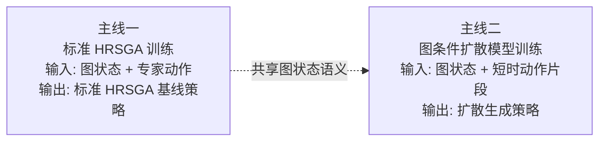
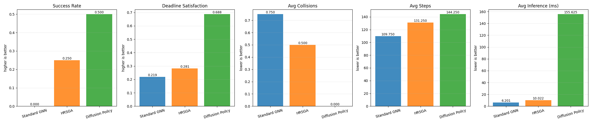
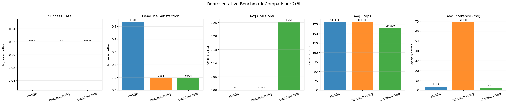
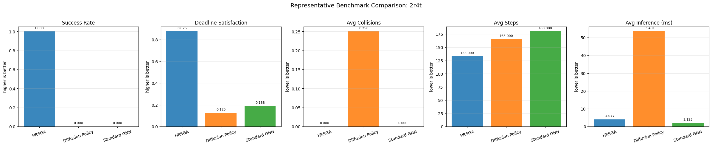
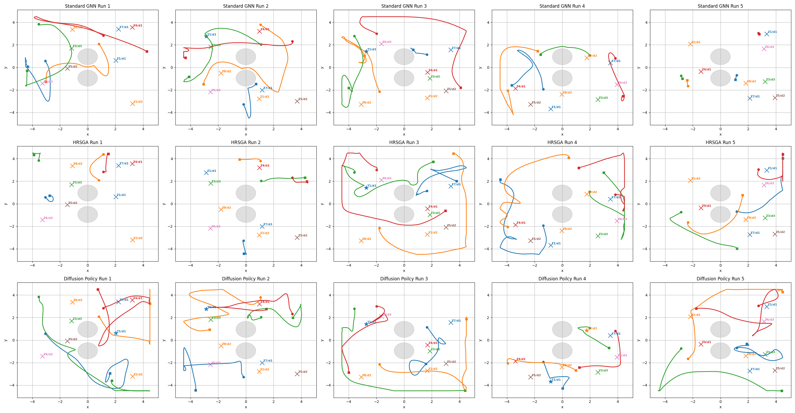
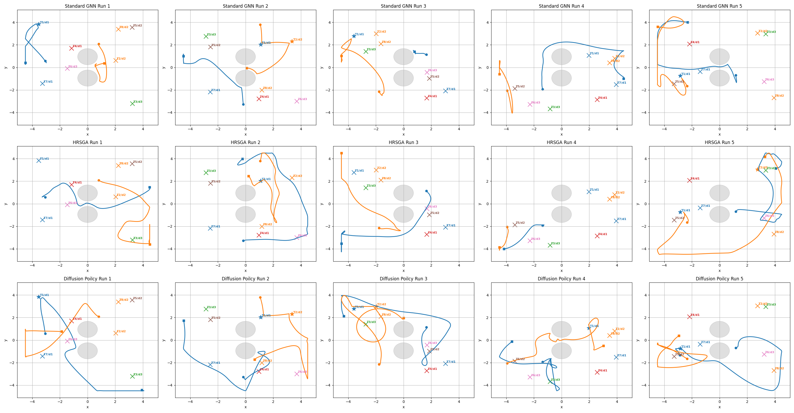
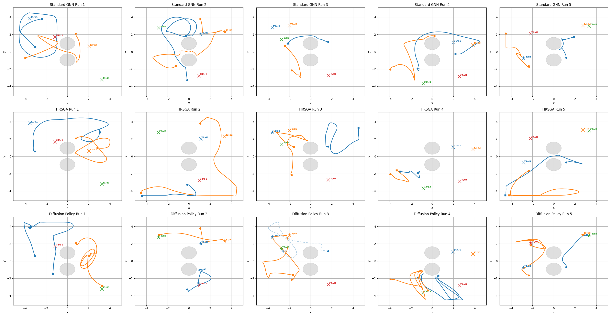
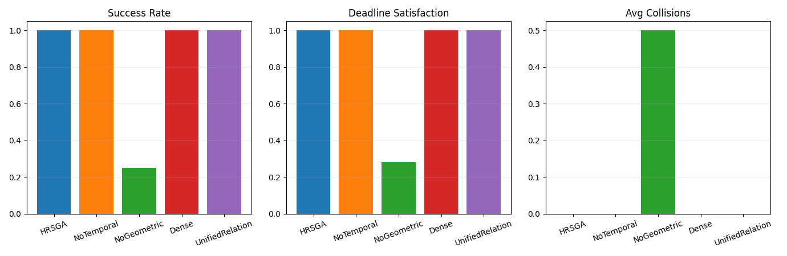

# 面向多机器人多目标遍历的轨迹规划

## 摘要
本文面向多机器人多目标遍历问题，提出一种两阶段学习方法。第一阶段采用异质关系稀疏图注意力网络 HRSGA（Heterogeneous Relational Sparse Graph Attention）学习图状态到联合动作的结构化映射，通过关系类型感知多头注意力、几何与时序联合边偏置、Top-K 稀疏边选择以及两阶段机器人中心式更新，对机器人、任务与障碍之间的关键交互进行建模；第二阶段在相同图状态语义下训练图条件扩散模型（graph-conditioned diffusion model），学习短时联合动作片段分布，并将其直接作为最终执行策略进行评测。基于当前 `4r8t` 与 `2r8t` 的正式结果可见，HRSGA 具备稳定高效的在线闭环性能，而 diffusion model 能够以生成式方式刻画局部多步协同行为，但在直接闭环执行时仍表现出更高的推理代价与更弱的总体稳定性。整体上，本文给出了一个从判别式图策略到生成式轨迹策略的统一两阶段研究框架。

## 1. 介绍
### 1.1 研究背景与问题挑战

随着制造业柔性化、个性化与智能化发展需求的持续提升，多机械臂协同作业模式被广泛应用于各类生产单元。多台独立机械臂在共享工作空间内并行完成抓取、搬运、装配与检测等复杂工序，已成为智能制造的重要实现路径之一[1][2]。与单臂作业相比，多机械臂系统能够显著提升生产效率、空间利用率与任务冗余性，但多体协同也显著增加了运动规划与协作控制的复杂度。

多机械臂规划问题的困难主要体现在两个方面。其一，所有机械臂的联合构型空间维数极高，传统规划算法的计算开销随自由度和机器人数量增加而迅速增长[1][10][11]。其二，多机器人目标选择、时序紧迫性与运动协调之间存在强耦合关系，任务释放时间、截止时间、共享通道冲突和碰撞约束需要被同时考虑，局部决策的不合理往往会导致整体方案不可行[2][4][26][27]。

因此，理想的多机器人规划器应同时具备四项能力：一是可扩展性，即在机器人数量增加时仍保持可控的计算代价；二是协作性，即在共享空间内实现无碰撞且互不阻碍的联合执行；三是闭环性，即能够对动态变化做出实时响应；四是灵活性，即能够适配不同数量、布局和任务组合，而无需对每一种新配置重新设计求解流程[1][2][4]。

### 1.2 现有研究与局限

多机械臂轨迹规划通常可表述为在联合配置空间内同时为所有机械臂生成满足运动学与动力学约束的连续轨迹，并在整个时间域内规避环境障碍和臂间碰撞。传统方法主要包括集中式规划器与去中心化方法。前者如概率路线图（Probabilistic Roadmap, PRM）[10]、快速扩展随机树（Rapidly-exploring Random Tree, RRT）[11] 及其变体，能够利用全局信息生成无碰撞轨迹，但在高维场景中易出现计算复杂度过高、难以实时响应环境变化的问题；后者如多机器人路径规划中的冲突搜索（Conflict-Based Search, CBS）[12]、M*[13] 以及多智能体路径搜索（Multi-Agent Path Finding, MAPF）统一定义框架[14] 所代表的方法，虽然在特定离散场景下具备较好的求解效率，但通常难以直接迁移到高自由度机械臂的紧耦合工作空间。

近年来，基于学习的方法在多机器人规划中得到了广泛研究。Ha 等人[3]通过多智能体强化学习训练去中心化策略，并结合基于采样的运动规划专家演示，提高了学习效率与推理速度。Long 等人[15]和 Sartoretti 等人[16] 分别从深度强化学习和强化学习结合模仿学习的角度出发，探索了多机器人避碰与路径规划的学习式求解。进一步地，图神经网络与强化学习的结合也已被用于多机器人目标选择与协同控制问题[4]。这类方法通常将机器人、任务和障碍物统一表示为图结构，并在大规模仿真中学习策略，从而获得较好的泛化能力与实时性能。

从图表示学习的发展脉络来看，图卷积网络（Graph Convolutional Network, GCN）[17]、GraphSAGE 方法[18] 和神经消息传递框架[19] 为图结构上的局部聚合与关系推理奠定了基础；关系归纳偏置与图网络的系统性讨论进一步说明了图表示在复杂交互建模中的适用性[20]。在此基础上，图注意力网络（Graph Attention Network, GAT）[5] 证明了基于邻域重要性的自适应加权机制能够有效提升图表示能力；异质图注意力网络（Heterogeneous Graph Attention Network, HAN）[6] 则进一步表明，在多类型节点与多类型关系并存的图中，对不同语义通道进行独立建模是必要的。与此同时，关系图卷积网络（Relational Graph Convolutional Network, R-GCN）[7] 与关系图注意力网络（Relational Graph Attention Network, R-GAT）[8] 为多关系图上的参数共享与关系区分提供了方法基础，使得“按边类型建模”成为关系图学习中的重要思路。在机器人规划方向，Message-Aware Graph Attention Networks[9] 已展示出图注意力机制在大规模多机器人路径规划中的应用潜力，说明显式关系建模对于提升多主体协调效率具有直接价值。

此外，从更广义的注意力机制发展来看，Transformer 模型[21] 的提出使自注意力成为结构化建模的重要工具；Sparse Transformer[22] 和 BigBird[23] 等工作进一步表明，稀疏注意力能够在保持表达能力的同时显著提升长序列或大规模结构上的计算效率。进一步地，图 Transformer 方向的研究，如图 Transformer 的一般化框架[24] 与 Graphormer[25]，说明了将注意力机制推广到图结构并结合结构偏置已成为具有代表性的发展趋势。另一方面，时间窗调度、资源受限项目调度以及时序规划领域的研究[26][27][28] 也说明，在复杂任务系统中显式表示时间约束与资源约束是获得可执行解的重要前提。这些工作共同构成了本文方法设计的理论背景。

然而，已有图策略中的注意力机制往往仍较为轻量，通常仅在边级别进行简单权重调制。这类设计一方面缺乏对不同关系类型语义差异的显式建模，另一方面也没有充分利用几何信息与工作时序信息来刻画边的重要性。在多机器人场景中，上述不足会限制模型对复杂交互关系的表达能力；同时，全连接图所带来的大量低价值边也会增加训练与推理开销。

### 1.3 本文工作与贡献

针对上述问题，本文提出一种面向多机器人多目标遍历的两阶段学习框架。其核心思想是：第一阶段先训练 HRSGA 结构化策略网络，在异质图上完成任务吸引、障碍约束与机器人间协调的统一建模；第二阶段再引入图条件扩散模型，对短时联合动作片段的多峰分布进行离线学习，并将该生成式模型直接视为最终执行策略进行闭环评测。

本文的主要贡献可概括为以下三点：

1. 设计了一种以机器人为中心的异质关系稀疏图注意力主干，在统一表示内同时处理任务吸引、障碍约束与机器人间协同，并通过几何偏置、轻量时序偏置、Top-K 稀疏选择以及两阶段机器人中心式更新提升关系建模效率与协调稳定性。
2. 提出一种图条件扩散模型训练路径，在与 HRSGA 共享图状态语义的前提下学习局部多步联合动作分布，并把扩散采样策略直接作为第二阶段的最终执行策略进行闭环测试。
3. 建立了覆盖 HRSGA 基线、扩散最终策略与 HRSGA 结构消融的统一评估方案，系统比较了判别式图策略与生成式轨迹策略在多机器人多目标遍历任务中的性能差异。

## 2. 相关工作

### 2.1 传统多机器人规划方法

传统多机器人规划方法主要包括集中式规划与去中心化协调两类。集中式方法通常在全局配置空间中直接求解多机器人联合轨迹，能够显式处理碰撞约束，但在高维、多机器人场景下往往面临严重的计算瓶颈[1]。典型代表包括 PRM[10]、RRT[11] 以及针对多主体冲突消解提出的 CBS[12] 与 M*[13] 等方法。去中心化方法通过局部规则、优先级机制或速度障碍模型实现实时协调，尽管在一定程度上降低了计算负担，但通常依赖较强的场景假设和手工设计，难以兼顾复杂约束与全局最优性[14]。

### 2.2 基于学习的多机器人策略

随着深度强化学习的发展，越来越多工作尝试通过学习方法直接从环境状态到机器人动作构建映射。此类方法具有在线推理速度快、适应动态变化能力强等优点。代表性工作包括基于多智能体强化学习的去中心化多臂规划方法[3]，以及面向多机器人避碰和协同路径规划的深度强化学习方法[15][16]。这些方法在一定程度上缓解了高维动作空间和多主体协同带来的训练困难，但通常对输入结构的设计较为敏感，且对多实体关系的表达能力有限。

### 2.3 图表示学习在多机器人规划中的应用

图表示学习为多机器人规划提供了天然的关系建模框架。通过将机器人、任务和障碍物表示为图中的不同实体，图神经网络能够在消息传递过程中显式编码实体之间的交互关系。基础图表示方法如 GCN[17]、GraphSAGE[18] 与神经消息传递框架[19] 为此类建模提供了统一视角，而关系归纳偏置研究则进一步说明了图结构对复杂交互系统建模的重要性[20]。图注意力网络（Graph Attention Network, GAT）[5] 首次将自注意力机制引入图结构学习，使节点能够根据邻域重要性自适应分配权重；异质图注意力网络（Heterogeneous Graph Attention Network, HAN）[6] 则进一步强调了不同类型节点与关系在图表示学习中的独立建模需求。另一方面，关系图卷积网络（R-GCN）[7] 与关系图注意力网络（R-GAT）[8] 为多关系图上的参数化建模提供了基础，使得不同边类型可以通过独立变换或注意力机制进行区分处理。

在机器人规划方向，Message-Aware Graph Attention Networks[9] 已将图注意力机制引入大规模多机器人路径规划任务，表明显式关系建模有助于提升多主体协调效率。进一步地，图神经网络与强化学习的结合也被用于多机器人目标选择与协同控制的联合求解[4]。与此同时，稀疏注意力研究[22][23] 与图 Transformer 研究[24][25] 均表明，在大规模结构化输入上引入稀疏连接和结构偏置，有助于提升模型的效率与表达能力。然而，现有方法中的图注意力机制大多仍停留在统一关系建模或轻量边权重调制层面，对异质关系、几何偏置以及稀疏图结构的联合建模仍然不足。基于此，本文构建一种更适用于多机器人多目标遍历场景的异质关系稀疏图注意力框架。

### 2.4 时间属性与在线决策相关研究

除空间几何与拓扑关系外，多机器人目标遍历过程往往还受到释放时间、截止时间和共享通道竞争等时间属性的共同影响，因此与时间结构相关的规划研究同样构成本文的重要背景。经典调度理论系统讨论了释放时间、截止时间与机器占用等因素对任务可执行性和最优性的影响[26]；资源受限项目调度问题（Resource-Constrained Project Scheduling Problem, RCPSP）及其扩展研究则进一步说明，当共享资源与时间约束并存时，任务排序和资源分配之间存在显著耦合[27]。另一方面，时序规划领域的研究，如 PDDL2.1 对持续动作与时间约束的表达[28]，表明在复杂任务系统中显式建模时间结构是获得可执行规划的重要前提。

不过，上述研究大多侧重符号规划、运筹优化或规则驱动的离线求解，较少直接面向多机器人连续运动决策中的表征学习问题。相较而言，本文关注的是如何将释放时间、截止期和潜在冲突时间差等轻量级时间属性转化为注意力分配中的结构偏置，使其能够直接影响图上的关系建模过程。换言之，本文并非试图以注意力模型替代经典调度器，而是将与在线决策最相关的时间约束编码为图注意力中的可学习偏置，用于服务多目标遍历过程中的表示学习与动作选择。

### 2.5 扩散模型与轨迹先验规划

近两年，扩散模型开始被用于机器人轨迹生成与运动规划。相关综述指出，扩散模型的核心优势在于能够学习多峰轨迹分布，并通过逐步去噪过程生成满足复杂几何约束的动作或轨迹先验，这使其特别适合处理抓取、移动操作和受限空间运动中的多模态决策问题[29]。在单机器人运动规划方向，Motion Planning Diffusion 系列工作表明，扩散模型可以作为轨迹分布先验，用于为后续优化或规划过程提供高质量初始化，并通过条件采样适配不同任务目标和约束形式[30][31]。这类方法的关键价值不在于用扩散过程完全替代在线控制器，而在于把原本难以手工编码的“高质量候选轨迹分布”显式建模出来。

在多机器人场景中，扩散模型的潜力主要体现为对联合轨迹多样性和协同模式的建模能力。Multi-Robot Motion Planning with Diffusion Models 进一步表明，扩散生成的联合轨迹能够更自然地覆盖会车、绕障和让行等多峰协同行为，但若要满足严格碰撞约束与联合可行性，通常仍需要与投影、搜索或显式约束筛选过程结合[32]。这意味着，对于本文关注的多机器人多目标遍历问题，扩散模型既可以被理解为局部轨迹先验学习器，也可以被直接看作一种生成式闭环策略候选。基于这一认识，本文将扩散模型明确纳入第二阶段，并直接评估其作为最终执行策略的效果。

## 3. 多机器人多目标遍历问题定义

考虑一个共享障碍环境下的多机器人多目标遍历任务。设系统中包含 $N_r$ 个机器人、$N_t$ 个任务目标以及 $N_o$ 个障碍物。在每个决策时刻，系统状态包含所有机器人的运动学状态、所有任务的位置、完成状态与时间属性，以及障碍物的几何信息。这里的时间属性主要包括任务释放时间、截止时间和优先级等与在线决策直接相关的轻量级信号。目标是在避免碰撞并满足机器人运动约束的前提下，生成协调动作，使全部任务尽可能高效地完成。

本文将环境状态表示为有向异质图

$$
G = (V, E)
$$

其中节点集合由机器人节点 $V_r$、任务节点 $V_t$ 和障碍节点 $V_o$ 构成，边集合由机器人到机器人 $E_{rr}$、任务到机器人 $E_{tr}$、障碍到机器人 $E_{or}$ 三类交互关系组成：

$$
E = E_{rr} \cup E_{tr} \cup E_{or}
$$

每条边都带有关系特征，其中既包含相对位姿、障碍尺寸、可达性相关信息，也包含等待时间、时间窗松弛量和潜在冲突时间差等时间特征。基于上述异质图表示，本文将多机器人多目标遍历问题表述为从图状态到联合动作的映射学习问题：

$$
\pi_\theta : G \mapsto a
$$

其中 $a$ 表示所有机器人的联合动作向量。本文关注的问题是：在统一异质图表示下，如何根据机器人、任务和障碍之间的结构化交互关系，生成满足安全约束并兼顾任务推进效率的多机器人联合动作。

## 4. 方法

本文方法采用两阶段组织。第一阶段训练 HRSGA，得到结构化图策略基线；第二阶段训练图条件扩散模型，学习未来若干步联合动作的生成分布，并把该扩散模型直接作为最终执行策略进行闭环测试。

### 4.1 整体框架

本文方法由两个依次展开的阶段构成。第一阶段是 HRSGA 在线策略学习，它负责在异质图状态上完成实时动作决策；第二阶段是图条件扩散模型学习，它负责在相同图条件下学习短时联合动作片段分布，并在测试时通过反向扩散采样直接输出当前执行动作。因而，本文的重点不是把两个阶段重新合并为单一模型，而是比较结构化图策略与生成式轨迹策略这两类求解路径。

在这一框架中，环境状态被表示为由机器人、任务和障碍物组成的异质图，所有与决策直接相关的信息最终都汇聚到机器人节点表示上。HRSGA 负责把这种结构化状态映射为毫秒级在线动作输出；扩散模型则负责建模同一图状态下未来若干步联合动作的多模态分布，并在闭环执行时通过生成片段的首步动作给出当前控制量。

### 4.2 注意力图网络
 
#### 4.2.1 表示学习与关系建模

HRSGA 采用机器人中心式异质图建模。给定机器人、任务和障碍物节点的原始特征分别为 $x_i^r$、$x_j^t$ 和 $x_k^o$，首先用类型特定编码器映射到共享潜空间：

$$
\begin{aligned}
h_i^r &= E_r(x_i^r), \\
h_j^t &= E_t(x_j^t), \\
h_k^o &= E_o(x_k^o)
\end{aligned}
$$

随后，模型针对三类关系 $c \in \{rr,tr,or\}$ 分别执行关系感知多头注意力。其中，机器人到机器人关系主要编码协调、竞争与避碰，任务到机器人关系主要编码目标吸引、目标竞争与可达性，障碍到机器人关系则编码几何约束与局部风险。对于关系类型 $c$ 下第 $h$ 个头，其 query、key 和 value 定义为：

$$
q_i^{c,h} = W_Q^{c,h} h_i^r,
\quad
k_j^{c,h} = W_K^{c,h} h_j^c,
\quad
v_j^{c,h} = W_V^{c,h} h_j^c
$$

未归一化注意力打分写为：

$$
\ell_{ij}^{c,h} = \frac{(q_i^{c,h})^\top k_j^{c,h}}{\sqrt{d}} + b^{c,h}(e_{ij}^c)
$$

其中 $e_{ij}^c$ 显式编码几何与时间属性。几何部分包括相对位置、距离、相对速度和障碍净间隙，时间部分则主要包括任务释放时间、截止时间、优先级以及潜在冲突时间差等轻量级在线决策信号。归一化注意力权重为：

$$
\alpha_{ij}^{c,h} = \operatorname{softmax}_{j \in \mathcal{N}_i^{c,h}}(\ell_{ij}^{c,h})
$$

为控制复杂度，HRSGA 在每类关系内执行 Top-K 稀疏筛选。于是，原始近似复杂度

$$
O(N_r^2 + N_rN_t + N_rN_o)
$$

被压缩为

$$
O(N_rk_r + N_rk_t + N_rk_o)
$$

其中 $k_r,k_t,k_o$ 分别表示机器人边、任务边和障碍边的保留数。保留边上的消息聚合结果记为：

$$
m_i^{c,h} = \sum_{j \in \mathcal{N}_i^{c,h}} \alpha_{ij}^{c,h} v_j^{c,h}
$$

再经过头间拼接和关系类型投影得到关系级表示：

$$
m_i^c = W_O^c \, \operatorname{Concat}(m_i^{c,1}, \dots, m_i^{c,H})
$$

因此，每个机器人节点最终分别获得机器人协调消息 $m_i^{rr}$、任务引导消息 $m_i^{tr}$ 和障碍约束消息 $m_i^{or}$。这正是当前实现中 HRSGA 保留的核心：关系类型感知、几何与时间联合偏置、以及显式稀疏化建模。

#### 4.2.2 两阶段机器人中心式更新

当前实现仍然保留 HRSGA 最关键的两阶段更新机制，而这恰恰是它区别于轻量级统一图策略的重要部分。模型并不是一次性把三类关系消息直接拼接后更新机器人表示，而是先做“局部可行性”判断，再做“全局协调”判断。

第一阶段只融合任务与障碍关系，用于回答“当前从局部可达性和障碍风险看，机器人更适合怎么推进任务”：

$$
z_i^{loc} = \sigma\left(W_{loc}[h_i^r ; m_i^{tr} ; m_i^{or}]\right)
$$

$$
h_i^{r,(1)} = h_i^r + z_i^{loc} \odot \operatorname{Fuse}_{loc}([h_i^r ; m_i^{tr} ; m_i^{or}])
$$

第二阶段再在中间表示基础上引入机器人到机器人关系，用于回答“在其他机器人也在行动的情况下，当前动作是否会引发通道竞争、会车冲突或让行需求”。令第一阶段的全局上下文为

$$
g^{(1)} = \operatorname{Pool}(\{h_i^{r,(1)}\}_{i=1}^{N_r})
$$

则第二阶段更新为：

$$
z_i^{coord} = \sigma\left(W_{coord}[h_i^{r,(1)} ; m_i^{rr} ; g^{(1)}]\right)
$$

$$
h_i^{r,(2)} = h_i^{r,(1)} + z_i^{coord} \odot \operatorname{Fuse}_{coord}([h_i^{r,(1)} ; m_i^{rr} ; g^{(1)}])
$$

这种“先局部、后协调”的两阶段更新机制，是当前 HRSGA 版本里仍然保留的关键原理。它使模型先形成局部任务可做性判断，再显式考虑机器人间协调，从而降低任务吸引信息与跨机器人竞争信息在同一步更新中相互干扰的风险。

在此基础上，当前实现还支持一条可选的稠密残差分支，以缓解单次 Top-K 边筛选在 representative 高冲突布局中可能遗漏关键信息的问题。若记稀疏主干输出为 $h_i^{sparse}$、稠密补偿输出为 $h_i^{dense}$，则最终机器人表示为：

$$
z_i^{hyb} = \sigma\left(W_{hyb}[h_i^r ; h_i^{sparse} ; h_i^{dense}]\right)
$$

$$
h_i^{r,L} = h_i^{sparse} + z_i^{hyb} \odot h_i^{dense}
$$

最终，机器人表示经过策略头输出二维连续动作：

$$
a_i = s_{max} \tanh(W_a h_i^{r,L} + b_a)
$$

因此，当前版本当然仍然有 HRSGA，而且保留了它最重要的结构性要素：异质关系注意力、Top-K 稀疏筛选，以及两阶段机器人中心式更新。

不过，上述 HRSGA 主干本质上仍然是一个面向当前时刻联合动作输出的判别式策略网络。它能够高效完成在线决策，但对于会车、错峰通过和预定位等依赖短时多步展开的局部协同行为，单步监督信号的表达能力仍然有限。基于这一点，下一节进一步引入图条件扩散模型，用于补充生成式多步动作建模能力。

### 4.3 基于扩散模型的多步动作生成策略

本文只保留两条训练主线。第一条主线是标准 HRSGA 监督训练，用于得到结构化图策略基线；第二条主线是图条件扩散模型训练，用于学习短时动作片段分布，并在测试时直接作为最终执行策略。整个关系如图 1 所示。

图 1. 两阶段方法关系图。第一阶段训练标准 HRSGA 基线策略；第二阶段在相同图状态语义上训练图条件扩散模型，并将该扩散模型直接作为最终执行策略进行闭环评测。

仅依赖单步监督回归时，HRSGA 更容易学到“当前立刻怎么动”，但较难显式刻画会车、错峰通过和预定位这类短时多步协同行为。为此，本文在同一图状态语义之上进一步引入图条件扩散模型，用于直接学习局部多步动作生成分布，并通过反向扩散采样输出当前执行动作。

#### 4.3.1 主线一：标准 HRSGA 训练

第一条主线是标准 HRSGA 训练。该阶段仅使用图状态 $G_t$ 与专家单步动作 $a_t^{expert}$ 进行监督学习，目标是得到一个能够独立部署的在线策略基线。也就是说，仅靠第 4.2 节给出的异质关系注意力、Top-K 稀疏筛选以及两阶段机器人中心式更新，HRSGA 就已经能够直接把当前图状态映射为联合动作输出。

这里的专家动作并不是由人工逐步标注得到，而是由启发式专家控制器在线滚动生成。具体而言，在每个时刻，专家控制器根据当前环境快照分别计算机器人到机器人之间的避碰与让行作用、机器人到任务之间的目标吸引与时序紧迫性作用，以及机器人到障碍物之间的避障斥力；随后仅保留每类关系中得分最高的少量邻居，并对对应作用向量做加权汇聚，最终合成为当前时刻的联合动作。因而，第一阶段训练样本本质上由专家轨迹滚动产生的状态-动作对 $(G_t, a_t^{expert})$ 构成，其中 $a_t^{expert}$ 已经同时编码了局部任务推进、障碍规避和机器人间协调等启发式决策信息。

需要进一步说明的是，尽管系统已经具备启发式专家控制器，但本文仍然有必要学习一个参数化 HRSGA 策略。其原因在于，专家控制器本质上仍是一组人工设计的局部规则组合，主要承担稳定生成监督数据的作用，并不构成本文最终的方法主线；相比之下，HRSGA 则通过统一的图表示学习与前向推理机制，将这些局部决策经验压缩为可部署、可泛化的策略模型。换言之，专家控制器解决的是“监督信号从何而来”，而第一阶段学习解决的是“最终在线部署什么样的结构化图策略基线”的问题。

若记 HRSGA 的策略函数为 $\pi_\theta(G_t)$，则标准训练阶段的监督目标可写为：

$$
L_{\mathrm{HRSGA}} = \frac{1}{|\mathcal{A}|} \sum_{i \in \mathcal{A}} \lVert \pi_\theta(G_t)_i - a_{t,i}^{expert} \rVert_2^2
$$

其中 $\mathcal{A}$ 表示当前时刻的活动机器人集合。经过这一主线训练后，系统已经得到一个可直接用于在线执行的标准 HRSGA 策略，同时也为第二阶段扩散模型提供了共享的图状态语义背景。

#### 4.3.2 主线二：图条件扩散模型训练

第二条主线是图条件扩散模型训练。扩散模型的输入并不是重新设计的一套状态表示，而是与 HRSGA 主干共享同一异质图条件。对于时刻 $t$ 的图状态 $G_t$，系统首先从专家轨迹中构造长度为 $H$ 的短时动作片段：

$$
Y_t = [a_t^{expert}, a_{t+1}^{expert}, \dots, a_{t+H-1}^{expert}]
$$

若轨迹尾部不足 $H$ 步，则用最后一个 expert 动作重复填充。这样，每个监督样本除单步动作标签外，还额外携带一个未来动作片段标签，用于描述“在当前局部状态下，未来几步联合动作应如何展开”。

在条件编码上，扩散模型直接复用与 HRSGA 一致的异质图编码思想，将机器人、任务与障碍关系编码为机器人节点表示；随后对活动机器人表示做 masked mean pooling 与 masked max pooling，得到图条件向量 $c(G_t)$。这一做法的目的是保持第一阶段 HRSGA 与第二阶段扩散模型在状态语义上的一致性，使两阶段比较建立在相同信息基础之上，而不必在两套不一致的状态空间之间做额外对齐。

在扩散步 $\tau$ 下，前向加噪过程为：

$$
\widetilde{Y}_{t,\tau} = \sqrt{\bar{\alpha}_{\tau}}Y_t + \sqrt{1-\bar{\alpha}_{\tau}}\,\varepsilon
$$

其中 $\varepsilon \sim \mathcal{N}(0,I)$。扩散模型将扩散步数 $\tau$ 经正弦位置编码与 MLP 映射为时间嵌入，再将带噪动作片段 $\widetilde{Y}_{t,\tau}$ 通过动作编码器映射为动作隐向量，最后与图条件向量拼接后输入噪声预测头，输出对整段动作片段噪声的估计：

$$
\widehat{\varepsilon} = \varepsilon_\phi(\widetilde{Y}_{t,\tau}, c(G_t), \tau)
$$

其训练目标为标准噪声回归：

$$
L_{diff} = \mathbb{E}_{G_t,Y_t,\varepsilon,\tau}\left[\left\|\varepsilon - \varepsilon_\phi(\widetilde{Y}_{t,\tau}, c(G_t), \tau)\right\|_2^2\right]
$$

当前实现还利用活动机器人 mask 对损失做有效位加权，从而避免无效机器人槽位对训练造成干扰。与直接预测单步动作相比，这里的扩散模型学习的是局部短时联合动作分布，因此更容易吸收会车、绕障、让行与预定位等多模态协同行为模式。

在测试阶段，第二阶段扩散模型直接作为执行策略使用。具体地，在给定图状态 $G_t$ 时，模型从零向量或低温高斯噪声出发，结合当前图条件执行固定步数的反向扩散，逐步恢复出一段合理的未来联合动作片段。记采样得到的片段为 $\widehat{Y}_t$，则这一过程可理解为：在给定图状态 $G_t$ 的条件下，从已学习先验中生成一段与当前局部场景相匹配的短时动作展开方式。

若记第 $\tau$ 个反向步的当前样本为 $Y_{t,\tau}$，扩散模型先预测其中的噪声成分

$$
\widehat{\varepsilon}_{\tau} = \varepsilon_\phi(Y_{t,\tau}, c(G_t), \tau)
$$

再依据反向扩散更新公式，逐步将样本从高噪声状态推进到低噪声状态。随着 $\tau$ 从大到小递减，动作片段中的随机成分被不断去除，最终得到生成片段 $\widehat{Y}_t$。在当前实现中，采样温度参数用于控制初始随机性与反向过程中的扰动强度：当温度取 $0$ 时，扩散模型更接近确定性生成器；当温度略大于 $0$ 时，则允许模型在局部可行轨迹之间保留一定多样性。

闭环执行时，系统取生成片段的首步动作作为当前控制输出：

$$
\widehat{a}_t = \widehat{Y}_t[0]
$$

这样做的原因在于，环境交互接口始终定义为“每一步输出当前时刻联合动作”，因此直接输出整段动作片段会改变部署协议；而首步动作已经携带了扩散模型对局部多步轨迹结构的压缩信息，能够在不改变接口的前提下把生成式多步决策落到当前时刻执行上。从这一意义上说，第二阶段学习得到的 diffusion model 不再只是离线先验模型，而是本文两阶段方法中被直接拿来执行和评测的最终策略。

## 5. 实验

本节围绕本文的两阶段方法展开实验验证。关注的关键问题只有两个：第一，第一阶段 HRSGA 作为结构化图策略，是否能够在多机器人多目标遍历中稳定完成任务、规避碰撞并保持较低推理代价；第二，第二阶段 diffusion model 在直接作为最终执行策略时，是否能够凭借生成式多步动作建模取得更优的闭环表现。

### 5.1 实验设置

实验只保留与本文主创新直接相关的设置。所有正式训练均在二维多机器人多目标遍历环境中进行，场景包含中央双障碍压缩通道、任务释放时间、截止时间和最少驻留步数约束。第一阶段 HRSGA 与第二阶段 diffusion model 使用同一套安全专家数据，其来源为启发式专家控制器，并采用 `expert_max_collisions = 0` 过滤，仅保留无碰撞专家轨迹。正式训练数据共保留 384 条 episode，其中训练集 320 条、验证集 64 条。

统一训练设置为 `4r8t`，即 4 个机器人、8 个任务和 2 个静态障碍物。当前正文中，HRSGA、diffusion model 与 Standard GNN 的正式评测均采用 representative 布局下的 `4r8t`、`2r8t` 和 `2r4t` 三组设置。评价指标包含成功率、平均完成任务数、截止期满足率、平均碰撞次数、碰撞终止率、平均任务距离、平均步长以及可获得时的平均单步推理耗时。

对 HRSGA 主干而言，正式配置采用隐藏维度 128、4 头注意力、Top-K 稀疏关系选择以及两阶段局部-全局融合。对 diffusion model 而言，动作片段长度设置为 $H=4$，条件去噪推理步数为 16，并在训练完成后直接以反向扩散采样产生的首步动作作为闭环控制输出。两阶段模型共享同一图状态语义，但执行机制不同：HRSGA 是单次前向的判别式策略，而 diffusion model 是基于条件去噪的生成式策略。

### 5.2 性能比较

本节给出正式训练完成后的总体性能比较结果。当前保留第一阶段 HRSGA、第二阶段 diffusion model 以及 Standard GNN 基线三类模型。它们均以相同专家数据为训练来源，并在 representative 布局与 strict collision stop 协议下进行正式评测。`4r8t` 用于检验同分布性能，`2r8t` 用于检验“机器人更少但任务压力不减”时的跨规模完成能力，`2r4t` 用于检验“机器人与任务同步缩减”后的闭环稳定性与时间约束完成情况。

从正式聚合统计可以直接看出三类模型在“成功率-任务推进-安全性-推理代价”四个维度上的差异。HRSGA 仍然表现最稳健：在 `4r8t` 与 `2r4t` 两组设置中分别保持 `100%` 成功率与 `0%` 碰撞终止率；在更困难的 `2r8t` 设置中虽未达到全成功，但仍稳定完成平均 6.25 个任务，并始终保持 `0` 碰撞和 `0%` 碰撞终止。作为第二阶段最终执行策略的 diffusion model，在修正零温度采样随机性并加入规划式引导后，`4r8t` 下已提升到 `40.00%` 成功率、平均 `5.95/8` 个任务、`70.62%` 截止期满足率，碰撞终止率下降到 `10.00%`；在 `2r8t` 下成功率仍为 `0%`、平均完成 `1.50/8` 个任务；在 `2r4t` 下同样未取得成功 episode，平均仅完成 `0.50/4` 个任务，且存在 `25.00%` 的碰撞终止。相比之下，Standard GNN 在 `4r8t` 下平均完成 1.75 个任务、`75.00%` 的 episode 因碰撞提前终止；在 `2r8t` 与 `2r4t` 下同样维持较弱的任务推进能力。由此可见，第二阶段 diffusion model 在同分布 `4r8t` 条件下已经明显优于 Standard GNN，并较旧版 diffusion 结果有大幅改善，但跨规模场景下仍明显弱于第一阶段 HRSGA。

图 2 汇总了三类模型在三组设置下的聚合指标对比。可以看到，diffusion model 与 HRSGA 的主要差异不仅体现在成功率和任务完成数上，也体现在推理开销上：修正后的 diffusion model 在 `4r8t`、`2r8t` 和 `2r4t` 下的平均单步推理时间分别达到 `131.35` ms、`68.80` ms 和 `53.43` ms，仍远高于 HRSGA 的 `4.73` ms、`3.64` ms 和 `4.08` ms。这说明第二阶段 diffusion model 虽然通过规划式引导显著改善了同分布闭环质量，但其直接闭环使用仍然面临明显的实时性压力。

图 2. HRSGA、diffusion poilcy 与 Standard GNN 在三组 representative 测试设置上的聚合指标对比。三张子图分别对应 `4r8t`、`2r8t` 和 `2r4t` 设置，统一展示成功率、截止期满足率、平均碰撞数、平均步长和平均单步推理耗时。

在闭环行为层面，HRSGA 与 diffusion model 体现了两种明显不同的决策风格。HRSGA 更倾向于稳定推进并维持较低碰撞风险；diffusion model 则能够生成更丰富的局部动作模式，但在复杂通道协调和长时任务推进上更容易出现中途停滞、碰撞或推进不足。

为了进一步观察三类策略在未固定骨架下的闭环轨迹差异，图 3 给出了 `random` 布局下的三组轨迹对比结果。每组设置均绘制连续 `5` 个测试 episode，并在相同随机种子下同时展示 Standard GNN、HRSGA 与 diffusion poilcy 的完整轨迹。可以看到，在 `4r8t` 随机场景中，HRSGA 通常能够保持更连续的任务推进路径，而 diffusion poilcy 在部分场景下已能表现出接近 HRSGA 的局部协同行为；但在 `2r8t` 与 `2r4t` 两组跨规模随机测试中，diffusion poilcy 仍更容易出现中途停滞、绕行冗余或任务推进不足，这与表 1 中的 formal 聚合统计结论一致。

图 3. random 布局下 Standard GNN、HRSGA 与 diffusion poilcy 的轨迹对比。三张子图分别对应 `4r8t`、`2r8t` 和 `2r4t` 设置，每张图包含 `5` 个测试 episode，并展示相同随机种子条件下三类策略的闭环路径、任务点和障碍分布。

表 1 汇总了当前保留的正式统计。三类模型都在 representative 布局下按统一协议评测；其中 diffusion model 结果来自最新完成的 direct-policy formal benchmark。可以看到，作为第二阶段最终执行策略的 diffusion model 目前尚未超过第一阶段 HRSGA，但其结果仍给出了生成式多步动作策略在该任务中的真实可行性边界。

表 1. Standard GNN、HRSGA 与 diffusion model 在当前保留设置下的正式结果

| 测试设置 | 模型 | 成功率 | 平均完成任务数 | 截止期满足率 | 平均碰撞次数 | 碰撞终止率 | 平均任务距离 | 平均步长 | 平均推理时间/ms |
| --- | --- | --- | --- | --- | --- | --- | --- | --- | --- |
| 4r8t | HRSGA | 100.00% | 8.00 | 100.00% | 0.00 | 0.00% | 0.000 | 113.00 | 4.73 |
| 4r8t | diffusion model | 40.00% | 5.95 | 70.62% | 0.10 | 10.00% | 0.945 | 143.15 | 131.35 |
| 4r8t | Standard GNN | 0.00% | 1.75 | 21.88% | 0.75 | 75.00% | 1.740 | 109.75 | 3.34 |
| 2r8t | HRSGA | 0.00% | 6.25 | 53.12% | 0.00 | 0.00% | 1.528 | 180.00 | 3.64 |
| 2r8t | diffusion model | 0.00% | 1.50 | 9.38% | 0.00 | 0.00% | 2.932 | 180.00 | 68.80 |
| 2r8t | Standard GNN | 0.00% | 0.75 | 9.38% | 0.25 | 25.00% | 3.886 | 164.50 | 2.12 |
| 2r4t | HRSGA | 100.00% | 4.00 | 87.50% | 0.00 | 0.00% | 0.000 | 133.00 | 4.08 |
| 2r4t | diffusion model | 0.00% | 0.50 | 12.50% | 0.25 | 25.00% | 3.103 | 165.00 | 53.43 |
| 2r4t | Standard GNN | 0.00% | 0.75 | 18.75% | 0.00 | 0.00% | 2.248 | 180.00 | 2.13 |

从表 1 可以得到三点结论。首先，在同分布的 `4r8t` 设置下，第一阶段 HRSGA 仍优于第二阶段 diffusion model，但差距已经显著缩小：前者达到 `100%` 成功率和 `8.00` 的平均完成任务数，后者提升到 `40.00%` 成功率和 `5.95` 的平均完成任务数，且碰撞终止率下降到 `10.00%`。这说明规划式引导和确定性采样修正后，diffusion model 已经具备更强的同分布任务推进能力，但在稳定性和实时性上仍不如结构化图策略。

其次，在更困难的 `2r8t` 设置下，HRSGA 虽然同样未能在 180 步预算内完成全部任务，但仍能稳定完成平均 `6.25` 个任务；而 diffusion model 仅完成平均 `1.50` 个任务，截止期满足率只有 `9.38%`，平均任务距离增大到 `2.932`。这表明第二阶段 diffusion model 在高负载跨规模场景下尚未表现出比第一阶段 HRSGA 更强的任务推进能力。

再次，在 `2r4t` 设置下，HRSGA 保持 `100%` 成功率，而 diffusion model 和 Standard GNN 均未取得成功 episode；其中 diffusion model 平均只完成 `0.50/4` 个任务，并伴随 `25.00%` 的碰撞终止，整体甚至弱于 Standard GNN 的 `0.75/4` 任务推进。这说明第二阶段 diffusion model 的问题并不只出现在高负载 `2r8t`，在同步缩减规模的 `2r4t` 下也尚未恢复稳定闭环能力。综合三组结果，本文更稳妥的判断是：第二阶段 diffusion model 经过推理改进后已在同分布 `4r8t` 上展现出可观提升，但在现有设置下，第一阶段 HRSGA 仍是整体性能和实时性都更优的主策略。

### 5.3 消融实验

为分析各结构组件在正式协议下的独立贡献，本文在与主实验完全一致的 `4r8t` 训练设置上重新训练了四类消融版本：去除时序偏置（NoTemporal）、去除几何偏置（NoGeometric）、去除稀疏关系约束并退化为 Dense 版本，以及去除异质关系分通道建模并使用统一关系参数（UnifiedRelation）。所有消融模型均采用与主实验一致的安全 expert 过滤、representative rollout checkpoint 选择和 strict collision stop 测试协议，因此表 2 与表 1 可直接比较，只是表 2 更聚焦于同分布 `4r8t` 条件下不同结构组件的独立作用。

表 2. representative 布局下 4r8t 正式消融实验结果

| 模型变体 | 成功率 | 平均完成任务数 | 截止期满足率 | 平均碰撞次数 | 碰撞终止率 | 平均任务距离 | 平均步长 | 平均推理时间/ms |
| --- | --- | --- | --- | --- | --- | --- | --- | --- |
| 完整 HRSGA | 100.00% | 8.00 | 100.00% | 0.00 | 0.00% | 0.000 | 113.00 | 4.34 |
| 去时序偏置 | 100.00% | 8.00 | 100.00% | 0.00 | 0.00% | 0.000 | 113.50 | 5.03 |
| 去几何偏置 | 25.00% | 2.25 | 28.12% | 0.50 | 50.00% | 2.811 | 131.25 | 5.35 |
| 去稀疏化（Dense） | 100.00% | 8.00 | 100.00% | 0.00 | 0.00% | 0.000 | 113.25 | 5.22 |
| 去异质关系分通道（Unified Relation） | 100.00% | 8.00 | 100.00% | 0.00 | 0.00% | 0.000 | 116.50 | 5.27 |

从表 2 可以得到三点结论。首先，几何偏置仍然是 HRSGA 中最关键的性能来源。去除几何偏置后，成功率直接下降到 `25.00%`，平均完成任务数降到 `2.25`，截止期满足率仅剩 `28.12%`，碰撞终止率升至 `50.00%`，平均未完成任务距离也增大到 `2.811`。这说明在 representative `4r8t` 场景中，几何信息直接决定机器人是否能够建立有效的可达性判断、通道选择和避障行为；一旦缺少显式几何偏置，模型即使保留了其余结构，也难以维持稳定的闭环执行。

其次，在 representative `4r8t` 协议下，去时序偏置并未带来明显的任务质量下降。NoTemporal 版本在 20 次测试中同样达到 `100%` 成功率、`100%` 截止期满足率和 `0%` 碰撞终止，只是平均步长从 113.00 增加到 113.50，平均推理时间从 4.34 ms 上升到 5.03 ms。该结果表明，在固定骨架、固定任务规模的同分布场景中，性能瓶颈主要来自几何冲突协调，而不是任务时序区分；时序偏置的贡献更可能体现在 5.2 所示的跨规模高负载比较中。

再次，Dense 和 UnifiedRelation 两个版本在 `4r8t` 同分布测试中都保持了与完整 HRSGA 相同的成功率、截止期满足率和碰撞统计，但在线代价明显更高。Dense 版本的平均步长为 113.25，与完整模型几乎相同，但平均推理时间上升到 5.22 ms；UnifiedRelation 版本同样保持满成功，但平均步长增加到 116.50，平均推理时间上升到 5.27 ms。相比之下，完整 HRSGA 在保持满成功与零碰撞的同时，仅需 4.34 ms 的平均单步推理时间，因此从“性能-代价”权衡看仍是更稳妥的主模型选择。

图 5. representative 布局下 4r8t 正式消融实验的聚合结果对比。图中依次展示成功率、截止期满足率和平均碰撞次数。

综合来看，正式消融结果支持如下判断：几何先验是 HRSGA 在线主干取得稳定性能的决定性组成部分；而时序偏置、稀疏-稠密混合结构和异质关系分通道建模，在 `4r8t` representative 同分布协议下主要影响的是效率边界与部署代价，而不是是否能够达到满成功。结合 5.2 的跨规模比较结果，本文仍采用完整 HRSGA 作为当前性能更优的主模型；而 diffusion 模块则代表了一条值得继续强化的第二阶段生成式策略方向。

## 6. 结论

本文提出了面向多机器人多目标遍历的两阶段学习方法。第一阶段以 HRSGA 作为结构化图策略主干，通过关系类型感知注意力、几何与时序联合边偏置、Top-K 稀疏选择以及两阶段机器人中心式更新，在统一图策略中同时处理任务吸引、障碍约束与机器人间协调；第二阶段训练图条件 diffusion model，对短时动作片段分布进行生成式建模，并将其直接作为最终执行策略进行闭环评测。

正式实验表明，第一阶段 HRSGA 在 `4r8t` 与 `2r4t` 设置下均达到稳定、高成功率且零碰撞的闭环表现，在更高负载的 `2r8t` 设置下也显著优于 Standard GNN。第二阶段 diffusion model 则能够直接作为最终执行策略运行；在修正零温度随机性并加入规划式引导后，其在 `4r8t` 同分布设置上的成功率、任务完成率和安全性均获得显著改善，但总体上仍弱于 HRSGA，且在 `2r8t`、`2r4t` 两组跨规模设置下尚未恢复稳定闭环能力。

综合全文结果，本文支持如下结论：在当前多机器人多目标遍历任务中，可以将第一阶段 HRSGA 和第二阶段 diffusion model 统一纳入同一研究框架，并把 diffusion model 作为最终执行策略直接评测；但从现有结果看，结构化图策略仍然比生成式扩散策略更稳健。后续工作可以继续围绕更强的扩散条件编码、更高效的反向采样以及更稳健的跨规模泛化展开，以进一步提升第二阶段最终策略的闭环质量。

## 7. 索引

### 7.1 符号索引

- $G$：场景异质图。
- $V$：节点集合。
- $E$：边集合。
- $V_r$：机器人节点集合。
- $V_t$：任务节点集合。
- $V_o$：障碍节点集合。
- $E_{rr}$：机器人到机器人关系边。
- $E_{tr}$：任务到机器人关系边。
- $E_{or}$：障碍到机器人关系边。
- $N_r$：机器人数量。
- $N_t$：任务数量。
- $N_o$：障碍数量。
- $x_i^r, x_j^t, x_k^o$：机器人、任务、障碍的原始输入特征。
- $h_i^r, h_j^t, h_k^o$：对应节点的隐空间表示。
- $H$：多头注意力的头数。
- $d$：单个注意力头的特征维度。
- $q_i^{c,h}, k_j^{c,h}, v_j^{c,h}$：第 $h$ 个头在关系类型 $c$ 下的 query、key、value。
- $W_Q^{c,h}, W_K^{c,h}, W_V^{c,h}$：关系类型 $c$ 下第 $h$ 个注意力头的 query、key、value 投影矩阵。
- $e_{ij}^c$：关系类型 $c$ 下边 $(j \to i)$ 的边特征。
- $\Delta t_{ij}^{conf}$：机器人 $i$ 与机器人 $j$ 到达潜在冲突区域的时间差。
- $\rho_{ij}^{yield}$：机器人间由优先级或任务紧迫性导出的让行标记。
- $b^{c,h}(\cdot)$：关系类型 $c$ 下第 $h$ 个头的边偏置函数。
- $\ell_{ij}^{c,h}$：未归一化注意力打分。
- $\mathcal{N}_i^{c,h}$：机器人 $i$ 在关系类型 $c$ 的第 $h$ 个头下经稀疏筛选后保留的邻居集合。
- $\alpha_{ij}^{c,h}$：归一化注意力权重。
- $m_i^{c,h}$：机器人节点在关系类型 $c$ 的第 $h$ 个头下聚合得到的消息表示。
- $m_i^c$：机器人节点从关系通道 $c$ 聚合得到的消息表示。
- $W_O^c$：关系类型 $c$ 下的输出投影矩阵。
- $k_r, k_t, k_o$：机器人边、任务边和障碍边在 Top-K 稀疏化中分别保留的边数。
- $g^{(1)}$：第一阶段机器人中间表示池化得到的全局上下文向量。
- $\text{Pool}(\cdot)$：置换不变的池化聚合算子。
- $z_i^{loc}, z_i^{coord}, z_i^{hyb}$：局部融合、协调融合和稀疏-稠密混合阶段的门控向量。
- $W_{loc}, W_{coord}, W_{hyb}$：生成相应门控向量的线性映射矩阵。
- $\sigma(\cdot)$：逐元素 Sigmoid 激活函数。
- $\odot$：逐元素乘法。
- $\hat{h}_i^r$：融合更新后的机器人节点表示。
- $h_i^{r,(1)}$：第一阶段局部融合后得到的机器人中间表示。
- $h_i^{r,(2)}$：第二阶段协调融合后得到的机器人中间表示。
- $\text{Fuse}_{loc}(\cdot)$：面向任务可行性与障碍风险的局部融合模块。
- $\text{Fuse}_{coord}(\cdot)$：面向机器人间协调的全局融合模块。
- $h_i^{r,L}$：第 $L$ 层 HRSGA 模块输出的机器人节点表示。
- $\widetilde{h}_i^r$：融合动作条件后的机器人节点表示。
- $a_i$：第 $i$ 个机器人的动作输出。
- $s_{max}$：动作幅值上界。
- $W_a, b_a$：策略头的线性变换参数。
- $\text{MLP}_{actor}(\cdot)$：策略头网络，用于根据最终机器人表示生成动作。
- $\tanh(\cdot)$：双曲正切激活函数，用于对连续动作进行有界映射。
- $a$：所有机器人动作拼接形成的联合动作向量。
- $\text{MLP}_{act}(\cdot)$：动作条件编码器，用于联合编码机器人表示与动作。
- $\text{MLP}_{Q}(\cdot)$：价值头网络，用于输出状态动作价值估计。
- $\mathcal{A}$：当前仍处于活动状态的机器人集合。
- $a_i^{expert}$：机器人 $i$ 的专家动作。
- $L_{IL}$：监督模仿学习主损失。
- $S$：验证阶段的 checkpoint 选择分数。
- $R_{succ}$：成功率。
- $R_{ddl}$：截止时间满足率。
- $C$：平均碰撞次数。
- $R_{stop}$：因碰撞提前终止的比例。
- $Q(G,a)$：状态动作价值函数。

### 7.2 缩写索引

- HRSGA：Heterogeneous Relational Sparse Graph Attention。
- GNN：Graph Neural Network，图神经网络。
- RL：Reinforcement Learning，强化学习。
- GAT：Graph Attention Network，图注意力网络。
- Attention：注意力机制，用于对不同对象分配不同关注权重。
- Multi-Head Attention：多头注意力，通过多个并行注意力头从不同角度建模同一组交互关系。
- Graph Attention：图注意力，将注意力机制用于图结构中的邻居选择与信息聚合。
- Heterogeneous Graph Attention：异质图注意力，针对不同节点类型和关系类型分别建模注意力。
- Multi-Head Graph Attention：多头图注意力，在图注意力框架中并行使用多个注意力头。
- Geometric Bias：几何偏置，将相对位姿、距离、可达性和障碍几何等信息直接注入注意力打分。
- Temporal Bias：时序偏置，将释放时间、截止时间、优先级和冲突时间差等信息直接注入注意力打分。
- Dual Bias：双偏置，指几何偏置与时序偏置的联合建模。
- Sparse Edge Selection：稀疏边选择，仅保留对当前决策最关键的交互边。
- Top-K Sparsification：Top-K 稀疏化，对每个节点仅保留分数最高的前 K 条边。
- Relation-Type-Aware Attention：关系类型感知注意力，针对不同关系类型使用不同的注意力参数。
- Robot-Centric Fusion：机器人中心式融合，将多源关系信息汇聚到机器人节点表示上。
- Actor-Critic：行动者-评论家框架，在本文中作为可选强化学习扩展，其中 Actor 负责生成动作，Critic 负责评估动作价值。
- Query：查询向量，表示当前节点希望从邻居中检索什么信息。
- Key：键向量，表示节点可供匹配的特征。
- Value：值向量，表示节点在被关注后实际传递的信息。
- RRT：Rapidly-exploring Random Tree。
- PRM：Probabilistic Roadmap。

### 7.3 参考文献

[1] Madridano Á, Al-Kaff A, Martín D, et al. Trajectory planning for multi-robot systems: Methods and applications[J]. Expert Systems with Applications, 2021, 173: 114660.
[2] Zhen-Guo Z, Jian-Xu M, Hao-Ran T, et al. A review of task allocation and motion planning for multi-robot in major equipment manufacturing[J]. Acta Automatica Sinica, 2024, 50(1): 21-41.
[3] Ha H, Xu J, Song S. Learning a decentralized multi-arm motion planner[J]. arXiv preprint arXiv:2011.02608, 2020.
[4] Lai M, Go K, Li Z, et al. RoboBallet: Planning for multirobot reaching with graph neural networks and reinforcement learning[J]. Science Robotics, 2025, 10(106): eads1204.
[5] Veličković P, Cucurull G, Casanova A, Romero A, Liò P, Bengio Y. Graph Attention Networks[C]//International Conference on Learning Representations. 2018.
[6] Wang X, Ji H, Shi C, Wang B, Ye Y, Cui P, Yu P S. Heterogeneous Graph Attention Network[C]//Proceedings of the World Wide Web Conference. 2019: 2022-2032.
[7] Schlichtkrull M, Kipf T N, Bloem P, van den Berg R, Titov I, Welling M. Modeling Relational Data with Graph Convolutional Networks[C]//The Semantic Web: 15th International Conference, ESWC 2018. 2018: 593-607.
[8] Busbridge D, Sherburn D, Cavallo P, Hammerla N Y. Relational Graph Attention Networks[J]. arXiv preprint arXiv:1904.05811, 2019.
[9] Li J, Ruml W, Koenig S, Ma H. Message-Aware Graph Attention Networks for Large-Scale Multi-Robot Path Planning[J]. IEEE Robotics and Automation Letters, 2021, 6(3): 5533-5540.
[10] Kavraki L E, Švestka P, Latombe J C, Overmars M H. Probabilistic Roadmaps for Path Planning in High-Dimensional Configuration Spaces[J]. IEEE Transactions on Robotics and Automation, 1996, 12(4): 566-580.
[11] LaValle S M. Rapidly-Exploring Random Trees: A New Tool for Path Planning[R]. Computer Science Department, Iowa State University, 1998.
[12] Sharon G, Stern R, Felner A, Sturtevant N R. Conflict-Based Search for Optimal Multi-Agent Pathfinding[J]. Artificial Intelligence, 2015, 219: 40-66.
[13] Wagner G, Choset H. Subdimensional Expansion for Multirobot Path Planning[J]. Artificial Intelligence, 2015, 219: 1-24.
[14] Stern R, Sturtevant N R, Felner A, et al. Multi-Agent Pathfinding: Definitions, Variants, and Benchmarks[C]//Proceedings of the International Symposium on Combinatorial Search. 2019, 10(1): 151-159.
[15] Long P, Fan T, Liao X, Liu W, Zhang H, Pan J. Towards Optimally Decentralized Multi-Robot Collision Avoidance via Deep Reinforcement Learning[C]//2018 IEEE International Conference on Robotics and Automation. 2018: 6252-6259.
[16] Sartoretti G, Kerr J, Shi Y, et al. PRIMAL: Pathfinding via Reinforcement and Imitation Multi-Agent Learning[J]. IEEE Robotics and Automation Letters, 2019, 4(3): 2378-2385.
[17] Kipf T N, Welling M. Semi-Supervised Classification with Graph Convolutional Networks[C]//International Conference on Learning Representations. 2017.
[18] Hamilton W, Ying Z, Leskovec J. Inductive Representation Learning on Large Graphs[C]//Advances in Neural Information Processing Systems. 2017, 30.
[19] Gilmer J, Schoenholz S S, Riley P F, Vinyals O, Dahl G E. Neural Message Passing for Quantum Chemistry[C]//Proceedings of the 34th International Conference on Machine Learning. 2017: 1263-1272.
[20] Battaglia P W, Hamrick J B, Bapst V, et al. Relational Inductive Biases, Deep Learning, and Graph Networks[J]. arXiv preprint arXiv:1806.01261, 2018.
[21] Vaswani A, Shazeer N, Parmar N, et al. Attention Is All You Need[C]//Advances in Neural Information Processing Systems. 2017, 30.
[22] Child R, Gray S, Radford A, Sutskever I. Generating Long Sequences with Sparse Transformers[J]. arXiv preprint arXiv:1904.10509, 2019.
[23] Zaheer M, Guruganesh G, Dubey K A, et al. Big Bird: Transformers for Longer Sequences[J]. Advances in Neural Information Processing Systems, 2020, 33: 17283-17297.
[24] Dwivedi V P, Bresson X. A Generalization of Transformer Networks to Graphs[J]. arXiv preprint arXiv:2012.09699, 2021.
[25] Ying C, Cai T, Luo S, et al. Do Transformers Really Perform Bad for Graph Representation?[C]//Advances in Neural Information Processing Systems. 2021, 34: 28877-28888.
[26] Pinedo M L. Scheduling: Theory, Algorithms, and Systems[M]. 5th ed. Cham: Springer, 2016.
[27] Hartmann S, Briskorn D. A survey of variants and extensions of the resource-constrained project scheduling problem[J]. European Journal of Operational Research, 2010, 207(1): 1-14.
[28] Fox M, Long D. PDDL2.1: An extension to PDDL for expressing temporal planning domains[J]. Journal of Artificial Intelligence Research, 2003, 20: 61-124.
[29] Wolf R, Shi Y, Liu S, Rayyes R. Diffusion Models for Robotic Manipulation: A Survey[J]. arXiv preprint arXiv:2504.08438, 2025.
[30] Carvalho J, Le A T, Baierl M, Koert D, Peters J. Motion Planning Diffusion: Learning and Planning of Robot Motions with Diffusion Models[J]. arXiv preprint arXiv:2308.01557, 2023.
[31] Carvalho J, Le A, Kicki P, Koert D, Peters J. Motion Planning Diffusion: Learning and Adapting Robot Motion Planning with Diffusion Models[J]. arXiv preprint arXiv:2412.19948, 2024.
[32] Shaoul Y, Mishani I, Vats S, Li J, Likhachev M. Multi-Robot Motion Planning with Diffusion Models[J]. arXiv preprint arXiv:2410.03072, 2024.
