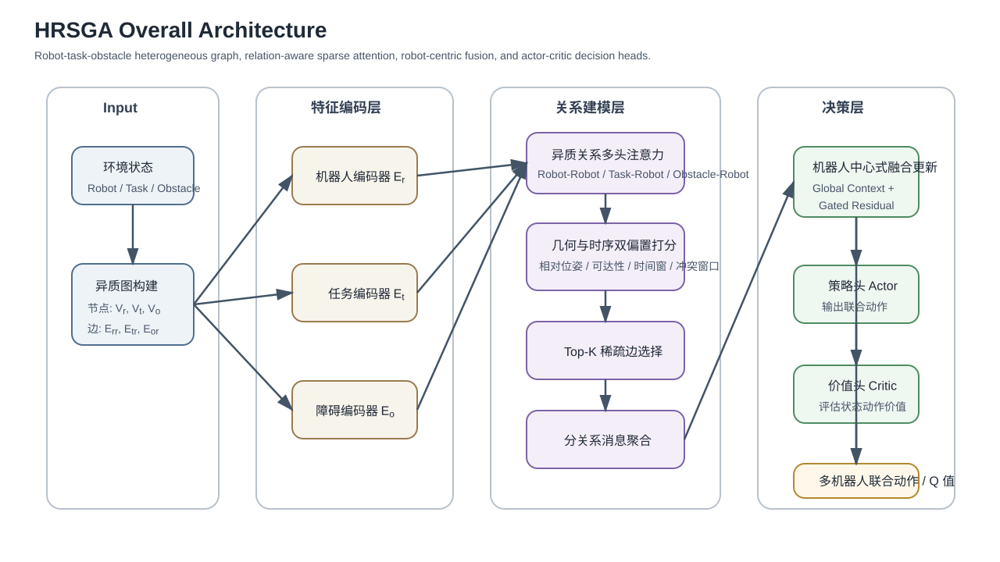
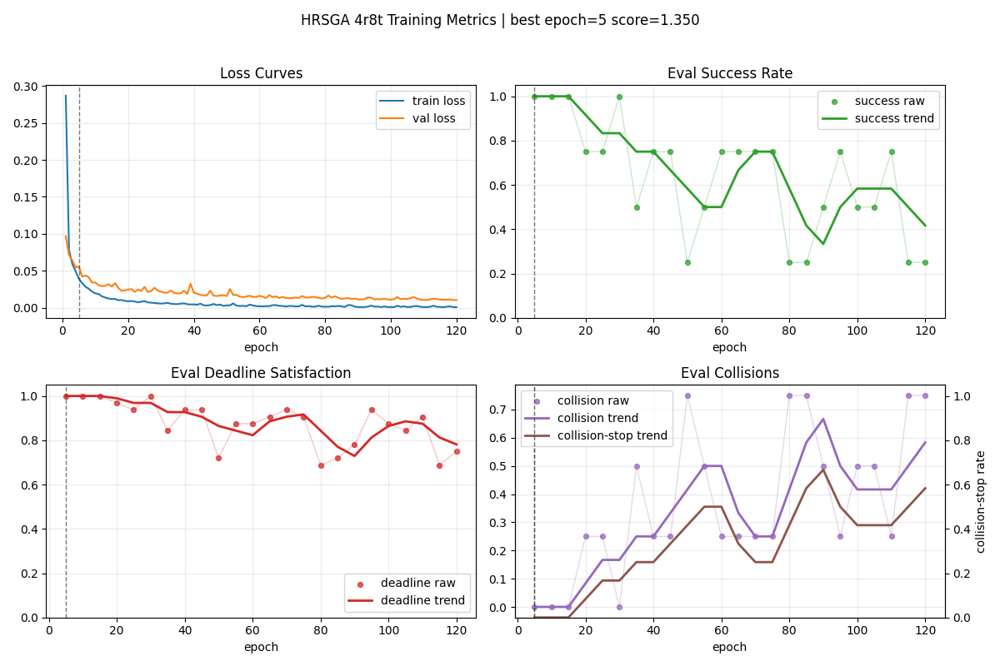
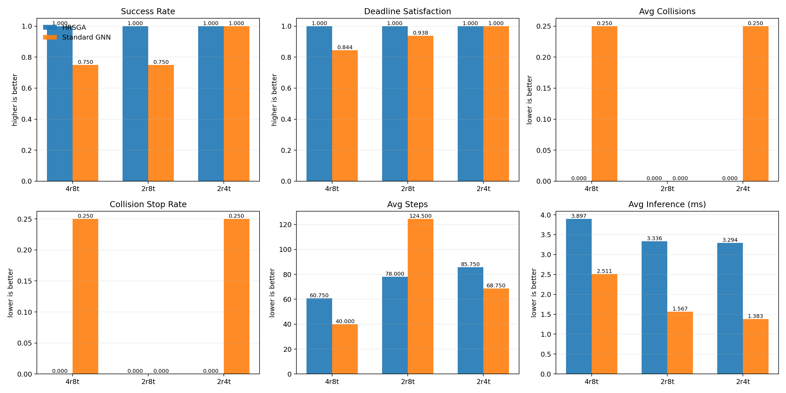
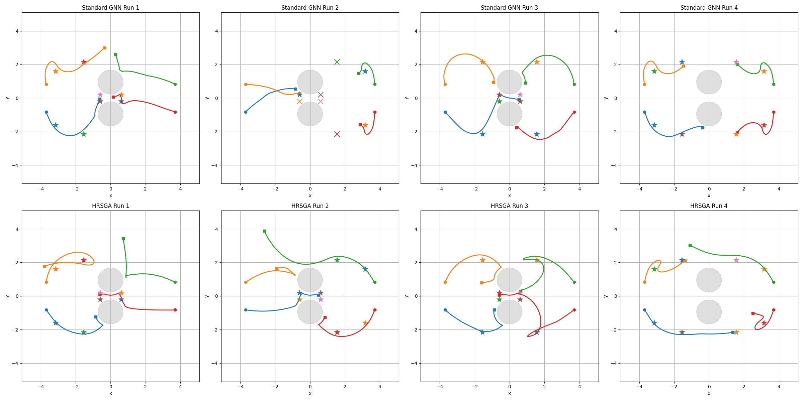
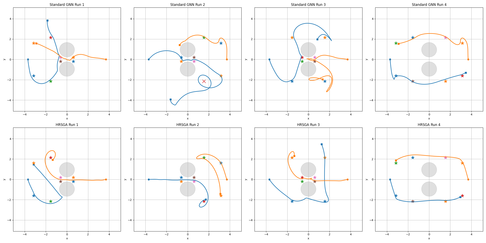
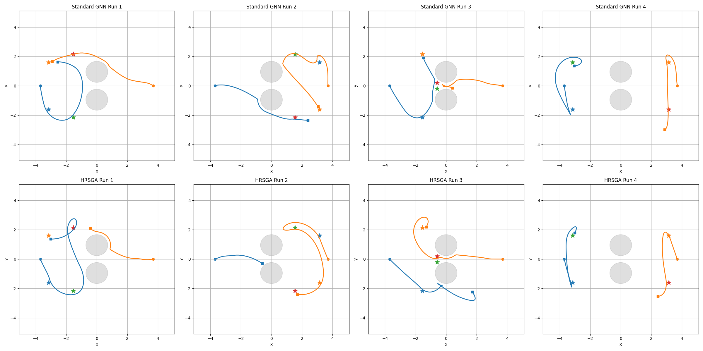

# 面向多机器人多目标遍历的异质关系稀疏图注意力网络

## 摘要
本文提出了一种面向多机器人多目标遍历的异质关系稀疏图注意力网络，记为 HRSGA（Heterogeneous Relational Sparse Graph Attention）。该结构以机器人、任务和障碍物构成的异质图为输入，引入关系类型感知的多头注意力机制、几何与时序联合驱动的边重要性评估，以及基于 Top-K 的稀疏边选择策略。当前实现进一步采用局部可行性与全局协调分离的两阶段机器人中心式融合，并在稀疏关系主干之外加入稠密残差分支以增强分布外鲁棒性。实验采用 4r8t 训练、4r8t/2r8t/2r4t 三组 representative 测试和同协议消融分析。结果表明，HRSGA 在三组测试中均保持 100% 成功率与 0 碰撞终止，显著优于 Standard GNN；消融结果进一步说明，几何偏置是决定性能的关键组成部分，而时序偏置、稀疏-稠密混合结构和异质关系分通道建模更多影响效率边界与跨设置鲁棒性。本文工作为多机器人多目标遍历中的关系建模提供了一种可扩展且实验上可验证的图策略框架。

## 1. 介绍
### 1.1 研究背景与问题挑战

随着制造业柔性化、个性化与智能化发展需求的持续提升，多机械臂协同作业模式被广泛应用于各类生产单元。多台独立机械臂在共享工作空间内并行完成抓取、搬运、装配与检测等复杂工序，已成为智能制造的重要实现路径之一[1][2]。与单臂作业相比，多机械臂系统能够显著提升生产效率、空间利用率与任务冗余性，但多体协同也显著增加了运动规划与协作控制的复杂度。

多机械臂规划问题的困难主要体现在两个方面。其一，所有机械臂的联合构型空间维数极高，传统规划算法的计算开销随自由度和机器人数量增加而迅速增长[1][10][11]。其二，多机器人目标选择、时序紧迫性与运动协调之间存在强耦合关系，任务释放时间、截止时间、共享通道冲突和碰撞约束需要被同时考虑，局部决策的不合理往往会导致整体方案不可行[2][4][26][27]。

因此，理想的多机器人规划器应同时具备四项能力：一是可扩展性，即在机器人数量增加时仍保持可控的计算代价；二是协作性，即在共享空间内实现无碰撞且互不阻碍的联合执行；三是闭环性，即能够对动态变化做出实时响应；四是灵活性，即能够适配不同数量、布局和任务组合，而无需对每一种新配置重新设计求解流程[1][2][4]。

### 1.2 现有研究与局限

多机械臂轨迹规划通常可表述为在联合配置空间内同时为所有机械臂生成满足运动学与动力学约束的连续轨迹，并在整个时间域内规避环境障碍和臂间碰撞。传统方法主要包括集中式规划器与去中心化方法。前者如概率路线图（Probabilistic Roadmap, PRM）[10]、快速扩展随机树（Rapidly-exploring Random Tree, RRT）[11] 及其变体，能够利用全局信息生成无碰撞轨迹，但在高维场景中易出现计算复杂度过高、难以实时响应环境变化的问题；后者如多机器人路径规划中的冲突搜索（Conflict-Based Search, CBS）[12]、M*[13] 以及多智能体路径搜索（Multi-Agent Path Finding, MAPF）统一定义框架[14] 所代表的方法，虽然在特定离散场景下具备较好的求解效率，但通常难以直接迁移到高自由度机械臂的紧耦合工作空间。

近年来，基于学习的方法在多机器人规划中得到了广泛研究。Ha 等人[3]通过多智能体强化学习训练去中心化策略，并结合基于采样的运动规划专家演示，提高了学习效率与推理速度。Long 等人[15]和 Sartoretti 等人[16] 分别从深度强化学习和强化学习结合模仿学习的角度出发，探索了多机器人避碰与路径规划的学习式求解。进一步地，图神经网络与强化学习的结合也已被用于多机器人目标选择与协同控制问题[4]。这类方法通常将机器人、任务和障碍物统一表示为图结构，并在大规模仿真中学习策略，从而获得较好的泛化能力与实时性能。

从图表示学习的发展脉络来看，图卷积网络（Graph Convolutional Network, GCN）[17]、GraphSAGE 方法[18] 和神经消息传递框架[19] 为图结构上的局部聚合与关系推理奠定了基础；关系归纳偏置与图网络的系统性讨论进一步说明了图表示在复杂交互建模中的适用性[20]。在此基础上，图注意力网络（Graph Attention Network, GAT）[5] 证明了基于邻域重要性的自适应加权机制能够有效提升图表示能力；异质图注意力网络（Heterogeneous Graph Attention Network, HAN）[6] 则进一步表明，在多类型节点与多类型关系并存的图中，对不同语义通道进行独立建模是必要的。与此同时，关系图卷积网络（Relational Graph Convolutional Network, R-GCN）[7] 与关系图注意力网络（Relational Graph Attention Network, R-GAT）[8] 为多关系图上的参数共享与关系区分提供了方法基础，使得“按边类型建模”成为关系图学习中的重要思路。在机器人规划方向，Message-Aware Graph Attention Networks[9] 已展示出图注意力机制在大规模多机器人路径规划中的应用潜力，说明显式关系建模对于提升多主体协调效率具有直接价值。

此外，从更广义的注意力机制发展来看，Transformer 模型[21] 的提出使自注意力成为结构化建模的重要工具；Sparse Transformer[22] 和 BigBird[23] 等工作进一步表明，稀疏注意力能够在保持表达能力的同时显著提升长序列或大规模结构上的计算效率。进一步地，图 Transformer 方向的研究，如图 Transformer 的一般化框架[24] 与 Graphormer[25]，说明了将注意力机制推广到图结构并结合结构偏置已成为具有代表性的发展趋势。另一方面，时间窗调度、资源受限项目调度以及时序规划领域的研究[26][27][28] 也说明，在复杂任务系统中显式表示时间约束与资源约束是获得可执行解的重要前提。这些工作共同构成了本文方法设计的理论背景。

然而，已有图策略中的注意力机制往往仍较为轻量，通常仅在边级别进行简单权重调制。这类设计一方面缺乏对不同关系类型语义差异的显式建模，另一方面也没有充分利用几何信息与工作时序信息来刻画边的重要性。在多机器人场景中，上述不足会限制模型对复杂交互关系的表达能力；同时，全连接图所带来的大量低价值边也会增加训练与推理开销。

### 1.3 本文工作与贡献

针对上述问题，本文提出一种面向多机器人多目标遍历的异质关系稀疏图注意力网络 HRSGA。该方法以机器人、任务和障碍物构成的异质图为基础，通过关系类型感知的多头注意力机制、几何与时序联合驱动的边重要性评估以及基于 Top-K 的稀疏边选择，实现对多机器人关键交互关系的精细建模。

本文的主要贡献可概括为以下三点：

1. 提出一种面向多机器人多目标遍历的异质关系图注意力框架，通过机器人中心式两阶段融合，将任务竞争、空间避障与机器人间协调统一到同一图策略中。
2. 提出几何属性、时间属性与稀疏关系选择相结合的状态编码与关系建模方式，并通过正式消融实验明确区分了“决定性能的关键因素”和“主要影响效率与泛化余量的结构因素”。
3. 构建一套覆盖同分布测试、跨规模测试和同协议消融分析的实验评估方案，系统验证了 HRSGA 相对 Standard GNN 的性能优势及其结构敏感性。

## 2. 相关工作

### 2.1 传统多机器人规划方法

传统多机器人规划方法主要包括集中式规划与去中心化协调两类。集中式方法通常在全局配置空间中直接求解多机器人联合轨迹，能够显式处理碰撞约束，但在高维、多机器人场景下往往面临严重的计算瓶颈[1]。典型代表包括 PRM[10]、RRT[11] 以及针对多主体冲突消解提出的 CBS[12] 与 M*[13] 等方法。去中心化方法通过局部规则、优先级机制或速度障碍模型实现实时协调，尽管在一定程度上降低了计算负担，但通常依赖较强的场景假设和手工设计，难以兼顾复杂约束与全局最优性[14]。

### 2.2 基于学习的多机器人策略

随着深度强化学习的发展，越来越多工作尝试通过学习方法直接从环境状态到机器人动作构建映射。此类方法具有在线推理速度快、适应动态变化能力强等优点。代表性工作包括基于多智能体强化学习的去中心化多臂规划方法[3]，以及面向多机器人避碰和协同路径规划的深度强化学习方法[15][16]。这些方法在一定程度上缓解了高维动作空间和多主体协同带来的训练困难，但通常对输入结构的设计较为敏感，且对多实体关系的表达能力有限。

### 2.3 图表示学习在多机器人规划中的应用

图表示学习为多机器人规划提供了天然的关系建模框架。通过将机器人、任务和障碍物表示为图中的不同实体，图神经网络能够在消息传递过程中显式编码实体之间的交互关系。基础图表示方法如 GCN[17]、GraphSAGE[18] 与神经消息传递框架[19] 为此类建模提供了统一视角，而关系归纳偏置研究则进一步说明了图结构对复杂交互系统建模的重要性[20]。图注意力网络（Graph Attention Network, GAT）[5] 首次将自注意力机制引入图结构学习，使节点能够根据邻域重要性自适应分配权重；异质图注意力网络（Heterogeneous Graph Attention Network, HAN）[6] 则进一步强调了不同类型节点与关系在图表示学习中的独立建模需求。另一方面，关系图卷积网络（R-GCN）[7] 与关系图注意力网络（R-GAT）[8] 为多关系图上的参数化建模提供了基础，使得不同边类型可以通过独立变换或注意力机制进行区分处理。

在机器人规划方向，Message-Aware Graph Attention Networks[9] 已将图注意力机制引入大规模多机器人路径规划任务，表明显式关系建模有助于提升多主体协调效率。进一步地，图神经网络与强化学习的结合也被用于多机器人目标选择与协同控制的联合求解[4]。与此同时，稀疏注意力研究[22][23] 与图 Transformer 研究[24][25] 均表明，在大规模结构化输入上引入稀疏连接和结构偏置，有助于提升模型的效率与表达能力。然而，现有方法中的图注意力机制大多仍停留在统一关系建模或轻量边权重调制层面，对异质关系、几何偏置以及稀疏图结构的联合建模仍然不足。本文工作正是在这一背景下展开，旨在构建一种更适用于多机器人多目标遍历场景的异质关系稀疏图注意力框架。

### 2.4 时间属性与在线决策相关研究

除空间几何与拓扑关系外，多机器人目标遍历过程往往还受到释放时间、截止时间和共享通道竞争等时间属性的共同影响，因此与时间结构相关的规划研究同样构成本文的重要背景。经典调度理论系统讨论了释放时间、截止时间与机器占用等因素对任务可执行性和最优性的影响[26]；资源受限项目调度问题（Resource-Constrained Project Scheduling Problem, RCPSP）及其扩展研究则进一步说明，当共享资源与时间约束并存时，任务排序和资源分配之间存在显著耦合[27]。另一方面，时序规划领域的研究，如 PDDL2.1 对持续动作与时间约束的表达[28]，表明在复杂任务系统中显式建模时间结构是获得可执行规划的重要前提。

不过，上述研究大多侧重符号规划、运筹优化或规则驱动的离线求解，较少直接面向多机器人连续运动决策中的表征学习问题。相较而言，本文关注的是如何将释放时间、截止期和潜在冲突时间差等轻量级时间属性转化为注意力分配中的结构偏置，使其能够直接影响图上的关系建模过程。换言之，本文并非试图以注意力模型替代经典调度器，而是将与在线决策最相关的时间约束编码为图注意力中的可学习偏置，用于服务多目标遍历过程中的表示学习与动作选择。

## 3. 问题定义

考虑一个共享障碍环境下的多机器人到达任务（reaching task）。设系统中包含 $N_r$ 个机器人、$N_t$ 个任务目标以及 $N_o$ 个障碍物。在每个决策时刻，系统状态包含所有机器人的运动学状态、所有任务的位姿、完成状态与时间属性，以及障碍物的几何信息。这里的时间属性主要包括任务释放时间、截止时间和优先级等与在线决策直接相关的轻量级信号。目标是在避免碰撞并满足机器人运动约束的前提下，生成协调动作，使全部任务尽可能高效地完成。

本文将环境状态表示为有向异质图

$$
G = (V, E)
$$

其中$V$为节点集合，$E$为边集合，$G$为图。节点集合由三类实体组成：机器人节点 $V_r$、任务节点 $V_t$ 和障碍节点 $V_o$。边集合由机器人到机器人 $E_{rr}$、任务到机器人 $E_{tr}$、障碍到机器人 $E_{or}$ 之间的交互关系构成：

$$
E = E_{rr} \cup E_{tr} \cup E_{or}
$$

每条边都带有关系特征，其中既包含相对位姿、障碍尺寸、可行性相关信息，也可包含等待时间、时间窗松弛量和潜在冲突时间差等时间特征。

基于上述异质图表示，本文将多机器人规划问题表述为结构化关系状态上的策略学习问题。具体而言，策略网络需综合不同类型节点及其交互边所携带的空间约束、任务耦合及时序信息，并据此学习从图状态到联合动作的映射关系。策略网络学习如下映射：

$$
\pi_\theta : G \mapsto a
$$

其中 $a$ 表示所有机器人的联合动作向量。当前主实验采用监督模仿学习直接训练策略网络从图状态生成联合控制动作；若需要进一步扩展到强化学习设置，则可在同一状态编码器之上附加动作条件价值网络。因而，本文关注的核心问题仍是：如何在统一的图表示框架下，从包含几何关系、任务竞争与时间属性的结构化状态中生成高质量的多机器人联合动作。

尽管统一的图神经网络对所有边做消息传递已经具备良好的扩展性，但轻量级边权重调制并没有显式区分不同关系类型的语义差异。在多机器人场景中，不同关系承担的作用是不同的：

- 机器人到机器人边主要编码协调、竞争与避碰关系。
- 任务到机器人边主要编码目标吸引、目标竞争与可达性。
- 障碍到机器人边主要编码几何约束和局部风险。

如果所有交互共享同一套更新逻辑，模型可能难以充分表达这些差异。进一步地，当任务存在释放时间、截止期或明显不同的紧迫程度时，若注意力中缺少显式时间信息，模型将难以区分“当前应优先处理”与“可以暂缓处理”的目标。与此同时，在任务和障碍数量较大时，全连接图会产生大量低价值边，增加训练和推理成本。因此，需要一种同时具备关系类型感知能力、时间属性感知能力和稀疏化能力的图注意力结构。

## 4. 方法

### 4.1 HRSGA 总体结构

当前多目标版本的 HRSGA 将环境状态表示为以机器人、任务和障碍物为节点的异质图，并以机器人节点作为最终决策载体。与早期“一机器人对应一个固定任务”的设置不同，本文当前实现面向的是“多机器人协同遍历多目标”问题：任务数量 $N_t$ 可以独立于机器人数量 $N_r$ 设置，任意机器人都可以在任务释放后完成任意尚未完成的目标；环境中的 `task_id` 与 `assigned_agent` 仅作为每一步动态更新的参考提示，而不再表示永久绑定关系。

在这一设定下，HRSGA 的整体结构包含五个主要部分：

1. 类型特定的节点编码器，用于分别处理机器人、任务和障碍物的异质特征。
2. 关系类型感知的稀疏注意力模块，用于独立建模机器人-机器人、任务-机器人和障碍-机器人交互。
3. 几何与时间属性联合驱动的边表示，用于显式注入距离、接近趋势、任务释放/截止等先验。
4. 基于 Top-K 的关系内稀疏边筛选，用于抑制低价值交互带来的噪声和计算开销。
5. 两阶段机器人中心式融合与可选稠密残差分支，用于先完成局部任务可行性判断，再完成全局协调决策。

图 1 给出了当前 HRSGA 的总体结构。整体流程可概括为：首先依据环境状态构建异质图；随后使用类型特定编码器将机器人、任务与障碍物映射到共享隐空间；再在三类关系通道内分别进行带边偏置的多头注意力与 Top-K 稀疏聚合；接着，先将任务与障碍信息汇聚到机器人节点，形成局部可执行性表示，再引入机器人间协调信息得到全局动作表示；最后，通过策略头输出每个机器人在当前时刻的二维连续控制动作。若需要强化学习扩展，则可在同一编码器之上附加动作条件价值网络。

图 1. HRSGA 总体结构图

### 4.2 表示学习与关系建模

#### 4.2.1 类型特定的节点编码

给定机器人、任务和障碍节点的原始特征分别为 $x_i^r$、$x_j^t$ 和 $x_k^o$，首先使用三个相互独立的编码器将其映射到共享潜空间：

$$
\begin{aligned}
h_i^r &= E_r(x_i^r), \\
h_j^t &= E_t(x_j^t), \\
h_k^o &= E_o(x_k^o)
\end{aligned}
$$

其中 $E_r$、$E_t$、$E_o$ 均为多层感知机。采用独立编码器的原因在于三类节点携带的语义完全不同：机器人节点描述当前运动状态与局部任务参照，任务节点描述可完成目标的空间位置和时间属性，障碍节点则仅描述静态几何约束。

与固定任务分配版本相比，当前实现中机器人特征不再绑定一个永久拥有的任务，而是引入“动态参考任务”机制。对于机器人 $i$，首先优先读取环境当前给出的参考任务提示；若该提示无效或对应任务已经完成，则在所有未完成任务中选择一个得分最高的临时参考任务 $\tau(i)$。该得分综合了距离、任务是否已释放以及距截止时间的紧迫程度，可写为：

$$
\\tau(i)=\\arg\\max_{j \\in \\mathcal{U}}
\left(
\frac{\alpha_1}{d_{ij}+\varepsilon}
+ \alpha_2 \phi_j^{rel}
+ \frac{\alpha_3}{\Delta t_j^{ddl}+c}
+ \alpha_4 p_j
\right)
$$

其中 $\mathcal{U}$ 表示未完成任务集合，$d_{ij}$ 表示机器人 $i$ 到任务 $j$ 的距离，$\phi_j^{rel}$ 表示任务是否已经释放，$\Delta t_j^{ddl}$ 表示剩余截止时间，$p_j$ 表示任务优先级。这样，机器人节点始终带有一个与当前决策最相关的局部参考任务，而不是被某个固定目标永久绑定。

因此，机器人特征主要包含自身位置、速度、到参考任务的相对位移、该参考任务的释放/截止时间松弛量、剩余任务比例以及参考任务距离；任务特征则包含任务位置、释放与截止信息、优先级、完成标记、是否已释放以及当前最近机器人距离；障碍节点仅保留位置与半径信息。这样得到的编码既保留了当前控制所需的局部动作上下文，也为后续跨机器人协调预留了任务竞争与几何冲突信息。

#### 4.2.2 关系感知多头注意力

在获得类型特定的节点表示后，模型进一步对不同实体之间的交互关系进行显式建模。设关系类型 $c \in \{rr, tr, or\}$，分别表示机器人到机器人、任务到机器人和障碍到机器人关系；设注意力头数为 $H$。对于关系类型 $c$ 下的第 $h$ 个注意力头，接收端机器人节点生成 query，源节点生成 key 与 value：

$$
q_i^{c,h} = W_Q^{c,h} h_i^r,
\quad
k_j^{c,h} = W_K^{c,h} h_j^c,
\quad
v_j^{c,h} = W_V^{c,h} h_j^c
$$

其中当 $c = rr$ 时，$h_j^c$ 为其他机器人隐表示；当 $c = tr$ 时，$h_j^c$ 为任务隐表示；当 $c = or$ 时，$h_j^c$ 为障碍隐表示。该设计保持了“机器人作为统一接收端、其他实体作为信息源”的结构，从而使所有重要约束最终都汇聚到机器人节点表示上。

当前实现同时支持两种关系参数化方式：其一是三类关系各自使用独立的稀疏注意力模块；其二是将边特征先映射到统一隐空间后共享同一套关系注意力权重。前者对应主模型配置，后者用于“去异质关系分通道”的消融实验。

#### 4.2.3 几何与时间属性联合偏置建模

仅依赖节点隐表示进行相似性计算仍不足以表达多机器人遍历问题中的关键决策约束。当前实现中，任务时序不再采用复杂的前驱工序或资源占用建模，而是聚焦于与在线控制直接相关的释放时间、截止时间、优先级和竞争关系；同时，几何结构则通过相对位置、速度、障碍间隙和接近趋势显式注入到边表示中。

设关系边 $(j \to i)$ 在关系类型 $c$ 下的边特征为 $e_{ij}^c$，则第 $h$ 个注意力头的未归一化打分为：

$$
\ell_{ij}^{c,h}
= \frac{(q_i^{c,h})^\top k_j^{c,h}}{\sqrt{d}} + b^{c,h}(e_{ij}^c)
$$

其中 $d$ 表示单头维度，$b^{c,h}(\cdot)$ 表示由边特征映射得到的附加偏置。当前实现中的几类边特征可概括为：

1. 机器人-机器人边 $e_{ij}^{rr}$：相对位置、相对速度、欧氏距离、接近速度、潜在冲突时间差以及让行提示。这里的让行提示并非固定优先规则，而是根据两机器人当前参考任务的截止时间相对先后动态生成。
2. 任务-机器人边 $e_{ij}^{tr}$：机器人到任务的相对位移、距离、任务释放松弛量、截止松弛量、当前是否被分配为参考提示任务、任务优先级以及任务是否已释放。
3. 障碍-机器人边 $e_{ij}^{or}$：机器人到障碍的相对位移、中心距离、几何净间隙和障碍物尺寸。

因此，当前 HRSGA 中所谓“时序偏置”主要对应 release/deadline/priority 这类轻量级可执行性信号，而非复杂调度器中的前驱依赖和资源占用计划。该设计与在线多目标遍历场景更一致：模型需要回答的是“此刻哪个目标更值得去、哪些机器人此刻更容易冲突”，而不是离线求解一个完整工序调度表。

此外，当前代码还支持两类结构消融：若关闭 temporal bias，则会在进入编码器前将与 release/deadline 等相关的特征切片置零；若关闭 geometric bias，则相应地将位置、距离与间隙相关特征置零。这样可以直接评估几何信息与时间信息对决策质量的独立贡献。

#### 4.2.4 稀疏边筛选与关系级聚合

在大规模场景中，机器人-机器人、任务-机器人和障碍-机器人全连接关系会引入大量低价值边。原始交互复杂度可近似写为：

$$
O(N_r^2 + N_rN_t + N_rN_o)
$$

为控制复杂度并抑制噪声传播，当前实现对每个机器人节点在每一类关系内都执行 Top-K 稀疏选择，仅保留得分最高的若干条边。设机器人边、任务边和障碍边分别保留 $k_r$、$k_t$ 和 $k_o$ 条，则有效复杂度近似压缩为：

$$
O(N_rk_r + N_rk_t + N_rk_o)
$$

其中 $k_r$、$k_t$ 和 $k_o$ 均远小于相应实体总数。保留边上的归一化注意力权重定义为：

$$
\alpha_{ij}^{c,h}
= \operatorname{softmax}_{j \in \mathcal{N}_i^{c,h}}(\ell_{ij}^{c,h})
$$

对应的头内聚合结果为：

$$
m_i^{c,h}
= \sum_{j \in \mathcal{N}_i^{c,h}} \alpha_{ij}^{c,h} v_j^{c,h}
$$

再经过头间拼接和输出投影得到关系级表示：

$$
m_i^c = W_O^c \, \operatorname{Concat}(m_i^{c,1}, \dots, m_i^{c,H})
$$

由此，每个机器人节点最终从三类关系中分别获得 $m_i^{rr}$、$m_i^{tr}$ 和 $m_i^{or}$。其中 $m_i^{rr}$ 主要对应跨机器人协调与碰撞规避，$m_i^{tr}$ 主要对应任务吸引与任务竞争，$m_i^{or}$ 主要对应局部障碍风险。三类关系结果显式分离是当前实现取得稳定性能收益的关键之一。

### 4.3 机器人中心式融合与决策输出

#### 4.3.1 两阶段机器人中心式融合更新

在得到三类关系消息后，模型采用两阶段机器人中心式融合。与将三类关系一次性拼接后直接更新不同，当前实现首先完成“局部可做性”判断，再完成“全局协调”判断。

第一阶段只融合任务与障碍关系：

$$
z_i^{loc}
= \sigma\left(W_{loc}[h_i^r ; m_i^{tr} ; m_i^{or}]\right)
$$

$$
h_i^{r,(1)}
= h_i^r + z_i^{loc} \odot \operatorname{Fuse}_{loc}([h_i^r ; m_i^{tr} ; m_i^{or}])
$$

这一阶段回答的是：从局部几何与任务时序角度看，当前机器人更适合去哪些未完成任务，当前周围障碍是否会限制其短时机动。

第二阶段在中间表示基础上再引入机器人间关系。设阶段一全局机器人上下文为

$$
g^{(1)} = \operatorname{Pool}(\{h_i^{r,(1)}\}_{i=1}^{N_r})
$$

则第二阶段更新为：

$$
z_i^{coord}
= \sigma\left(W_{coord}[h_i^{r,(1)} ; m_i^{rr} ; g^{(1)}]\right)
$$

$$
h_i^{r,(2)}
= h_i^{r,(1)} + z_i^{coord} \odot \operatorname{Fuse}_{coord}([h_i^{r,(1)} ; m_i^{rr} ; g^{(1)}])
$$

其中 $\operatorname{Pool}(\cdot)$ 在当前实现中采用均值池化。这样，模型先形成“我当前局部更该做什么”的判断，再在全局层面回答“我与其他机器人是否会在目标选择或空间通道上产生冲突”。在多目标遍历场景下，这种分解显著优于早期固定任务绑定下的单阶段融合。

#### 4.3.2 动态目标竞争与协调机制

由于当前环境中任务并不永久绑定给某个机器人，机器人之间的核心竞争关系也随时间动态变化。HRSGA 因此不再把机器人-机器人关系仅仅理解为“避碰边”，而是将其扩展为“竞争目标边 + 时空冲突边”。

一方面，若两个机器人当前参考任务接近、且到达潜在冲突区域的时间差较小，则对应的机器人-机器人边会获得更高权重；另一方面，若某个机器人所参考任务的截止时间更早，则让行提示会在边特征中被显式编码，从而使协调阶段倾向于让更紧迫的机器人获得优先通行权。由此，当前实现中的协调机制不是基于固定编号或手工优先级，而是由动态任务状态和局部运动状态共同驱动。

#### 4.3.3 稀疏主干与稠密残差混合

为缓解纯 Top-K 稀疏选择在分布外布局中可能遗漏关键边的问题，当前实现支持在稀疏关系主干之外并联一条稠密残差分支。该分支对所有有效边做平滑聚合，但仍保留“局部融合 $\rightarrow$ 协调融合”的顺序。记稀疏主干输出为 $h_i^{sparse}$，稠密残差分支输出为 $h_i^{dense}$，则最终机器人表示为：

$$
z_i^{hyb} = \sigma\left(W_{hyb}[h_i^r ; h_i^{sparse} ; h_i^{dense}]\right)
$$

$$
h_i^{r,L} = h_i^{sparse} + z_i^{hyb} \odot h_i^{dense}
$$

这里的稠密分支不是为了替代稀疏主干，而是作为一种更保守、更平滑的补充上下文，用来缓解单次边筛选失误在代表性布局或随机布局中被放大的问题。论文中的 Dense 消融正是围绕该结构展开。

#### 4.3.4 策略头与可选价值扩展

在主监督训练路径中，最终机器人表示直接送入策略头输出二维连续动作：

$$
a_i = s_{max} \tanh(W_a h_i^{r,L} + b_a)
$$

其中 $s_{max}$ 表示动作幅值上界，当前实现中与环境最大加速度量级保持一致。所有机器人动作拼接后得到联合动作向量

$$
a = [a_1, \dots, a_{N_r}]
$$

这也是当前 imitation 训练主线中真正使用的决策输出。

同时，为兼容 TD3 等强化学习扩展，代码中还实现了与策略编码器共享主体结构的动作条件价值网络。对于给定动作 $a_i$，首先将动作嵌入机器人表示：

$$
	ilde{h}_i^r = \operatorname{MLP}_{act}([h_i^{r,L}; a_i])
$$

再在机器人维度上做均值池化与最大池化的组合，得到全局动作条件表示，并输出标量价值估计：

$$
Q(G,a) = \operatorname{MLP}_{Q}([\operatorname{MeanPool}(\{\tilde{h}_i^r\}), \operatorname{MaxPool}(\{\tilde{h}_i^r\})])
$$

需要强调的是，这一价值头属于当前代码中的可选强化学习扩展，而本文实验主线与第 5 节结果主要基于监督模仿学习得到的策略头模型。

### 4.4 训练目标与方法优势

当前多目标 HRSGA 的主训练流程采用监督模仿学习。具体地，先使用启发式专家控制器在 mixed-layout 环境中采样轨迹，再将每一步快照转换为结构化图样本，最后通过机器人动作回归训练策略网络。设当前仍处于活动状态的机器人集合为 $\mathcal{A}$，专家动作为 $a_i^{expert}$，策略输出为 $a_i$，则主损失为：

$$
L_{IL} = \frac{1}{|\mathcal{A}|} \sum_{i \in \mathcal{A}} \lVert a_i - a_i^{expert} \rVert_2^2
$$

与旧版本不同，当前专家控制器并不再把每个机器人拉向其永久专属任务，而是基于动态参考任务、机器人-机器人冲突风险、障碍排斥和局部阻尼共同生成动作。因此，监督信号本身已经体现了多目标遍历与动态协调逻辑。

训练数据集由 structured、random 和 representative 三类布局共同组成，并支持基于碰撞次数过滤专家 episode。验证阶段则在 representative 布局上进行 rollout 评估，checkpoint 选择分数定义为：

$$
S = R_{succ} + 0.35 R_{ddl} - 0.10 C - 0.25 R_{stop}
$$

其中 $R_{succ}$ 表示成功率，$R_{ddl}$ 表示截止时间满足率，$C$ 表示平均碰撞次数，$R_{stop}$ 表示因碰撞提前终止的比例。该选择准则使模型不仅追求完成全部目标，还同时关注无碰撞和按时完成。

此外，当前代码仍保留 TD3 扩展路径，即在相同状态编码器之上叠加价值网络进行强化学习优化。但本文第 5 节主结果对应的仍是上述监督训练流程，因为该流程更适合先验证结构设计本身对多目标遍历表示学习的贡献。

从整体设计上看，当前多目标 HRSGA 相较于现有轻量级图策略主要体现在以下五个方面的增强：

1. 它显式面向“多机器人遍历多目标”而不是固定任务分配，因此能够处理 $N_t \neq N_r$ 的动态任务规模。
2. 它通过动态参考任务和任务竞争建模，把“该去哪个目标”与“如何避免冲突”统一到同一个图注意力框架中。
3. 它同时利用几何信息和轻量级时间属性，能够直接区分“当前已释放且更紧迫”的任务与“暂时不该优先处理”的任务。
4. 它具备显式稀疏化能力，可在任务数和机器人数增加时保留关键交互并控制推理开销。
5. 它采用局部可做性优先、全局协调随后介入的两阶段机器人中心式融合，并可通过稠密残差分支提升分布外鲁棒性。

因此，当前 HRSGA 不再只是“带异质关系的任务分配注意力网络”，而是一个面向多机器人多目标遍历、能够同时处理任务竞争、时序紧迫性与空间协调的统一图策略模型。

## 5. 实验

本节旨在系统验证 HRSGA 在多机器人多目标遍历问题中的有效性，并围绕以下四个问题展开实验分析：

1. 相比统一图消息传递模型或轻量级边注意力模型，HRSGA 是否能够提升任务完成质量、时序约束满足能力与避碰性能。
2. 几何偏置、时序偏置与 Top-K 稀疏机制是否分别带来独立可测的性能增益。
3. HRSGA 在训练分布内场景与分布外代表性冲突场景中是否均具有稳定表现。
4. 当机器人数量、任务数量与障碍数量增加时，HRSGA 是否保持较好的扩展性与推理效率。

### 5.1 实验设置

实验基于二维多机器人到达任务环境展开，核心任务是在存在任务约束与障碍干扰的条件下完成多机器人协同到达。评价时统一统计任务完成质量、时序满足情况、安全性和推理效率等指标，以从任务效果与在线代价两个维度评估模型表现。

本文将测试场景统一设置为 representative 布局。该类场景并非完全随机采样，而是采用固定骨架加少量离散置换的代表性冲突构造方式：在当前四机器人训练配置下，两台机器人从左侧出发、两台机器人从右侧出发，起点分别固定在工作空间两侧的上下槽位；场景中央上下各放置一个圆形障碍物，从而在中部形成较窄通行区域；目标点位于对侧，通过离散置换稳定制造直行穿越、局部交叉、双侧交叉以及障碍侧绕后的会车冲突。对于跨规模测试，本文保持相同的 representative 骨架与障碍布置，仅调整激活的机器人数量和目标数量，从而在共享冲突几何条件下考察策略对不同任务密度的泛化能力。当前正式 HRSGA 训练采用 staged hybrid 版本：在两阶段局部-全局融合主干之外，同时启用稠密残差分支，并以 representative rollout 结果选择 checkpoint。

图 2 给出了 representative 布局的示意图。其中，左右两侧蓝色圆点表示四台机器人的固定起点，橙色方块表示位于对侧的目标槽位，中央上下两个圆形障碍物共同压缩出中部通行带；不同随机种子并不改变该骨架，而只在右侧和左侧目标槽位之间切换 4 种离散的纵向对应关系。正因如此，该测试场景既保持了几何结构和冲突来源的一致性，又能通过有限种 representative 变体持续考察策略在会车、交叉和绕障协调中的鲁棒性。

图 2. representative 布局示意图。固定双侧起点、中央双障碍和对侧目标槽位构成共享骨架，具体目标纵向顺序由 4 种离散置换决定。

训练数据由启发式专家策略生成，整体训练采用统一的监督模仿学习协议，以保证不同模型之间的比较公平。与此前直接学习全部专家轨迹不同，当前正式 HRSGA 额外启用了安全专家过滤，即仅保留无碰撞 expert episode。最终为了得到 384 条可用专家 episode，一共尝试生成了 495 条轨迹，其中 111 条因存在碰撞被丢弃。该设计的目标是让训练目标与后续 strict collision stop 测试协议保持一致，避免模型继续模仿碰撞型专家行为。

当前正式比较主要围绕 HRSGA 与 Standard GNN 两类监督学习模型展开。两者均在 4r8t 配置上完成训练，然后直接在 representative 布局下测试三种设置：4r8t、2r8t 和 2r4t。这样的设计既覆盖训练同分布测试，也覆盖“机器人更少但目标不减”和“机器人更少且目标同步减少”两类跨规模泛化情形。表 2 汇总三种测试设置的正式结果，表 3 汇总与主实验同协议的 4r8t 正式消融结果。为避免正文中重复展开具体数值，场景规模、训练协议、测试预算与当前正式 HRSGA 的主要结构参数统一汇总于表 1。

表 1. 实验设置与关键参数汇总

| 参数类别 | 参数项 | 取值 |
| --- | --- | --- |
| 场景设置 | 空间维度 | 二维 |
| 场景设置 | 训练机器人数量 | 4 |
| 场景设置 | 训练任务数量 | 8 |
| 场景设置 | 跨规模测试设置 | `4r8t`, `2r8t`, `2r4t` |
| 场景设置 | 静态障碍物数量 | 2 |
| 场景设置 | 单次轨迹最大决策步长 | 180 |
| 场景设置 | 训练专家布局 | `structured, structured, random, representative` 混合循环 |
| 场景设置 | 分布外测试场景 | representative 布局 |
| 数据与训练 | 专家数据来源 | 启发式专家控制器 |
| 数据与训练 | 训练方式 | 监督模仿学习 |
| 数据与训练 | 专家碰撞过滤 | `expert_max_collisions = 0` |
| 数据与训练 | 保留专家 episode 数 | 384 |
| 数据与训练 | 尝试生成的 expert episode 数 | 495 |
| 数据与训练 | 丢弃的碰撞 episode 数 | 111 |
| 数据与训练 | 训练集规模 | 320 条 expert episode，16609 个状态-动作样本 |
| 数据与训练 | 验证集规模 | 64 条 expert episode，3322 个状态-动作样本 |
| 数据与训练 | 训练随机种子 | 4300 |
| 数据与训练 | 训练轮数 | 120 epoch |
| 数据与训练 | 批量大小 | 64 |
| 数据与训练 | 学习率 | $3\times10^{-4}$ |
| 数据与训练 | 权重衰减 | $10^{-5}$ |
| 数据与训练 | 优化器 | AdamW |
| 数据与训练 | 训练时 rollout 评估次数 | 16 |
| 数据与训练 | checkpoint 选择场景 | representative rollout + strict collision stop |
| 测试协议 | representative 独立测试次数 | 20 |
| 测试协议 | 碰撞处理规则 | strict collision stop |
| 模型配置 | 隐藏维度 | 128 |
| 模型配置 | 注意力头数 | 4 |
| 模型配置 | 机器人关系保留边数 | $k_r=2$ |
| 模型配置 | 任务关系保留边数 | $k_t=2$ |
| 模型配置 | 障碍关系保留边数 | $k_o=1$ |
| 模型配置 | 两阶段局部-全局融合 | 启用 |
| 模型配置 | 稠密残差分支 | 启用 |

### 5.2 训练过程

为分析模型训练稳定性与测试阶段的行为差异，本节给出训练过程曲线和聚合结果图。

图 3 展示了当前 4r8t 正式 HRSGA 在训练过程中的损失与 representative rollout 指标变化。可以看到，训练损失与验证损失整体稳定下降，说明在安全专家过滤后的数据集上，监督模仿学习阶段仍然可以正常收敛。更关键的是，在第 5 个 epoch，模型已经在 representative rollout 验证中达到 `success rate = 1.0`、`deadline satisfaction = 1.0`、`avg collisions = 0.0` 与 `collision-stop rate = 0.0`，该 checkpoint 随后被选为正式最佳模型，对应选择分数为 1.35。

从图像组成上看，图 3 左上角给出了 `train loss` 与 `val loss` 两条监督损失曲线，用于反映模型对安全 expert 数据的拟合过程；右上角给出 representative rollout 的 `success rate`，左下角给出 `deadline satisfaction`，右下角给出 `avg collisions`，并在同一坐标区域额外叠加 `collision-stop rate` 的趋势线。当前作图脚本会同时保留原始评估点与平滑趋势线，并用竖线标记训练期间被选中的最佳 checkpoint epoch，因此图中既能看到离散评测结果本身，也能看到更稳定的整体变化趋势。

这些曲线数据直接来自训练日志 `runs/hrsga_multi_4b8t_long_run/logs/metrics.jsonl`。其中，损失项按 epoch 记录，评估项则每隔 5 个 epoch 触发一次 representative rollout 验证。每次验证固定使用 16 个 episode，并启用 strict collision stop 规则，即一旦发生碰撞立即终止该 episode，并将该次运行同时计入碰撞统计与 collision-stop 统计。因此，图 3 中 success rate、deadline satisfaction、avg collisions 和 collision-stop rate 并不是训练批次上的即时值，而是小规模闭环测试的聚合结果。

图 3. HRSGA 4r8t 训练过程中的损失与评估指标曲线。左上为监督损失，右上为 representative rollout 成功率，左下为截止期满足率，右下为平均碰撞数及碰撞终止率趋势。

值得注意的是，损失继续下降并不意味着 representative 闭环表现继续单调提升。图 3 中在最佳 checkpoint 之后，虽然监督损失仍在继续缓慢降低，但 rollout 成功率、碰撞率与 collision-stop rate 出现了可见波动，说明在多机器人闭环执行中仍然存在典型的 imitation learning 分布偏移现象。这里的波动一部分来自闭环策略对未见冲突布局的真实敏感性，另一部分则来自评估样本量仅为 16 个 episode 所带来的统计方差。因此，后半段曲线的来回起伏不应被简单理解为“训练失败”或“优化器发散”，而应理解为监督拟合继续改善的同时，闭环泛化性能在离散代表性场景上仍然存在高方差。

也正因为如此，本文最终采用 representative rollout + strict collision stop 的组合指标，而不再仅依据验证损失选择 checkpoint。换言之，图 3 的主要作用并不是证明所有指标都会随 epoch 单调变好，而是揭示“监督收敛”和“闭环鲁棒性”并非同一问题：前者回答模型是否学会了模仿安全 expert，后者回答模型在高冲突 representative 布局中是否仍能稳定完成任务而不碰撞。当前 4r8t HRSGA 的最佳 checkpoint 正是在这两类信号的共同约束下选出的。

### 5.3 性能比较

本节给出当前已完成的正式总体性能比较结果。由于两类模型都在 4r8t 上完成训练，因此三组测试可以分别回答三个不同问题：4r8t 用于检验同分布场景性能，2r8t 用于检验“机器人更少但任务压力不减”时的跨规模任务协调能力，2r4t 则用于检验“机器人更少且任务同步减少”时的安全性与效率变化。

图 4 汇总了三组测试设置下的聚合指标对比。可以看到，HRSGA 在 4r8t、2r8t 和 2r4t 三组测试中都保持了 100% 的成功率与 0 的碰撞终止率；相比之下，Standard GNN 在 4r8t 与 2r8t 两组高任务压力场景中成功率都下降到 75%，在 2r4t 下虽然能够完成全部任务，但仍保留 25% 的碰撞终止率。图 4 还显示，HRSGA 的推理耗时始终高于 Standard GNN，但均稳定保持在毫秒级，因此其结构增益并未以不可接受的在线代价为代价。

图 4. HRSGA 与 Standard GNN 在 4r8t、2r8t、2r4t 三组 representative 测试上的聚合指标对比。图中依次展示成功率、截止期满足率、平均碰撞次数、碰撞终止率、平均步长和平均单步推理耗时。

图 5 给出了三种测试设置下的逐 seed 轨迹对比。圆点表示起点，方块表示终点，星号表示已完成任务，叉号表示未完成任务。通过这种定性可视化，可以直接观察两类策略在会车、交叉通道和障碍侧绕区域中的行为差异。

从图 5 可以看到，在 4r8t 下，Standard GNN 已经出现代表性的中央拥挤区碰撞终止，而 HRSGA 仍能够稳定完成全部 8 个目标；在 2r8t 下，Standard GNN 的主要失效模式从“碰撞”转为“完成不足”，即虽然不一定发生碰撞，但会留下 1 个未完成任务并显著拉长执行步长，而 HRSGA 仍保持全完成；在 2r4t 下，两者都能完成全部目标，但 Standard GNN 仍会周期性出现碰撞终止，而 HRSGA 的轨迹则更稳定地保持安全间距并完成任务。

图 5. HRSGA 与 Standard GNN 在三组 representative 测试设置下的逐 seed 轨迹对比。上至下分别为 4r8t、2r8t 和 2r4t；每张图中上排为 Standard GNN，下排为 HRSGA。

表 2 汇总了三组设置下各 20 次独立测试的聚合统计。这里的“聚合统计”指的是：在相同布局分布、相同规则和连续随机种子区间下，对每次独立 episode 的成功标记、完成任务数、截止期满足率、碰撞次数、碰撞终止标记、任务距离、执行步长和单步推理耗时分别记录后，再对 20 次运行结果取平均得到的总体指标。可以看到，当前 HRSGA 不仅在同分布 4r8t 测试中显著优于 Standard GNN，而且在 2r8t 和 2r4t 两类跨规模场景中也维持了更稳定的闭环表现。

表 2. HRSGA 与 Standard GNN 在三组测试设置下的正式结果

| 测试设置 | 模型 | 成功率 | 平均完成任务数 | 截止期满足率 | 平均碰撞次数 | 碰撞终止率 | 平均任务距离 | 平均步长 | 平均推理时间/ms |
| --- | --- | --- | --- | --- | --- | --- | --- | --- | --- |
| 4r8t | HRSGA | 100.00% | 8.00 | 100.00% | 0.00 | 0.00% | 0.000 | 60.75 | 3.90 |
| 4r8t | Standard GNN | 75.00% | 6.75 | 84.38% | 0.25 | 25.00% | 0.291 | 40.00 | 2.51 |
| 2r8t | HRSGA | 100.00% | 8.00 | 100.00% | 0.00 | 0.00% | 0.000 | 78.00 | 3.34 |
| 2r8t | Standard GNN | 75.00% | 7.75 | 93.75% | 0.00 | 0.00% | 0.909 | 124.50 | 1.57 |
| 2r4t | HRSGA | 100.00% | 4.00 | 100.00% | 0.00 | 0.00% | 0.000 | 85.75 | 3.29 |
| 2r4t | Standard GNN | 100.00% | 4.00 | 100.00% | 0.25 | 25.00% | 0.000 | 68.75 | 1.38 |

从表 2 可以得到三点结论。首先，在训练同分布的 4r8t 设置下，HRSGA 相比 Standard GNN 将成功率提升了 25 个百分点，将平均完成任务数从 6.75 提升到 8.00，并把平均碰撞次数和碰撞终止率都压到 0。需要注意的是，Standard GNN 在该设置下的平均步长更短，并不意味着效率更高，而是因为 25% 的 episode 在碰撞后被提前终止。

其次，在更具挑战性的 2r8t 设置下，HRSGA 仍维持 100% 成功率和 100% 截止期满足率，而 Standard GNN 的成功率下降到 75%，平均完成任务数降到 7.75，平均任务距离升至 0.909，平均步长增加到 124.50 步。结合图 5(b) 可以看出，此时 Standard GNN 的主要失效模式已经不再是碰撞，而是无法在有限步长内稳定完成全部 8 个目标；这说明 HRSGA 的优势不仅体现在局部避碰上，更体现在“少机器人处理更多目标”时的动态任务选择与节奏控制能力上。

再次，在较轻负载的 2r4t 设置下，两类模型都能完成全部目标，但 Standard GNN 仍保留 25% 的碰撞终止率，而 HRSGA 继续保持零碰撞、零终止。也就是说，当任务压力下降后，Standard GNN 的完成能力恢复了，但其安全裕度仍不如 HRSGA 稳定。总体来看，HRSGA 的平均单步推理时间在三组设置下约为 3.29 至 3.90 ms，始终高于 Standard GNN 的 1.38 至 2.51 ms；不过该额外开销始终保持在毫秒级，且换来了更强的跨规模鲁棒性和更稳定的安全表现。

### 5.4 消融实验

为分析各结构组件在当前正式协议下的独立贡献，本文在与主实验完全一致的 4r8t 训练设置上重新训练了四类消融版本：去除时序偏置、去除几何偏置、去除 Top-K 稀疏关系主干之外的混合结构约束并退化为 Dense 版本，以及去除异质关系分通道建模并使用统一关系参数。所有模型均采用相同的安全专家过滤、representative rollout checkpoint 选择和 strict collision stop 测试协议，因此表 3 与表 2 可直接比较，只是表 3 聚焦的是 4r8t 同分布设置下的结构敏感性。

表 3. representative 布局下 4r8t 正式消融实验结果

| 模型变体 | 成功率 | 平均完成任务数 | 截止期满足率 | 平均碰撞次数 | 碰撞终止率 | 平均任务距离 | 平均步长 | 平均推理时间/ms |
| --- | --- | --- | --- | --- | --- | --- | --- | --- |
| 完整 HRSGA | 100.00% | 8.00 | 100.00% | 0.00 | 0.00% | 0.000 | 60.75 | 3.82 |
| 去时序偏置 | 100.00% | 8.00 | 100.00% | 0.00 | 0.00% | 0.000 | 62.00 | 3.97 |
| 去几何偏置 | 25.00% | 3.50 | 43.75% | 0.75 | 75.00% | 1.796 | 65.25 | 3.89 |
| 去稀疏化（Dense） | 100.00% | 8.00 | 100.00% | 0.00 | 0.00% | 0.000 | 62.00 | 4.42 |
| 去异质关系分通道（Unified Relation） | 100.00% | 8.00 | 100.00% | 0.00 | 0.00% | 0.000 | 58.75 | 4.56 |

从表 3 可以得到三点结论。首先，几何偏置仍然是当前 HRSGA 中唯一不可缺失的核心信息源。去除几何偏置后，成功率直接下降到 25.00%，平均完成任务数降到 3.50，碰撞终止率上升到 75.00%，平均任务距离升至 1.796。这说明无论在主实验还是消融实验中，几何关系都直接决定机器人是否能够形成有效的可达性判断、通道选择与避障行为。

其次，在当前 representative 4r8t 协议下，去时序偏置并未导致聚合指标下降。该版本在 20 次测试中同样达到 100% 成功率和 0 碰撞终止，只是平均步长从 60.75 上升到 62.00，平均推理时间也略有增加。这个结果表明，在当前固定骨架、固定任务规模的 representative 场景中，性能瓶颈更多来自几何冲突处理而非任务时序区分；时序偏置的作用更可能体现在 5.3 所示的跨规模测试，尤其是少机器人处理更多目标时的任务节奏控制，而不是 4r8t 同分布设置下的单一 aggregate 指标。

再次，Dense 和 Unified Relation 两个版本在 4r8t 同分布测试中都保持了与完整 HRSGA 相同的成功率、截止期满足率和碰撞统计，但其代价结构不同。Dense 版本把平均推理时间提高到 4.42 ms，而 Unified Relation 虽然把平均步长进一步降到 58.75，却带来了所有变体中最高的平均推理时间 4.56 ms。相比之下，完整 HRSGA 在保持满成功与零碰撞的同时，给出了更低的在线开销，因此从“性能-代价”权衡看仍是更稳妥的主模型选择。

图 6. representative 布局下 4r8t 正式消融实验的聚合结果对比。图中依次展示成功率、截止期满足率和平均碰撞次数。

综合来看，当前正式消融结果支持如下判断：几何先验是 HRSGA 的决定性组成部分；而时序偏置、稀疏-稠密混合结构和异质关系分通道建模，在 4r8t representative 同分布协议下更多影响的是效率边界与泛化余量，而不是是否能够达到满成功。结合 5.3 的跨规模结果，本文仍采用完整 HRSGA 作为主模型，因为它在不显著增加推理开销的前提下，给出了更稳妥的跨设置鲁棒性表现。

## 6. 结论

本文提出的 HRSGA 并非针对某一特定系统的局部改造，而是一种面向多机器人多目标遍历问题的图注意力建模框架。当前实现通过机器人中心式两阶段融合，把任务吸引、障碍约束与机器人间协调统一到同一异质图策略中，并在 4r8t 训练、4r8t/2r8t/2r4t representative 测试下验证了其闭环有效性。实验表明，HRSGA 相比 Standard GNN 在同分布和跨规模设置下都表现出更稳定的任务完成能力与更高的安全裕度；其中，几何偏置是决定模型成败的核心组成部分，而时序偏置、Dense 残差和异质关系分通道建模在当前同分布 4r8t 协议下主要影响效率边界与跨设置鲁棒性。总体来看，HRSGA 在保持毫秒级推理代价的同时，为多机器人多目标协同规划提供了一种兼顾结构表达、泛化能力与安全性的可行学习框架。

## 7. 索引

### 7.1 符号索引

- $G$：场景异质图。
- $V$：节点集合。
- $E$：边集合。
- $V_r$：机器人节点集合。
- $V_t$：任务节点集合。
- $V_o$：障碍节点集合。
- $E_{rr}$：机器人到机器人关系边。
- $E_{tr}$：任务到机器人关系边。
- $E_{or}$：障碍到机器人关系边。
- $N_r$：机器人数量。
- $N_t$：任务数量。
- $N_o$：障碍数量。
- $x_i^r, x_j^t, x_k^o$：机器人、任务、障碍的原始输入特征。
- $h_i^r, h_j^t, h_k^o$：对应节点的隐空间表示。
- $H$：多头注意力的头数。
- $d$：单个注意力头的特征维度。
- $q_i^{c,h}, k_j^{c,h}, v_j^{c,h}$：第 $h$ 个头在关系类型 $c$ 下的 query、key、value。
- $W_Q^{c,h}, W_K^{c,h}, W_V^{c,h}$：关系类型 $c$ 下第 $h$ 个注意力头的 query、key、value 投影矩阵。
- $e_{ij}^c$：关系边的几何特征。
- $u_{ij}^c$：关系边的时序特征。
- $u_{ij}^{tr}$：任务到机器人关系的时序特征。
- $u_{ij}^{rr}$：机器人到机器人关系的时序特征。
- $\omega_{ij}^{overlap}$：机器人 $i$ 与机器人 $j$ 的预计占用区间重叠量。
- $\Delta t_{ij}^{conf}$：机器人 $i$ 与机器人 $j$ 到达潜在冲突区域的时间差。
- $\rho_{ij}^{yield}$：机器人间由优先级或工艺顺序导出的让行标记。
- $b_{geo}^{c,h}(\cdot)$：关系类型 $c$ 下第 $h$ 个头的几何偏置网络。
- $b_{tmp}^{c,h}(\cdot)$：关系类型 $c$ 下第 $h$ 个头的时序偏置网络。
- $\ell_{ij}^{c,h}$：未归一化注意力打分。
- $\mathcal{N}_i^{c,h}$：机器人 $i$ 在关系类型 $c$ 的第 $h$ 个头下经稀疏筛选后保留的邻居集合。
- $\alpha_{ij}^{c,h}$：归一化注意力权重。
- $m_i^{c,h}$：机器人节点在关系类型 $c$ 的第 $h$ 个头下聚合得到的消息表示。
- $m_i^c$：机器人节点从关系通道 $c$ 聚合得到的消息表示。
- $W_O^c$：关系类型 $c$ 下的输出投影矩阵。
- $k_r, k_t, k_o$：机器人边、任务边和障碍边在 Top-K 稀疏化中分别保留的边数。
- $g$：由所有机器人节点表示池化得到的全局上下文向量。
- $\text{Pool}(\cdot)$：置换不变的池化聚合算子。
- $z_i$：机器人 $i$ 的门控向量，用于控制多关系信息的注入强度。
- $W_z$：生成门控向量 $z_i$ 的线性映射矩阵。
- $\sigma(\cdot)$：逐元素 Sigmoid 激活函数。
- $\odot$：逐元素乘法。
- $\hat{h}_i^r$：融合更新后的机器人节点表示。
- $h_i^{r,(1)}$：第一阶段局部融合后得到的机器人中间表示。
- $h_i^{r,(2)}$：第二阶段协调融合后得到的机器人中间表示。
- $\text{Fuse}_{loc}(\cdot)$：面向任务可行性与障碍风险的局部融合模块。
- $\text{Fuse}_{coord}(\cdot)$：面向机器人间协调的全局融合模块。
- $h_i^{r,L}$：第 $L$ 层 HRSGA 模块输出的机器人节点表示。
- $\tilde{h}_i^r$：融合动作条件后的机器人节点表示。
- $a_i$：第 $i$ 个机器人的动作输出。
- $\text{MLP}_{actor}(\cdot)$：策略头网络，用于根据最终机器人表示生成动作。
- $\tanh(\cdot)$：双曲正切激活函数，用于对连续动作进行有界映射。
- $a$：所有机器人动作拼接形成的联合动作向量。
- $\text{MLP}_{act}(\cdot)$：动作条件编码器，用于联合编码机器人表示与动作。
- $\text{MLP}_{Q}(\cdot)$：价值头网络，用于输出状态动作价值估计。
- $\text{MLP}_{feas}(\cdot)$：可行性预测头，用于输出机器人-任务对的可执行概率。
- $\text{MLP}_{coll}^{c}(\cdot)$：关系类型 $c$ 下的碰撞风险预测头，用于输出局部冲突概率。
- $p_{ij}^{feas}$：机器人 $i$ 执行任务 $j$ 的可行性预测概率。
- $p_{ij}^{coll,c}$：关系类型 $c$ 下的局部碰撞风险预测概率。
- $y_{ij}^{feas}$：机器人 $i$ 执行任务 $j$ 的可行性监督标签。
- $y_{ij}^{coll,c}$：关系类型 $c$ 下的局部碰撞风险监督标签。
- $L_{RL}$：主强化学习损失。
- $L_{feas}$：可行性预测辅助损失。
- $L_{coll}$：碰撞风险预测辅助损失。
- $L_{sparse}$：稀疏正则项。
- $\lambda_1, \lambda_2, \lambda_3$：各辅助损失与稀疏正则项的权重系数。
- $Q(G,a)$：状态动作价值函数。

### 7.2 缩写索引

- HRSGA：Heterogeneous Relational Sparse Graph Attention。
- GNN：Graph Neural Network，图神经网络。
- RL：Reinforcement Learning，强化学习。
- GAT：Graph Attention Network，图注意力网络。
- Attention：注意力机制，用于对不同对象分配不同关注权重。
- Multi-Head Attention：多头注意力，通过多个并行注意力头从不同角度建模同一组交互关系。
- Graph Attention：图注意力，将注意力机制用于图结构中的邻居选择与信息聚合。
- Heterogeneous Graph Attention：异质图注意力，针对不同节点类型和关系类型分别建模注意力。
- Multi-Head Graph Attention：多头图注意力，在图注意力框架中并行使用多个注意力头。
- Geometric Bias：几何偏置，将相对位姿、距离、可达性和障碍几何等信息直接注入注意力打分。
- Temporal Bias：时序偏置，将释放时间、截止时间、优先级和冲突时间差等信息直接注入注意力打分。
- Dual Bias：双偏置，指几何偏置与时序偏置的联合建模。
- Sparse Edge Selection：稀疏边选择，仅保留对当前决策最关键的交互边。
- Top-K Sparsification：Top-K 稀疏化，对每个节点仅保留分数最高的前 K 条边。
- Relation-Type-Aware Attention：关系类型感知注意力，针对不同关系类型使用不同的注意力参数。
- Robot-Centric Fusion：机器人中心式融合，将多源关系信息汇聚到机器人节点表示上。
- Actor-Critic：行动者-评论家框架，在本文中作为可选强化学习扩展，其中 Actor 负责生成动作，Critic 负责评估动作价值。
- Query：查询向量，表示当前节点希望从邻居中检索什么信息。
- Key：键向量，表示节点可供匹配的特征。
- Value：值向量，表示节点在被关注后实际传递的信息。
- RRT：Rapidly-exploring Random Tree。
- PRM：Probabilistic Roadmap。

### 7.3 参考文献

[1] Madridano Á, Al-Kaff A, Martín D, et al. Trajectory planning for multi-robot systems: Methods and applications[J]. Expert Systems with Applications, 2021, 173: 114660.
[2] Zhen-Guo Z, Jian-Xu M, Hao-Ran T, et al. A review of task allocation and motion planning for multi-robot in major equipment manufacturing[J]. Acta Automatica Sinica, 2024, 50(1): 21-41.
[3] Ha H, Xu J, Song S. Learning a decentralized multi-arm motion planner[J]. arXiv preprint arXiv:2011.02608, 2020.
[4] Lai M, Go K, Li Z, et al. RoboBallet: Planning for multirobot reaching with graph neural networks and reinforcement learning[J]. Science Robotics, 2025, 10(106): eads1204.
[5] Veličković P, Cucurull G, Casanova A, Romero A, Liò P, Bengio Y. Graph Attention Networks[C]//International Conference on Learning Representations. 2018.
[6] Wang X, Ji H, Shi C, Wang B, Ye Y, Cui P, Yu P S. Heterogeneous Graph Attention Network[C]//Proceedings of the World Wide Web Conference. 2019: 2022-2032.
[7] Schlichtkrull M, Kipf T N, Bloem P, van den Berg R, Titov I, Welling M. Modeling Relational Data with Graph Convolutional Networks[C]//The Semantic Web: 15th International Conference, ESWC 2018. 2018: 593-607.
[8] Busbridge D, Sherburn D, Cavallo P, Hammerla N Y. Relational Graph Attention Networks[J]. arXiv preprint arXiv:1904.05811, 2019.
[9] Li J, Ruml W, Koenig S, Ma H. Message-Aware Graph Attention Networks for Large-Scale Multi-Robot Path Planning[J]. IEEE Robotics and Automation Letters, 2021, 6(3): 5533-5540.
[10] Kavraki L E, Švestka P, Latombe J C, Overmars M H. Probabilistic Roadmaps for Path Planning in High-Dimensional Configuration Spaces[J]. IEEE Transactions on Robotics and Automation, 1996, 12(4): 566-580.
[11] LaValle S M. Rapidly-Exploring Random Trees: A New Tool for Path Planning[R]. Computer Science Department, Iowa State University, 1998.
[12] Sharon G, Stern R, Felner A, Sturtevant N R. Conflict-Based Search for Optimal Multi-Agent Pathfinding[J]. Artificial Intelligence, 2015, 219: 40-66.
[13] Wagner G, Choset H. Subdimensional Expansion for Multirobot Path Planning[J]. Artificial Intelligence, 2015, 219: 1-24.
[14] Stern R, Sturtevant N R, Felner A, et al. Multi-Agent Pathfinding: Definitions, Variants, and Benchmarks[C]//Proceedings of the International Symposium on Combinatorial Search. 2019, 10(1): 151-159.
[15] Long P, Fan T, Liao X, Liu W, Zhang H, Pan J. Towards Optimally Decentralized Multi-Robot Collision Avoidance via Deep Reinforcement Learning[C]//2018 IEEE International Conference on Robotics and Automation. 2018: 6252-6259.
[16] Sartoretti G, Kerr J, Shi Y, et al. PRIMAL: Pathfinding via Reinforcement and Imitation Multi-Agent Learning[J]. IEEE Robotics and Automation Letters, 2019, 4(3): 2378-2385.
[17] Kipf T N, Welling M. Semi-Supervised Classification with Graph Convolutional Networks[C]//International Conference on Learning Representations. 2017.
[18] Hamilton W, Ying Z, Leskovec J. Inductive Representation Learning on Large Graphs[C]//Advances in Neural Information Processing Systems. 2017, 30.
[19] Gilmer J, Schoenholz S S, Riley P F, Vinyals O, Dahl G E. Neural Message Passing for Quantum Chemistry[C]//Proceedings of the 34th International Conference on Machine Learning. 2017: 1263-1272.
[20] Battaglia P W, Hamrick J B, Bapst V, et al. Relational Inductive Biases, Deep Learning, and Graph Networks[J]. arXiv preprint arXiv:1806.01261, 2018.
[21] Vaswani A, Shazeer N, Parmar N, et al. Attention Is All You Need[C]//Advances in Neural Information Processing Systems. 2017, 30.
[22] Child R, Gray S, Radford A, Sutskever I. Generating Long Sequences with Sparse Transformers[J]. arXiv preprint arXiv:1904.10509, 2019.
[23] Zaheer M, Guruganesh G, Dubey K A, et al. Big Bird: Transformers for Longer Sequences[J]. Advances in Neural Information Processing Systems, 2020, 33: 17283-17297.
[24] Dwivedi V P, Bresson X. A Generalization of Transformer Networks to Graphs[J]. arXiv preprint arXiv:2012.09699, 2021.
[25] Ying C, Cai T, Luo S, et al. Do Transformers Really Perform Bad for Graph Representation?[C]//Advances in Neural Information Processing Systems. 2021, 34: 28877-28888.
[26] Pinedo M L. Scheduling: Theory, Algorithms, and Systems[M]. 5th ed. Cham: Springer, 2016.
[27] Hartmann S, Briskorn D. A survey of variants and extensions of the resource-constrained project scheduling problem[J]. European Journal of Operational Research, 2010, 207(1): 1-14.
[28] Fox M, Long D. PDDL2.1: An extension to PDDL for expressing temporal planning domains[J]. Journal of Artificial Intelligence Research, 2003, 20: 61-124.
